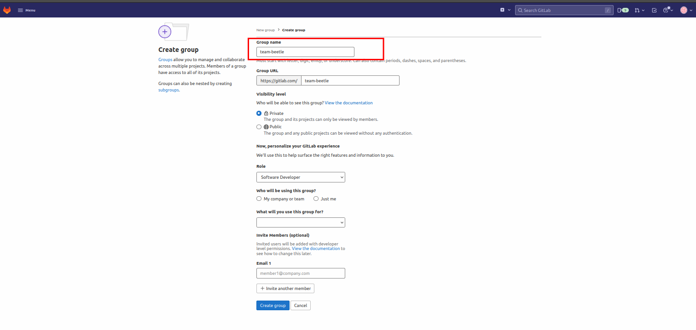
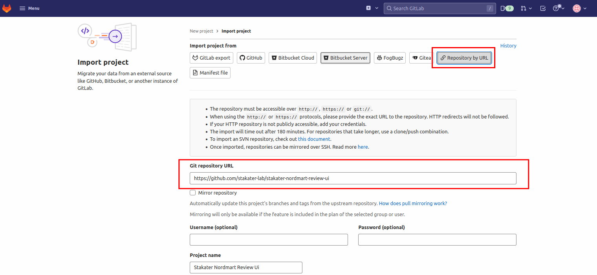

# Getting GitLab Ready for GitOps
> In this section we will get gitlab ready for our exercise. We will then import a couple of projects and prep them up to be deployed to the cluster.

1. Log into GitLab with your credentials. GitLab URL:

    ```bash
    https://<STAKATER_GITLAB>
    ```

   First, we need to create a Gitlab group with name as the <team_name> or <participant_name>
   For this open up the menu and select "Create group" from the "Groups" tab:

    

   This will redirect you to the following screen. Select "Create group" option.

    


2. Put your TEAM_NAME (`<TEAM_NAME>`) or YOUR_NAME (`<YOUR_NAME>`)  as the group name, select **Public** for Visibility level, and hit Create group. This is so we can easily share code and view other teams' activity.
    
    
    Gitlab will redirect you to the group's home page, once the group is created.

3. If you are working as a team, you must add your team members to this group. This will give them permissions to work on the projects created in this group. Select "Members" from the left panel and invite your team members via "Invite member" option. Make sure to choose "Maintainer" or "Owner" role permission. You can ignore this step if your are not working as a team.
   To do this, select "Group information from the left panel" and click member
    
    

   Add member to the group using the "Invite member" option.

    

4. We are going to create a Gitlab Personal Access Token (PAT). The token is a more secure and reliable method for accessing Gitlab from our scripts later on. Note, that for reference's sake, you can also generate a PAT in Gitlab under User > Settings > Access Tokens in the Web UI. We use a helper script here to help automate that process. To generate the token, open a terminal if you have not got one open and run the following commands.

    Export your Gitlab username.

    ```bash
    export GITLAB_USER=<YOUR_GITLAB_USER>
    ```

    Export your Gitlab password.

    ```bash
    export GITLAB_PASSWORD=<YOUR_GITLAB_PASSWORD>
    ```

    <p class="tip">
    ⛷️ <b>TIP</b> ⛷️ - If your password includes special characters, try putting it in single quotes. ie: <strong>'A8y?Rpm!9+A3B/KG'</strong>
    </p>

    Generate your Gitlab PAT.

    ```bash
    gitlab_pat
    ```

    Echo the `GITLAB_PAT` environment variable.

    ```bash
    echo $GITLAB_PAT
    ```

    We can see the PAT printed out on the command line, it is also stored in an environment variable called `GITLAB_PAT`

    

## Importing Nordmart projects
> In this part, we will import the projects we need to deploy on the cluster.

1. Select "Projects" from the menu and click "Create project". This will redirect you to the following screen. Select "Import Project".
       

2. Now select the "Repository by URL" option and paste in the following repository URL:
    ```
        https://github.com/stakater-lab/stakater-nordmart-review
    ```
      

   Repeat the above process for the following repository:

    ```
        https://github.com/stakater-lab/stakater-nordmart-review-ui
    ```
   
    

