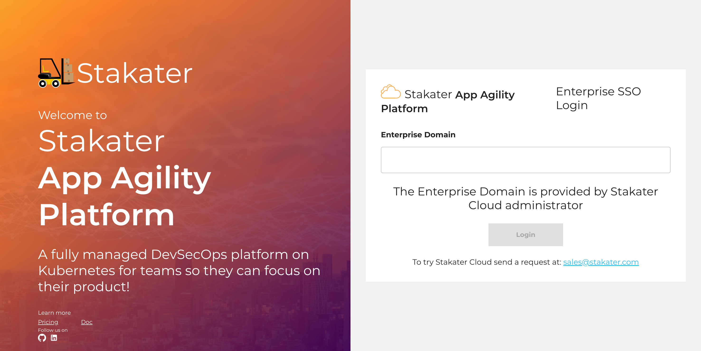

## 🐌 The Basics - CRW, OCP & Helm

### Stakater Cloud

1. Login to Stakater Cloud https://cloud.stakater.com/

    

2. Enter the domain name `workshop`


### CodeReady Workspaces setup

1. Login to your CodeReadyWorkspace (CRW) Editor. The link to this will be provided by your instructor.

    

    <p class="warn">
    If the workspace has not been set up for you, you can create one from this devfile. On CodeReady Workspaces, "Create Workspace > Custom Workspace". Enter this URL to load the TL500 stack:</br>
    <span style="color:blue;"><a href="https://raw.githubusercontent.com/rht-labs/enablement-framework/main/codereadyworkspaces/tl500-devfile.yaml">https://raw.githubusercontent.com/rht-labs/enablement-framework/main/codereadyworkspaces/tl500-devfile.yaml</a><span>
    </p>

2. In your IDE (it may take some time to open ... ⏰☕️), open a new terminal by hitting `Terminal > Open Terminal in Specific Container > stack-tl500` from the menu.

    

3. Notice the nifty default shell in the stack-tl500 container is `zsh` which rhymes with swish. It also has neat shortcuts and plugins - plus all the cool kids are using it 😎! We will be setting our environment variables in both `~/.zshrc` and `~/.bashrc` in case you want to switch to `bash`.

4. Setup your `TENANT_NAME` name in the environment of the CodeReadyWorkspace by running the command below. We will use the `TENANT_NAME` variable throughout the exercises so having it stored in our session means less changing of this variable throughout the exercises 💪. **Ensure your `TENANT_NAME` consists of only lower case alphanumeric characters or '-', and must start and end with an alphanumeric character (e.g. 'my-name',  or '123-abc.)**

    ```bash#test
    echo export TENANT_NAME="<TENANT_NAME>" | tee -a ~/.bashrc -a ~/.zshrc
    ```

5. Add the `CLUSTER_DOMAIN` to the environment:

    ```bash#test
    echo export CLUSTER_DOMAIN="<CLUSTER_DOMAIN>" | tee -a ~/.bashrc -a ~/.zshrc
    ```

6. Add the `GIT_SERVER` to the environment:

    ```bash#test
    echo export GIT_SERVER="<GIT_SERVER>" | tee -a ~/.bashrc -a ~/.zshrc
    ```

7. Verify the variables you have set:

    ```zsh#test
    source ~/.zshrc
    echo ${TENANT_NAME}
    echo ${CLUSTER_DOMAIN}
    echo ${GIT_SERVER}
    ```

8. Check if you can connect to OpenShift. Run the command below.

    <p class="tip">
    ⛷️ <b>TIP</b> ⛷️ - Before you hit enter, make sure you change the username and password to match your team's login details. If your password includes special characters, put it in single quotes, i.e.: <strong>'A8y?Rpm!9+A3B/KG'</strong>
    </p>

    ```bash
    oc login --server=https://api.${CLUSTER_DOMAIN##apps.}:6443 -u <USERNAME> -p <PASSWORD>
    ```

9. Check your user permissions in OpenShift by creating your team's `ci-cd` project. 

    ```bash#test
    oc new-project ${TENANT_NAME}-ci-cd || true
    ```

    

    <p class="warn">
        ⛷️ <b>NOTE</b> ⛷️ - If you are working as a team and are using the same TENANT_NAME, you may receive a message saying this project already exists. One of your teammates would have already created this project. It's all good!
    </p>
