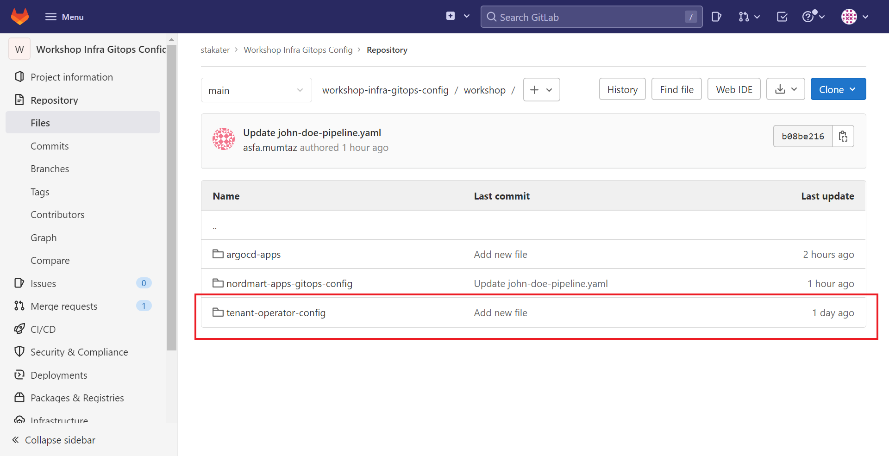
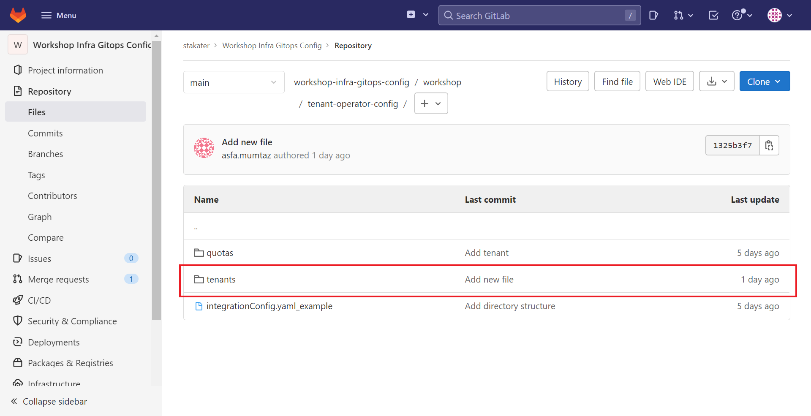

# 🐓 Tenant Operator 101

Stakater’s [Tenant-Operator](https://docs.cloud.stakater.com/content/sre/tenant-operator/overview.html) makes it easy to implement multi-tenancy in your organisation. When you create a tenant, you get a dedicated SAAP instance.
Network and Security Policies, Resource Quotas, Limit Ranges, and RBAC policies which are configured for a tenant, are inherited by all the namespaces and users of that tenant.

With Tenant-Operator custom resources, you can help your developers self-service, reliving your admins of some engineering toil.

Your Tenant Operator can configure the following custom resources;

- Tenants
- Quotas
- Templates for your application deployments
- ResourceSupervisor
- Namespaces

Tenant-Operator resources is designed 100% cloud-native, this means that you can manage your tenants as code allowing you to integrate Gitops best practices into your multi-tenancy workflow.

## Creating Tentants with GitOps

The following [Repository](https://gitlab.apps.devtest.vxdqgl7u.kubeapp.cloud/my-group/nordmart-gitops-config) contains ArgoCD app configurations to help automate the creation of your tenant.

1. From the repository, click on the `workshop` folder.


The `workshop` folder contains the following folders:

- `argocd-apps` This contains all the argocd apps “watching” your repositories.

- `nordmart-apps-gitops-config` Which containing the argocd configuration “watching” your apps

- `tenant-operator-config` which contains your Tenants configurations.


2. Click on the `tenant-operator-config` folder.




3. Click on the `tenants` folder.



> The `tenants` folder contains the configuration for all the tenants in your SAAP managed instance.

4. Click the `+`icon to create a new  yaml file. This file will contain your tenant configurations.


4. Paste the code below to create a new tenant with a user, a list of argoCD “watched” repositories belonging to the tenant and its accompanying namespaces.

> Replace "<INSERT_YOUR_TENANT_NAME>" and "<INSERT_YOUR_USER_NAME>" with your preferred tenent and user name.

```yaml
apiVersion: tenantoperator.stakater.com/v1beta1
kind: Tenant
metadata:
  name: <INSERT_YOUR_TENANT_NAME>
spec:
  quota: workshop-medium
  owners:
    users:
      - <INSERT_YOUR_USER_NAME>
  argocd:
    sourceRepos:
      - 'https://gitlab.apps.devtest.vxdqgl7u.kubeapp.cloud/dominators/workshop-infra-gitops-config.git'
      - 'https://gitlab.apps.devtest.vxdqgl7u.kubeapp.cloud/genesis/nordmart-apps-gitops-config.git'
      - 'https://stakater.github.io/stakater-charts'
  namespaces:
  - dev
  - build
  - test
  - prod
```

5. Add a usefull commit message indicating the changes you wish to make. In the `Target Branch` tile, input your branch name and select `commit changes` to create a merge request.


6. Once your merge request is accepted, your tenant will be created. ArgoCD automates the creation of tenants by syncing your desired state with the actual state of your SAAP instance makes tenant creation seamless.
You can view your created tenant and name spaces via your OpenShift Console.


