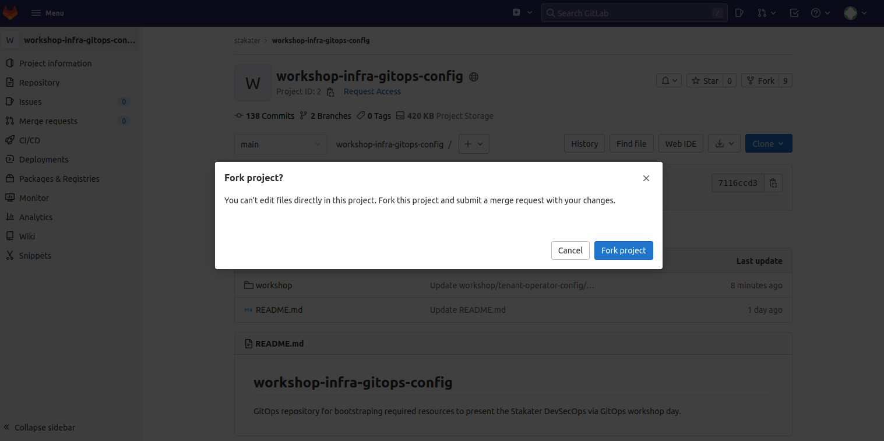
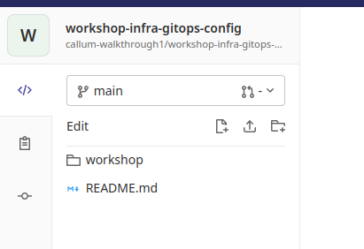
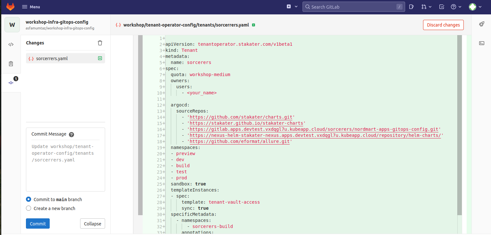
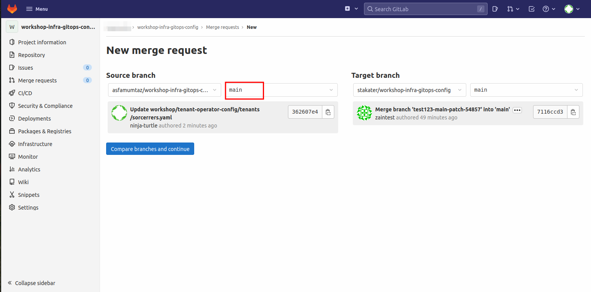
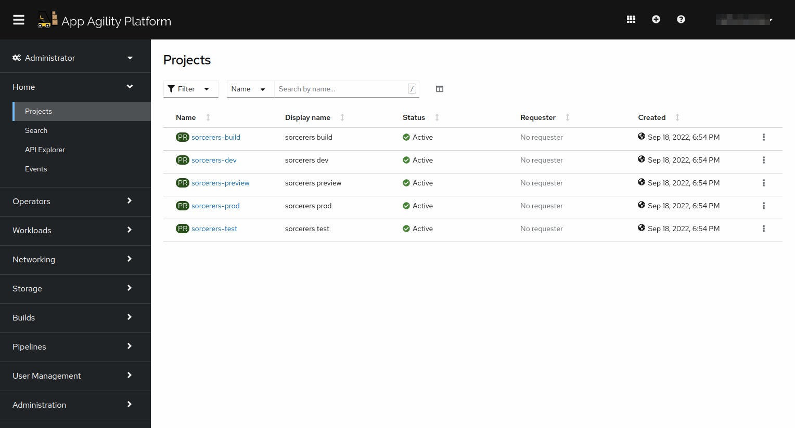

# 🐓 Tenant Operator 101

> Stakater's [Tenant-Operator](https://docs.cloud.stakater.com/content/sre/tenant-operator/overview.html) makes it easy to implement multi-tenancy in your organization.  

OpenShift is designed to support a single tenant platform, hence making it difficult for cluster admins to host multi-tenancy in a single OpenShift cluster. If multi-tenancy is achieved by sharing a cluster, it can have many advantages, e.g. efficient resource utilization, less configuration effort and easier sharing of cluster-internal resources among different tenants.  

Stakater Multi-Tenancy Operator helps to solve the complexity issues of doing true multi-tenancy by providing simplified abstractions on top of the native primitives to provide organizations and platform providers the tooling, self-service capabilities and robust automation needed to do secure and efficient Multi-Tenancy in a single OpenShift cluster.  

Tenant operator provides wrappers around OpenShift resources to provide a higher level of abstraction to the users. With Tenant Operator admins can configure Network and Security Policies, Resource Quotas, Limit Ranges, RBAC for every tenant, which are automatically inherited by all the namespaces and users in the tenant. Depending on users role, they are free to operate within their tenants in complete autonomy. Tenant Operator supports initializing new tenants using GitOps management pattern. Changes can be managed via PRs just like a typical GitOps workflow, so tenants can request changes; add new user or remove user.  

The idea of Tenant Operator is to use namespaces as independent sandboxes, where tenant applications can run independently of each other. To minimize cluster admin efforts, cluster admins shall configure Tenant Operator's custom resources, which then become a self-service system for tenants. Tenant Operator enables cluster admins to host multiple tenants in a single OpenShift Cluster, i.e.  

- Share an OpenShift cluster with multiple tenants

- Share managed applications with multiple tenants

- Configure and manage tenants and their sandboxes

## Workshop Infra GitOps Config  

> Workshop Infra GitOps Config : https://gitlab.apps.devtest.vxdqgl7u.kubeapp.cloud/stakater/workshop-infra-gitops-config

   - `workshop` folder contains separate folder for separate clusters.

   - `workshop/argocd-apps` contains `argocd-apps` for your folders e.g. `nordmart-apps-gitops-config`, `tenant-operator-config`, other operators.

   - `workshop/nordmart-apps-gitops-config` contains `argocd-apps` pointing to tenants `nordmart-apps-gitops-config` and `argocd-apps` folders.

   - `workshop/tenant-operator-config` contains your cluster **tenants**.

## Creating Tenants with GitOps

We will now collaborate on [workshop-infra-gitops-config](https://gitlab.apps.devtest.vxdqgl7u.kubeapp.cloud/stakater/workshop-infra-gitops-config) repository which is already setup to bootstrap your access via the creation of your cluster tenants.  

**You will need to come up with a name for your tenant and we will need them to be unique amongst the participants, but if you are here as a group you can also share a tenant. We would recommend using your company name for simplicity but feel free to use something factitious if preferred.**  

  > Everywhere we see `<TENANT_NAME>` in the rest of the tutorial we need to replace it with your new tenant name.  

1. Navigate to [GitLab](https://gitlab.apps.devtest.vxdqgl7u.kubeapp.cloud/) and Sign-in if required. You can also go via the GitLab tile in [Forecastle](https://forecastle-stakater-forecastle.apps.devtest.vxdqgl7u.kubeapp.cloud). 

   First, we need to create a GitLab group with name as the `<TENANT_NAME>`

   For this open up the `Menu` and select `Groups` > `Create group`:

   

   This will redirect you to the following screen. Select `Create group`.

   

2. Use your `<TENANT_NAME>` as the group name, select `Public` for Visibility level > leave the rest of the defaults and click `Create group`.  

    > Remember that `group name` should match your **tenant name**. 

   

   GitLab will redirect you to the group's home page, once the group is created.


3. If you are working as a team, and you haven't already done at group creation, you can add your colleagues to this group now.   

   This will give them permissions to work on the projects created in this group. Select `Group information` > `Members` from the left panel and invite your colleagues via `Invite member` option. Make sure to choose `Maintainer` or `Owner` role permission. You can ignore this step if you are not working as a team.

   Select `Group information` from the left panel and click `Members`

   

   Click `Invite members` and add your colleagues usernames or emails that they logged into GitLab with.


4. Next from the [workshop-infra-gitops-config](https://gitlab.apps.devtest.vxdqgl7u.kubeapp.cloud/stakater/workshop-infra-gitops-config) repository, click on the `Web IDE` button.

   

Gitlab will prompt you and ask you if you want to fork the repo. Click `Fork Project`.

  

Gitlab will now take you to your forked repository.

5. Click the vertical 3 dot menu next to `workshop` in the left hand navigation and select `New File`

   

6. Name the file using the following directory prefix `workshop/tenant-operator-config/tenants/<TENANT-NAME>.yaml`.  
   
   > We need to update `<TENANT_NAME>` with name you came up with earlier.    

   


7. Paste the code below to create a new tenant with a user, a list of ArgoCD “watched” repositories belonging to the tenant and its accompanying namespaces.

> Replace `<TENANT_NAME>` and `<INSERT_YOUR_USER_NAME>` with your preferred tenant name and list the username/s you; and if any, your colleagues registered with at the beginning.

   ```yaml
   apiVersion: tenantoperator.stakater.com/v1beta1
   kind: Tenant
   metadata:
      name: <TENANT_NAME>
   spec:
      quota: workshop-medium
      owners:
         users:
            - <INSERT_YOUR_USER_NAME> # This is the username you registered with at the beginning.
      argocd:
         sourceRepos:
            - 'https://github.com/stakater/charts.git'
            - 'https://stakater.github.io/stakater-charts'
            - 'https://gitlab.apps.devtest.vxdqgl7u.kubeapp.cloud/stakater/workshop-infra-gitops-config.git'
            - 'https://nexus-helm-stakater-nexus.apps.devtest.vxdqgl7u.kubeapp.cloud/repository/helm-charts/'
            - 'https://gitlab.apps.devtest.vxdqgl7u.kubeapp.cloud/<TENANT_NAME>/nordmart-apps-gitops-config.git'
      namespaces:
      - dev
      - build
      - preview
      - test
      - prod      
      sandbox: true
      onDelete:
         cleanNamespaces: true
      templateInstances:
      - spec:
            template: tenant-vault-access
            sync: true
      specificMetadata:
         - namespaces:
            - <TENANT_NAME>-build
           annotations:
               openshift.io/node-selector: node-role.kubernetes.io/pipeline=
   ```


8. Click `Create commit...` 

   

9. Select `Commit to main branch` > Click `Commit` and navigate back to your project view by clicking the `W` in the top left corner.  

   

10. Navigate to `Merge Requests` > Click `New merge request` > Select `main` for the `source branch` > Select `Compare branches and continue`

      

11. you can leave everything as default and click `Create merge request`.

      

12. Once your merge request is accepted, your tenant will be created.  

    ArgoCD is busy syncing your changes to the workshop SAAP instance and passing off the manifests to the components that automate  
    the creation of the tenants, by syncing your recent changes to the desired state with the actual state of your SAAP instance.

    After about 3-5 min you can view your created tenant and namespaces via your [OpenShift Console](https://console-openshift-console.apps.devtest.vxdqgl7u.kubeapp.cloud/k8s/cluster/projects).

      


