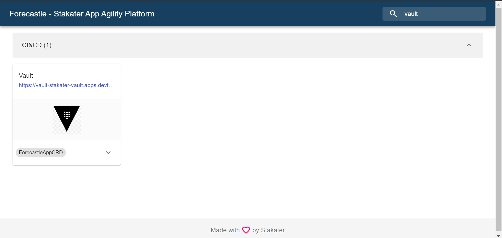

# 🐭 Vault 101

Keeping your application configurations separate from your container instances can be advantageous for improving its flexibility and reducing overall engineering overhead.

[Secrets](https://kubernetes.io/docs/concepts/configuration/secret/) are objects which contain sensitive data. These sensitive data can be passwords, keys, tokens, etc., and are created independently of your applications. They are used in your applications as environment variables or volumes. 

[Vault](https://www.vaultproject.io/docs) is an identity-based secret and encryption management system. It is an open-source tool which provides a secure, reliable way to store and distribute secrets, as well as encrypt data.

Vault uses the concept of `Secret Engines` to manage sensitive data. Secrets Engines are components that store, generate, or encrypt data. When provided with data, they take some action on it and depending on the kind of engine, return a result.
    
   > SAAP comes with a fully managed instance of Vault. 
    
1. To access your Vault, from your `Forecastle` console, click on the `Vault` tile.

   

2. From the drop down menu under `Method`, select `OIDC` and click on `Sign in with OIDC Provider`

3. You will be brought to the `Vault` console. Upon creation of your tenant, a folder belonging to your tenant for holding your secrets is created as well.

   

<<<<<<< HEAD
4. You can view a list of your secret from your tenant secrets folder.
=======
3. You can add your secrets to be managed by clicking on your secrets folder.
   

4. Next give your secret a folder path indicating where it should be saved. Then add the secret as key-value pair and select `Save` to create your secret.

     

5. Once your secret has been created you can view alist of your secret from your tenant secrets folder.
>>>>>>> 2e352fee535d687f9cba59fb57bf02d1856df234

   
