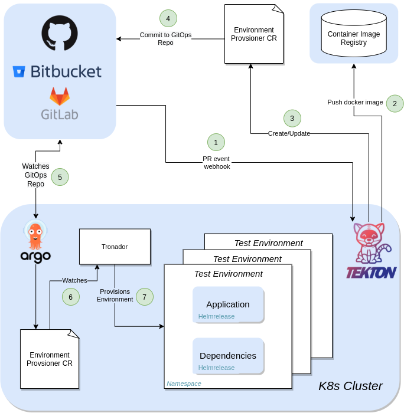
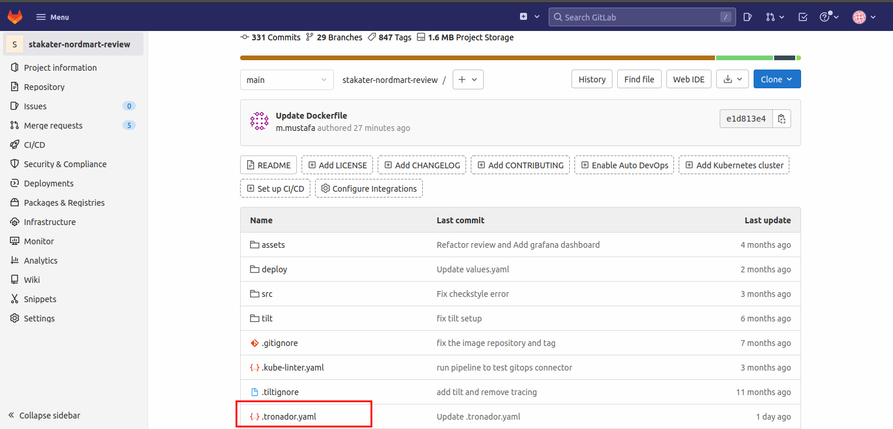
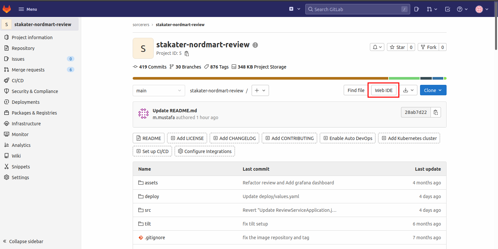
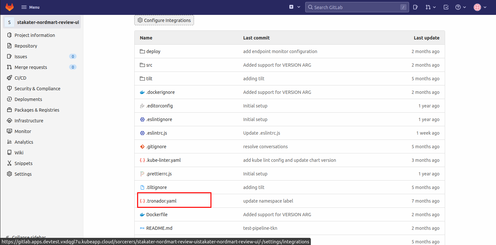
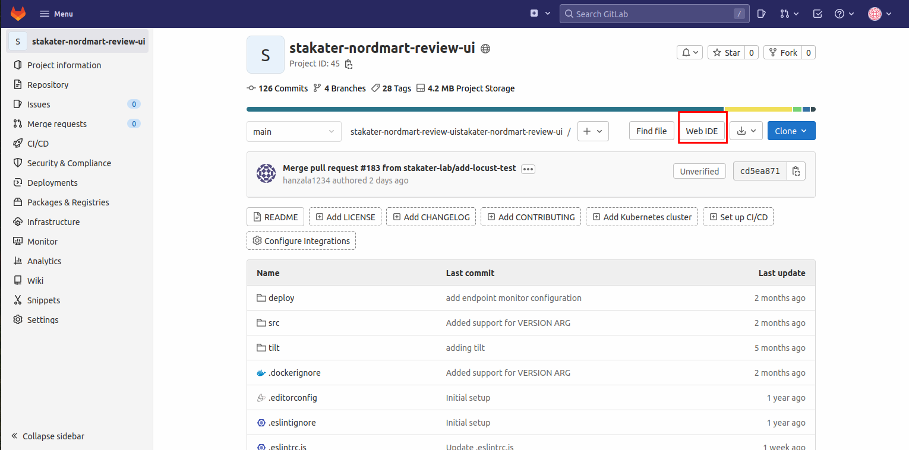
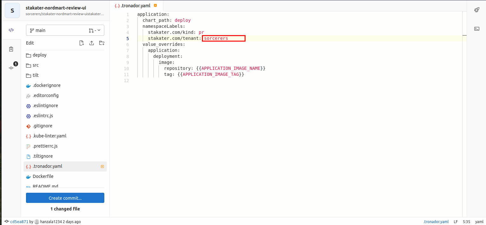
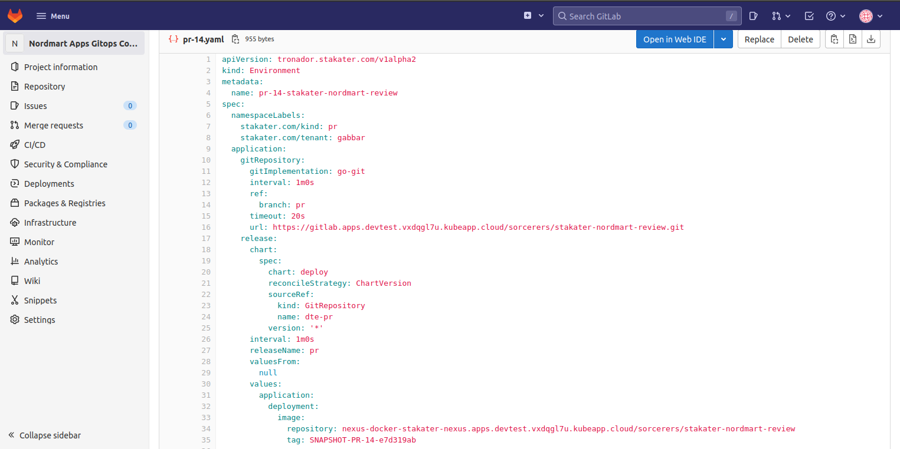

# 🐋 Tronador 101

> _**Tronador** - Environment-as-a-Service;
Dynamic test environments on Kubernetes on demand!_

Traditionally, many software development projects merge changes from developers into the repository, and then identify regressions resulting from those changes, followed by more patches to fix those bugs.

To prevent changes that introduce regressions from being merged, changes should be confirmed to work without disruption before they merged.

Tronador provides testing environments so the changes can be tested in the same environment with the production. The testing environments are aligned with the codebase and provisioned on OpenShift or Kubernetes.

Tronador enables teams to have separate isolated testing environments per project easily in declarative way and enables multiple teams to collaborate on complex application stacks respecting their own revisions.

> SAAP comes pre-configured with Trondaor to make dynamic testing easy for you!

### How it works
Tronador provisions an environment within your cluster in a specific namespace, and then deploy your application to that namespace. This is done by deploying a HelmRelease in the namespace, which will then create a deployment that manages the application's pods. This provides a way to test the application without having to manually deploy everything by yourself, allowing the developer/tester to save valuable time.

Tronador comes with a CRD and a Tekton cluster task. The CRD, Environment , will be used for creating a DTE within your cluster. The Tekton cluster task, create-environment , will be used for automatically creating the Environment Custom Resource. The task depends on a Tronador config file to be created in your repository, which will be used to create the CR. The create-environment task can be used within your own Tekton pipeline, automating the process of creating and deploying the image of your application after changes are made to it

### Adding Tronador Config

Let's add the tronador config file that we just talked about to our repository. In section 2, we will add the create-environment task to our pipeline that will use this file to provision dynamic test environment.

1. Head over to your  `stakater-nordmart-review` repository. You will see a `.tronador.yaml` file at the repository root
   
  
3. Now select the `Web IDE` option and open `.tronador.yaml` file

  

4. Replace the existing tenant named `gabbar` with your tenant name and `Commit the changes to main`.

   

Now let's reqeat the process for `stakater-nordmart-review-ui`

1. Head over to your  `stakater-nordmart-review-ui` repository. You will see a `.tronador.yaml` file at the repository root

3. Now select the `Web IDE` option and open `.tronador.yaml` file

4. Replace the existing tenant named `gabbar` with your tenant name and `Commit the changes to main`.

   

As mentioned, create-environment tekton task will use this file to create test environments. If you noticed in tenant operator exercise, we also added a preview envornment.
Tronador will add the `Environment` CR to this env. The environment CR will look like this:

We will not be creating any Environment CR is this section. Let's head over to section to and make our pipeline do it for us!!