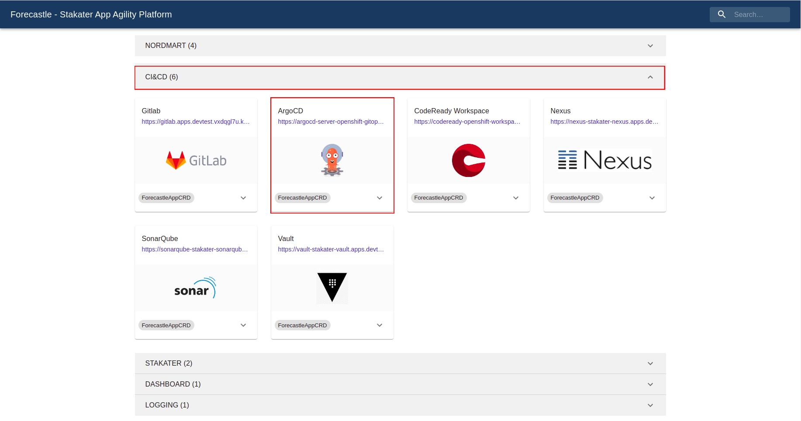
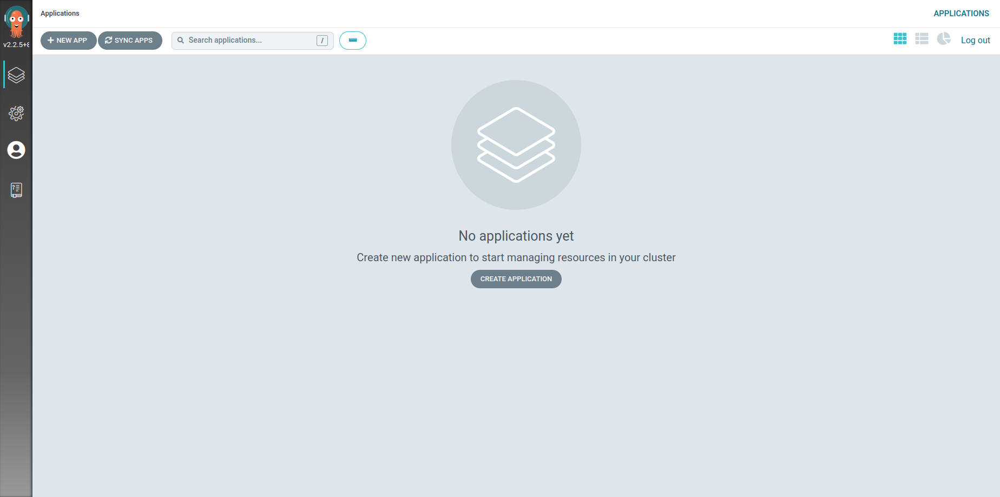
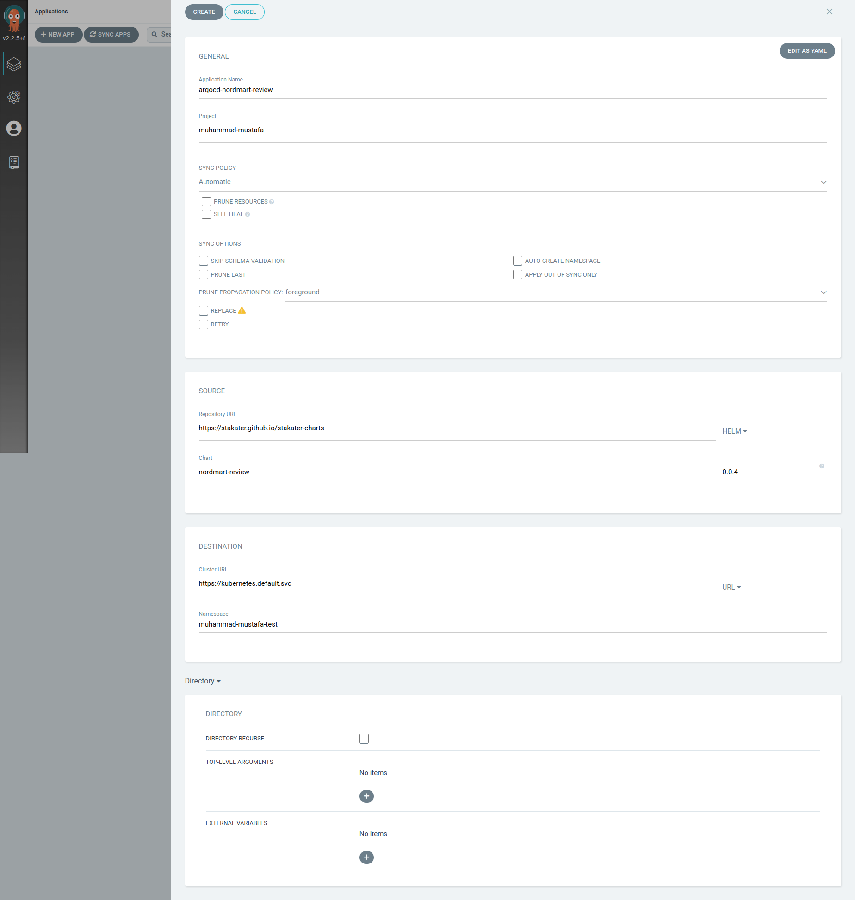
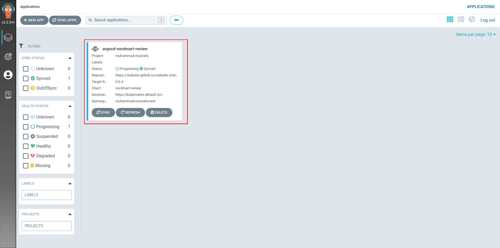
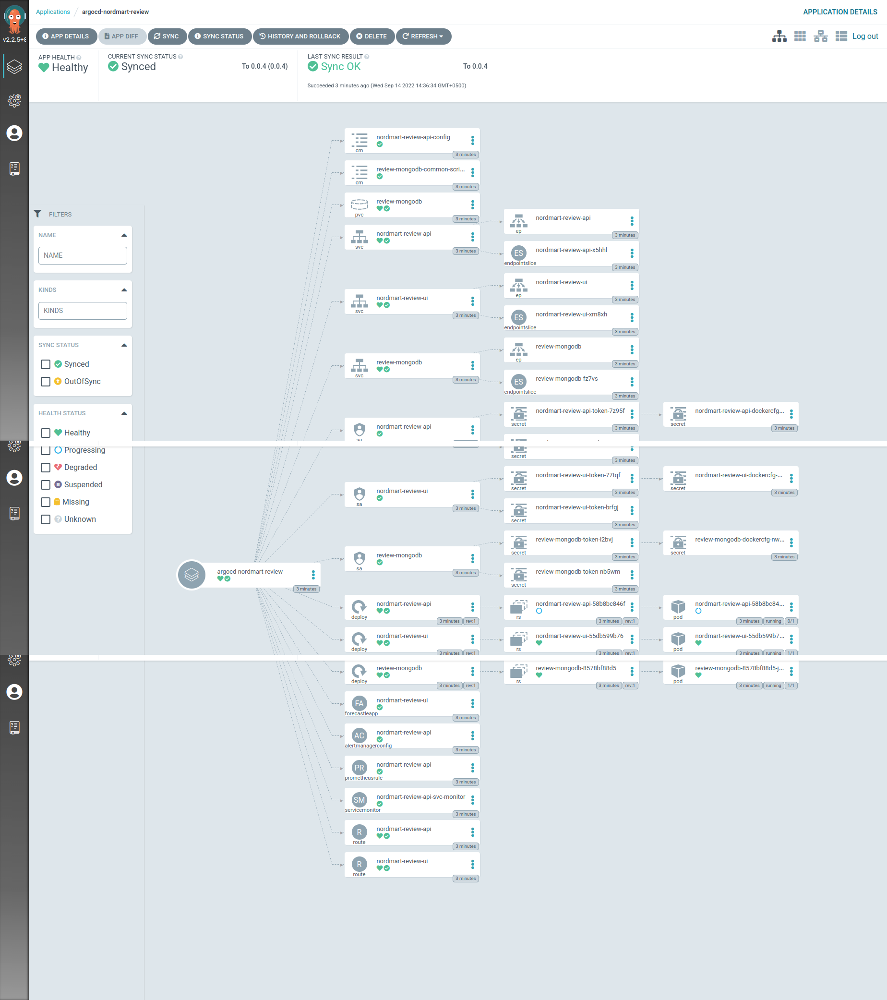
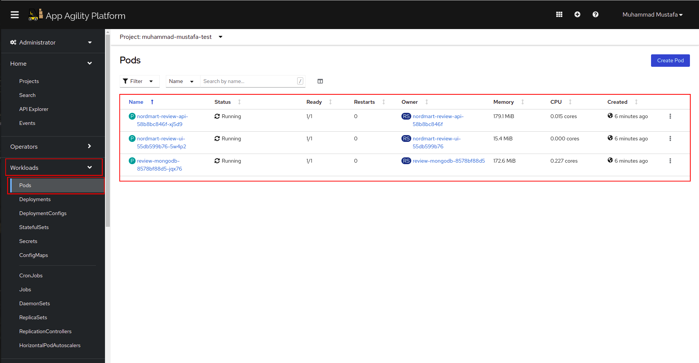
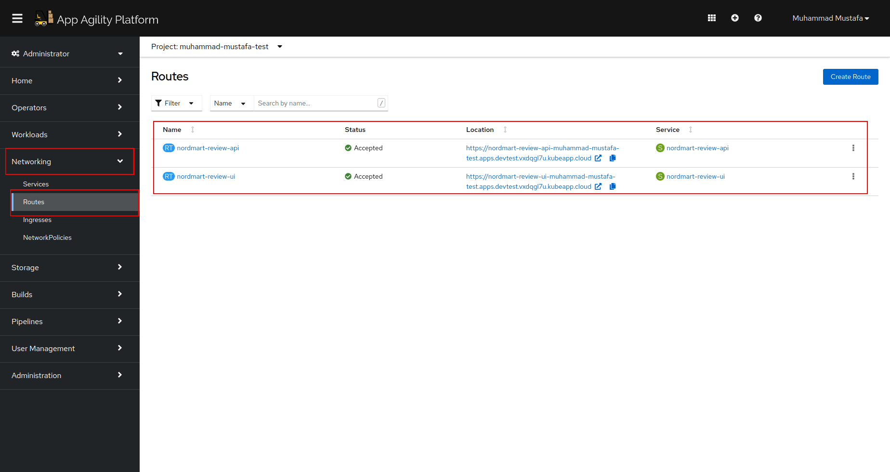
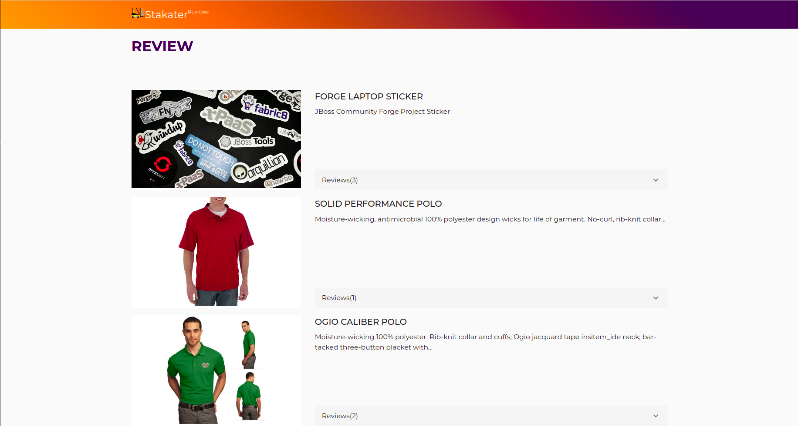

## 🐙 ArgoCD 101

GitOps can be seen as a developer-centric approach to Ops. It teaches developers good practices around taking ownership of code once it leaves their machines and the approach to deploying and monitoring this code once it's running.

When practicing GitOps ideally, every action should be idempotent. Every action or operation can be applied multiple times, producing the exact same result. This is a very useful property in many situations, as it means that an operation can be repeated or retried as often as necessary without causing unintended effects. Configuration should be created declaratively. That is to say, you write the configuration to describe the desired state of an application or set of apps.

To implement a GitOps approach to our Helm charts, all we need to do is connect a tool to the Git repository, which can be alerted or watch for changes coming through. When those changes arrive, this tool can assess the difference between what the current state is and what state is desired and apply the changes automatically for
us.

From ArgoCD's website, it is described as a tool that:

<pre>
    automates the deployment of the desired application states in the specified target
    environments. Application deployments can track updates to branches, tags, or be pinned
    to a specific version of manifests at a Git commit.
</pre>

When something is seen as not matching the required state in Git, an application becomes out of sync. Depending on how you have implemented your GitOps, ArgoCD can then re-sync the changes to apply whatever is in Git immediately or fire a warning to initiate some other workflow. In the world of Continuous Delivery as implemented by ArgoCD, Git is the single source of truth, so we should always apply the changes as seen there.

> Stakater App Agility Platform (SAAP) already deploys ArgoCD for you hence we can directly move on to logging in and deploying our application.

## Nordmart App on ArgoCD

Lets install an ArgoCD Application that deploy the `nordmart-review application` onto the cluster.

1. Open `Forecastle` > Navigate to `CI & CD` and Click the `ArgoCD` tile.  
    
    
    **or**  

    Search `argocd` in search bar and Open the ArgoCD link. 
    

2. If you are not automatically be logged in via KeyCloak SSO the Click `LOG IN VIA OPENSHIFT` > Select `workshop` as the login method 

3. Select `Allow selected permissions` for the initial login.

4. You just logged into ArgoCD 👏👏👏! 

5. Lets deploy a sample application through the UI. In fact, let's get ArgoCD to deploy the `stakater-nordmart-review` app you manually deployed previously using Helm. On ArgoCD - click `+ NEW APP`. You should see an empty form.
    > Make sure you have deleted previous Helm release deployed in Helm 101.
  
Let's fill it out by setting the following:

   * On the **GENERAL** box
      * Application Name: `argocd-nordmart-review`
      * Project: `<TENANT_NAME>`
      * Sync Policy: `Automatic`
   * On the **SOURCE** box
      * Repository URL: `https://stakater.github.io/stakater-charts`
      * Select `Helm` from the right drop down menu
      * Chart: `nordmart-review`
      * Version: `0.0.4`
   * On the **DESTINATION** box
      * Cluster URL: `https://kubernetes.default.svc`
      * Namespace: `<TENANT_NAME>-test`

Your form should look like the follow image, if so click `Create`

6. After you hit `Create`, you'll see `argocd-nordmart-review` application is created and should start deploying in your `<TENANT_NAME>-test` namespace.

7. If you drill down into the application you will get ArgoCD's amazing view of all of the k8s resources that were generated by the chart

8. You can verify the application is running and behaving as expected by navigating to `Pods` under `Workloads` section in your `OpenShift Console`.

  > Select the drop down and switch to `Administrator` view in the OpenShift console if you are not already there

9. Now go to `Networking` > `Routes` and click the `location` uri to visit `nordmart-review-ui` website.

🪄🪄 Magic! You've now got ArgoCD to manually deploy an application for you. Next up, we'll make ArgoCD do some *REAL* GitOps 🪄🪄

🪄🪄Thanks to SAAP, We didn't have to deploy ArgoCD ourselves.🪄🪄
