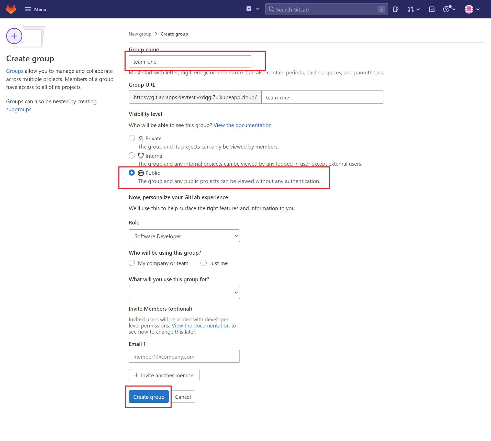
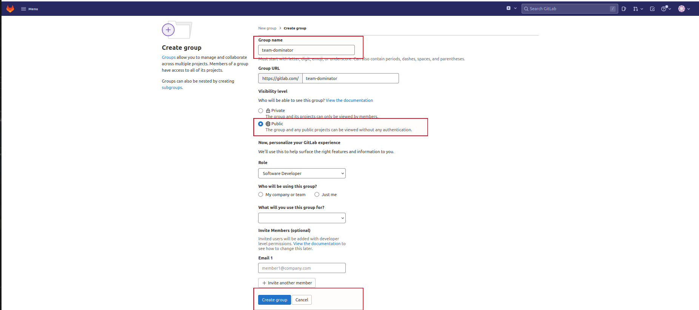
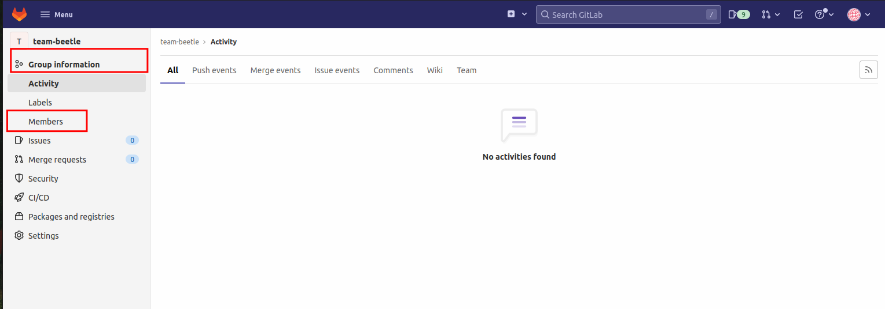
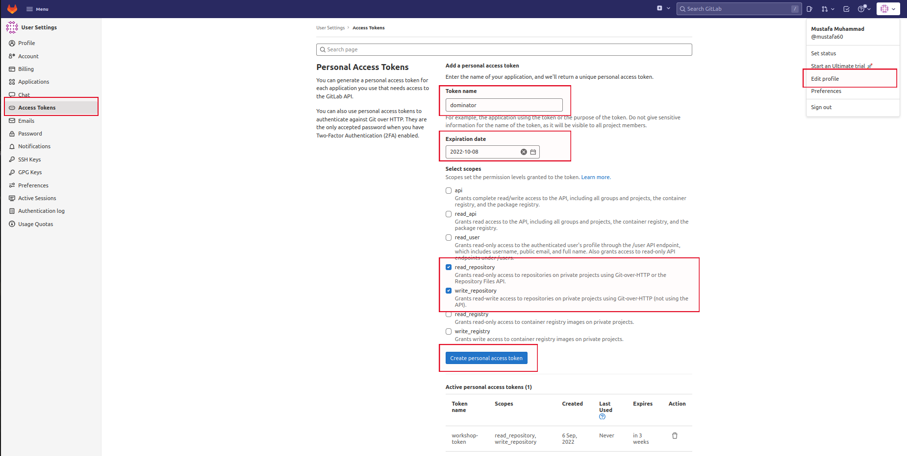
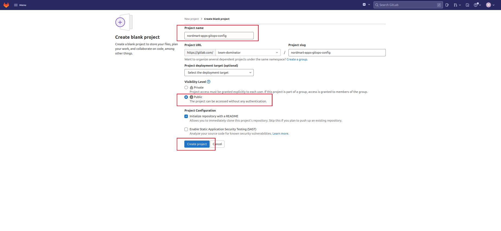
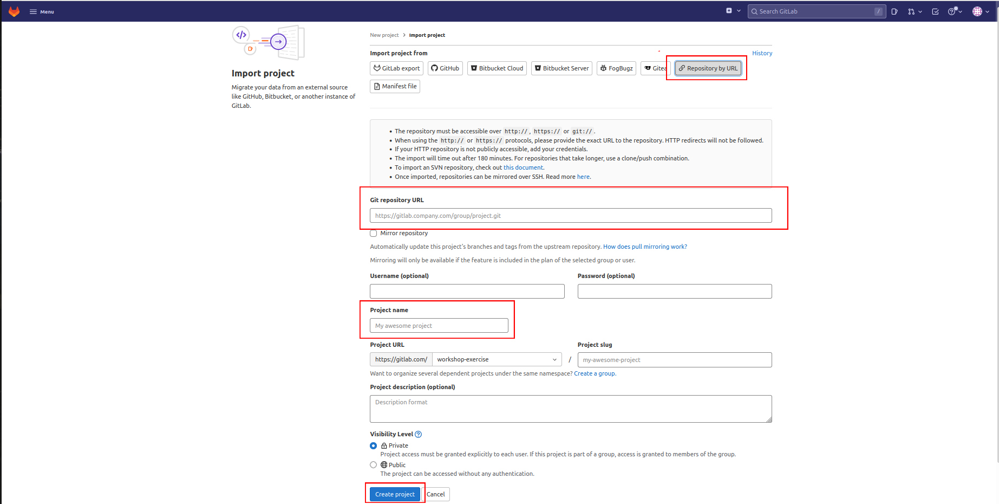

# Getting GitLab Ready for GitOps
> In this section we will get gitlab ready for our exercise. We will then import a couple of projects and prep them up to be deployed to the cluster.

## Create a gitlab group
1. Log into GitLab with your credentials. GitLab URL:

    ```bash
    https://<STAKATER_GITLAB_URL>
    ```

   First, we need to create a Gitlab group with name as the <team_name> or <participant_name>
   For this open up the menu and select "Create group" from the "Groups" tab:

    

   This will redirect you to the following screen. Select "Create group" option.

    


2. Put your TEAM_NAME (`<TEAM_NAME>`) or YOUR_NAME (`<YOUR_NAME>`)  as the group name, select **Public** for Visibility level, and hit Create group. This is so we can easily share code and view other teams' activity.
    
    
    Gitlab will redirect you to the group's home page, once the group is created.

3. If you are working as a team, you must add your team members to this group. This will give them permissions to work on the projects created in this group. Select "Members" from the left panel and invite your team members via "Invite member" option. Make sure to choose "Maintainer" or "Owner" role permission. You can ignore this step if your are not working as a team.
   To do this, select "Group information from the left panel" and click member
    
    

   Add member to the group using the "Invite member" option.

    

## Gitlab Personal Access Tokens
We are going to create a Gitlab Personal Access Token (PAT). The token is a more secure and reliable method for accessing Gitlab from our scripts later on.

1. Generate a PAT in Gitlab, Navigate to User Icon > Edit Profile on the left on topbar, Select Access Tokens in left sidebar the Web UI. 

    

    Export your Gitlab PAT.

2. Copy the token, then set the token and username as environment variable.

    Export your Gitlab User.

    ```bash
    export GITLAB_USER=<YOUR_GITLAB_USER>
    ```

    Export your Gitlab PAT.

    ```bash
    export GITLAB_PAT=<YOUR_GITLAB_PAT>
    ```

    <p class="tip">
    ⛷️ <b>TIP</b> ⛷️ - If your token includes special characters, try putting it in single quotes. ie: <strong>'A8y?Rpm!9+A3B/KG'</strong>
    </p>


## Initialize Gitops Repository

> **GitOps** is a simple process of managing all of your **systems, environments, and applications via Git**. Git represents the single source of truth for all your applications, your tooling, and even your clusters configuration. Changes to any of these things can be pull requested and discussed before an automated process applies them! GOOO GOOOO GITOPS 💪

1. Now let's create the git repository that we are going to use for <span style="color:purple;" >GIT</span>Ops purposes. The nordmart-apps-gitops-config will serve as a mono-repo holding our application definitions and some other stuff. Hit `New project` button on the right hand side
   
    

2. On the new view, use `nordmart-apps-gitops-config` as Project Name, select **Internal** for Visibility level, then hit Create project. Make sure the project is in the group you created previously and not the username's.
    
    

## Importing Nordmart projects
> In this part, we will import the projects we need to deploy on the cluster.

1. Select "Projects" from the menu and click "Create project". This will redirect you to the following screen. Select "Import Project".
       

2. Now select the "Repository by URL" option and paste in the following repository URL:
    ```
        https://github.com/stakater-lab/stakater-nordmart-review
    ```
      


    Repeat the above process for the following repository:

    ```
        https://github.com/stakater-lab/stakater-nordmart-review-ui
    ```
