# 🐡 Setting Up GitLab

Gitlab is an open-source DevSecOps platform with built-in version control, issue tracking, code review, and CI/CD,  giving developers the needed flexibility for managing their application development lifecycle. 

SAAP Instance comes with a fully managed instance of GitLab.

To access your GitLab instance, from your `Forecastle` console, click on the `GitLab` tile.


You will be brought to the Gitlab Console.

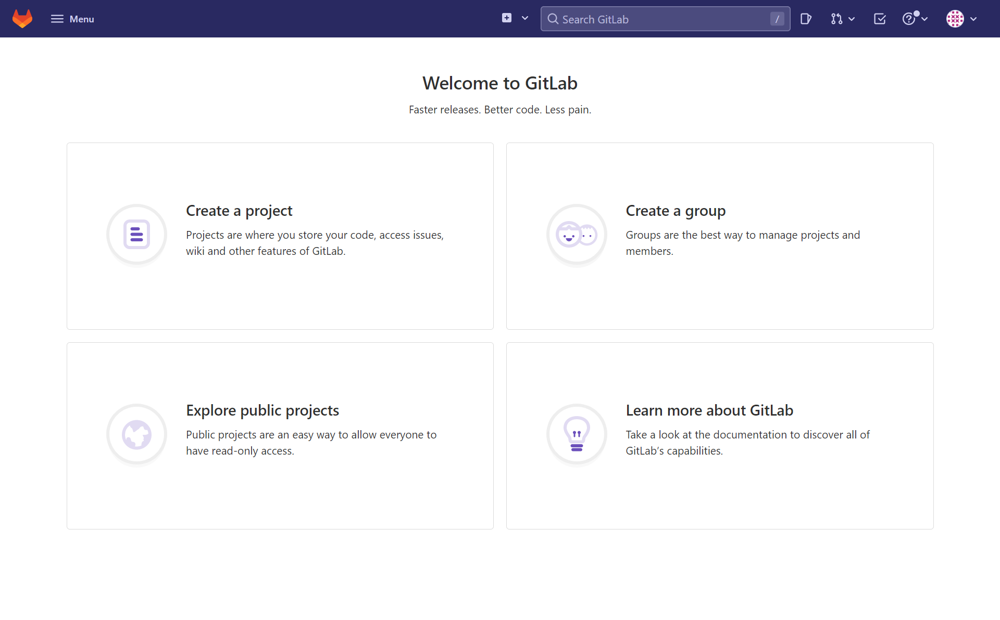

## Setting Up Your Gitlab

### Gitlab Group

Gitlab Groups allows you group related projects together. You can manage permissions for your projects, collaborate with your team members and view all issues relating to your project.

1. To create a group, click on `create a group` tile.


2. Give your group a name and set the visibility level to `public`. You can also add team members.
Click on `create group` 


Your group has been created.

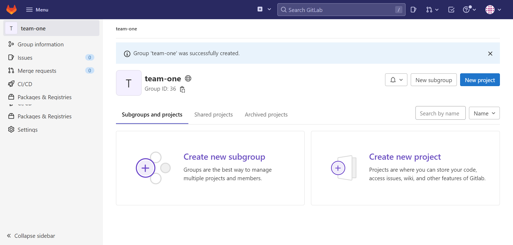

### GitLab Projects

Gitlab Projects allow you group related codebases in one place for ease of collaboration, management and continuity. 

With your project, you can host your code  in repositories, track issues concerning them, make changes using the web IDE, implement CI & CD pipelines and integrate cloud services.

You will leverage Gitlab Projects to manage your application code.

1. To create a new project, from your group page, click on `New project`


Our sample application to be deployed to your cluster, `Nordmart Review`, is a three-tier app consisting of;

1. Web User Interface
2. REST API
3. Database

2. `Nordmart Review` is hosted in a git repository, which you can import the application code by clicking on the `Import Project` tile.


3. To import the `Nordmart Review` User Interface codebase, click on the `Repository via URL` tile and input the following URL.

```
https://github.com/stakater-lab/stakater-nordmart-review-ui
```
add your project name and select `internal` for the visibility level. Then click `Create Project`

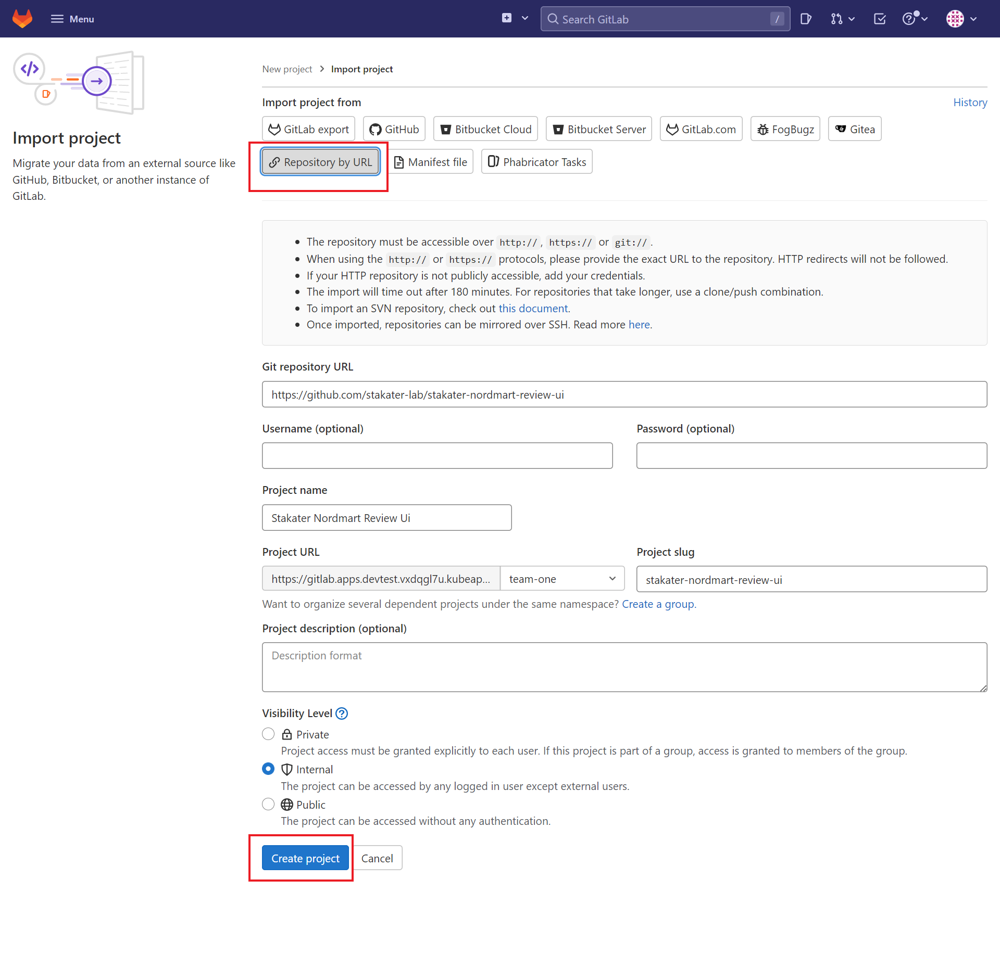

your project has been imported.


4. Next, import the `Nordmart Review` backend API codebase by repeating the previous steps. From your groups page, select `New Project` 


5. Select the `Import Project` tile.


6. Import the `Nordmart Review` backend application code by clicking the `Repository via URL` tile and inputing the following URL. 

```
https://github.com/stakater-lab/stakater-nordmart-review

```

include your project name and select `internal` for your project visibility. Import your project by clicking on `Create Project`

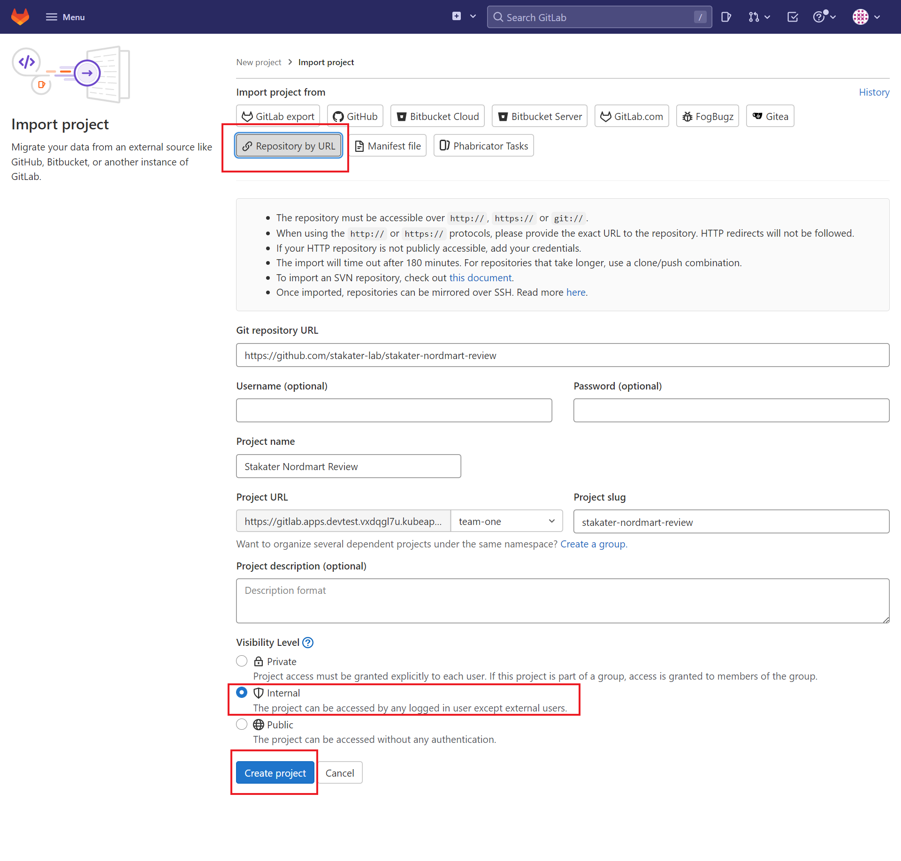

Your project has been imported.

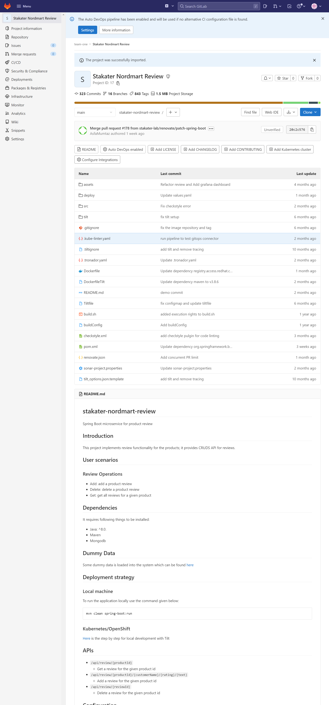

7. Finally, you will import the `Nordmart Review` gitops configurations by also following the previous steps. From your groups page, click on `New Project`


then select `Import Project` tile.


8. Import the `Nordmart Review` Gitops configuration  by clicking the `Repository via URL` tile and inputing the following URL. 

```
 https://github.com/stakater-lab/nordmart-apps-gitops-config-template
 
 ```
 
include your project name and select `internal` for your project visibility. Import your project by clicking on `Create Project`

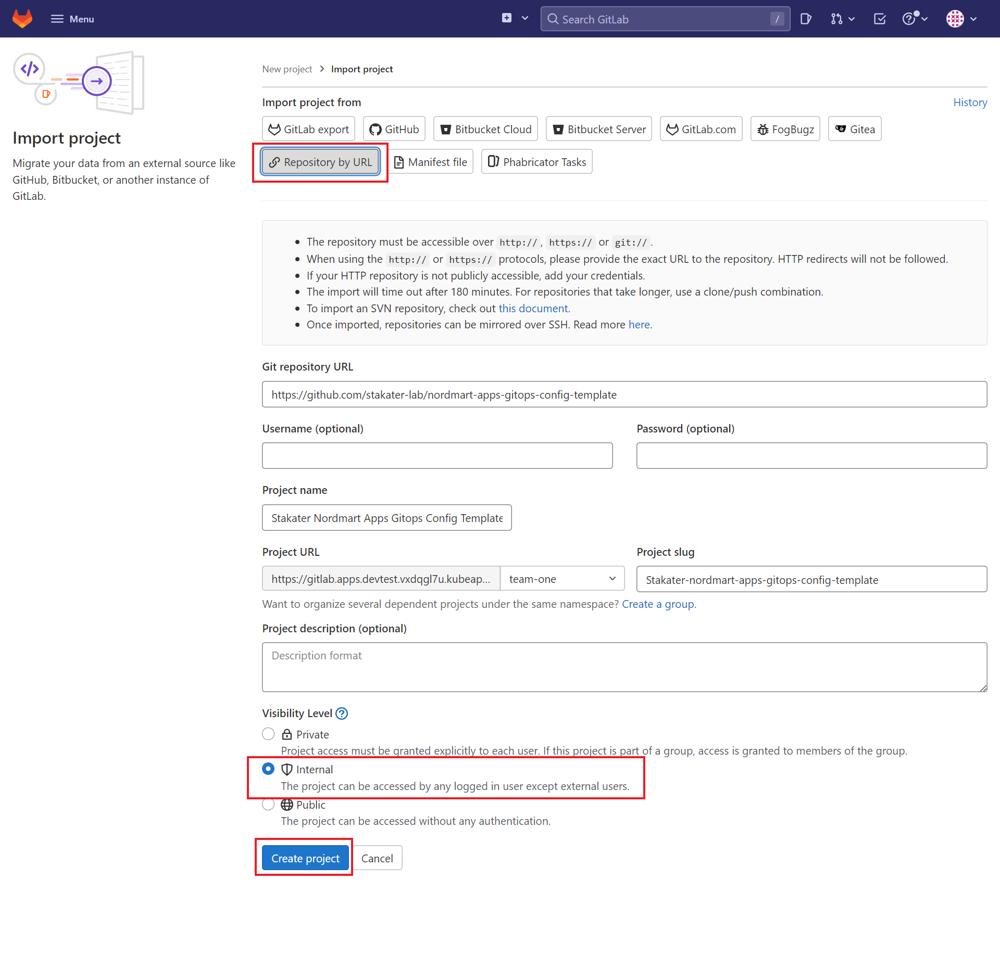

Your Project has been imported.


9. You can see all your projects from your groups page.

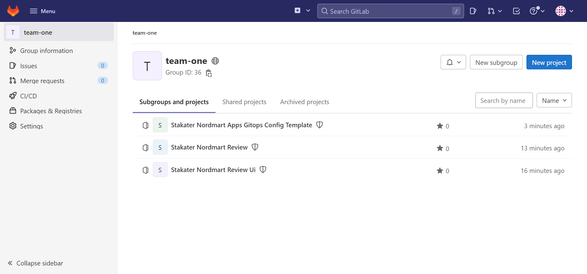

### Making Changes to Your Code

GitLab `Personal Access Token` allows you interact safely with your GitLab repositories from remote enviroments. With your Personal Token, you can push changes directly to your GitLab projects from your workstation. Take the following steps to create your token and add it to your Dev enviroment.

1. Click on your profile icon at the top right corner of your page, and select `Edit profile`.

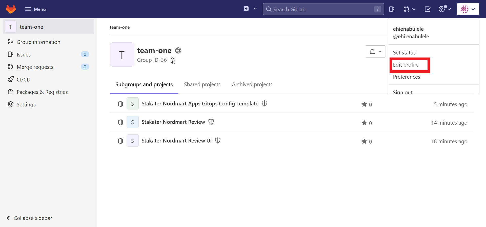

2. At the left corner, Click on `Access Tokens`. You will be brought to the `Personal Access Token` Page

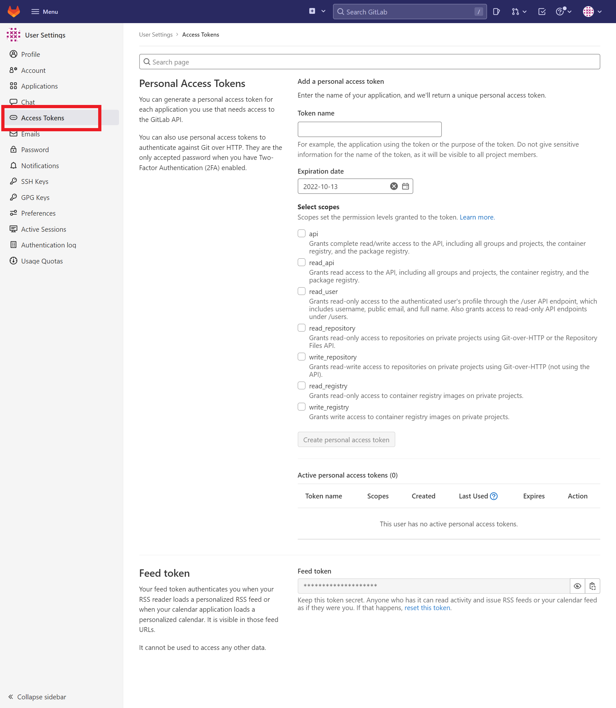

3. Give your token a name, as well as the `read_repository` and `write_repository` permissions. Then select `Create Personal Access Token`

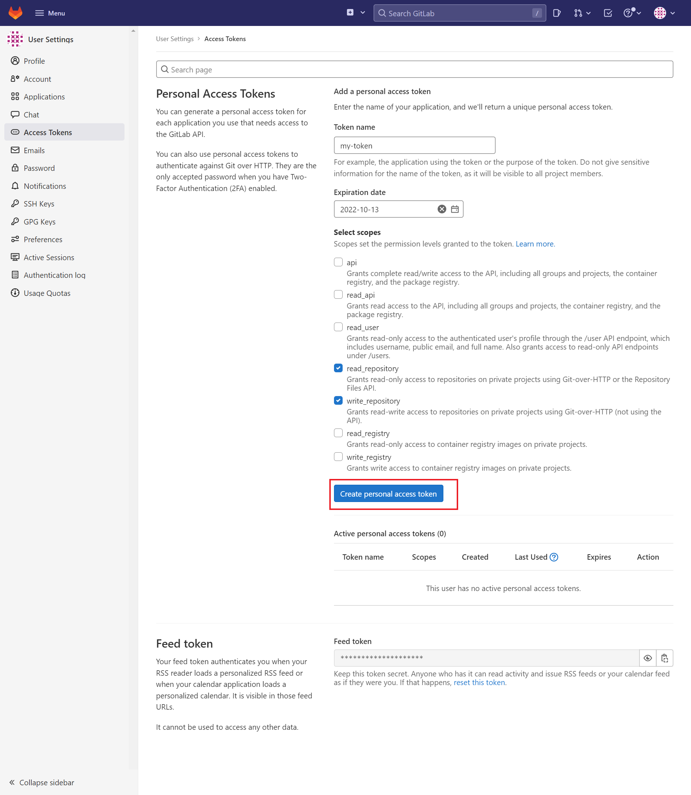

4. Once your Access Token has been created, make sure you copy it and keep in a safe place, as you  will not get a chance to view it again.


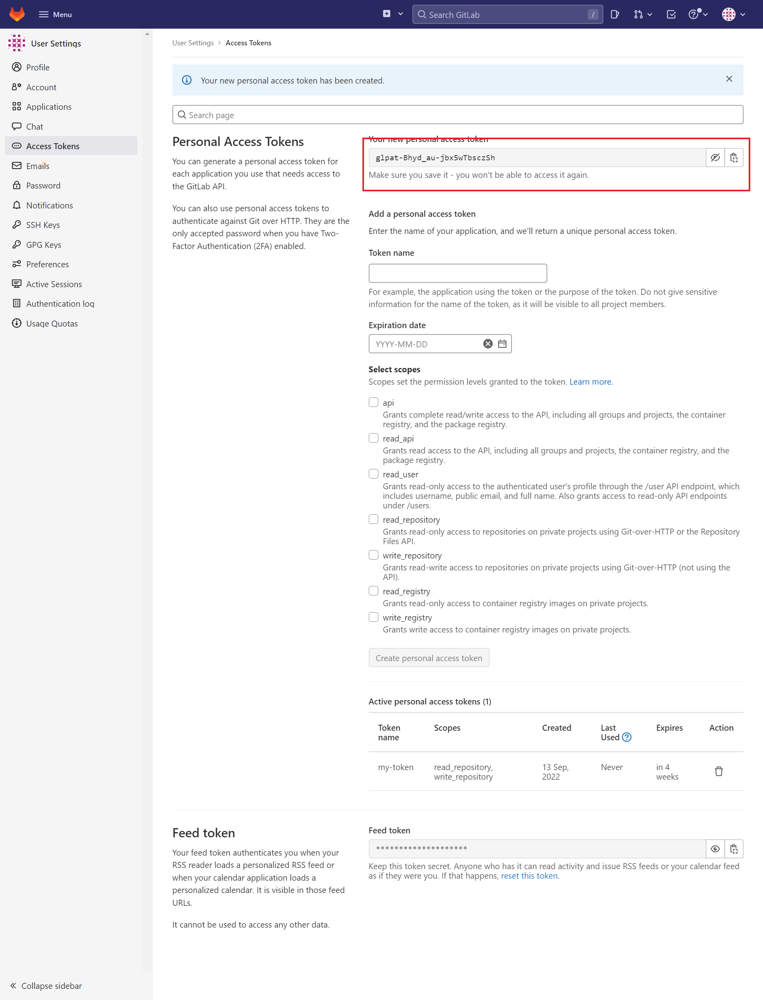

5. Finally, add your Token to your Dev Workstation by saving them as the following enviroment variables.

```
export GIT_USER=<YOUR_TOKEN_NAME>
export GIT_TOKEN=<'YOUR_TOKEN>

```


