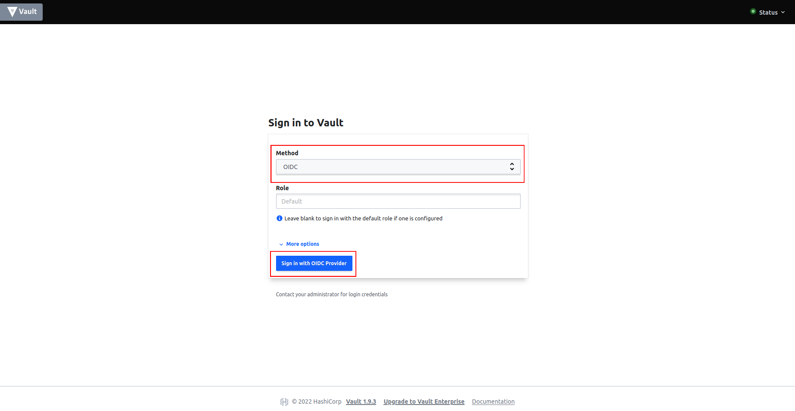
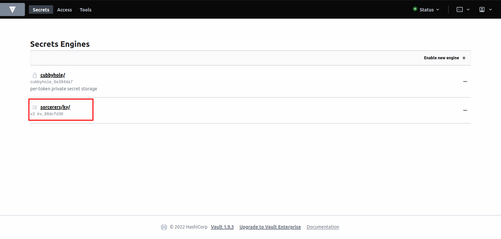
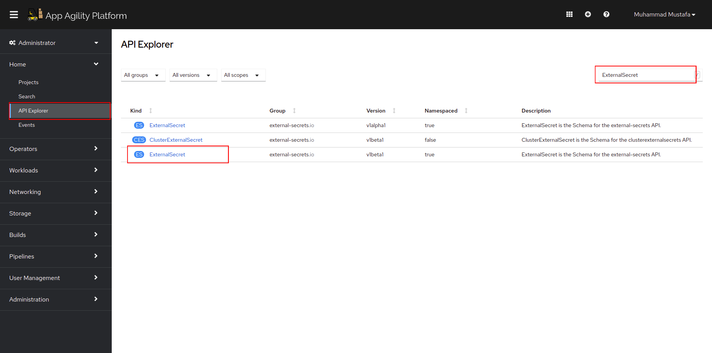

## Adding External Secrets through vault

When we say GitOps, we say _"if it's not in Git, it's NOT REAL"_ but how are we going to store our sensitive data like credentials in Git repositories, where many people can access?! Sure, Kubernetes provides a way to manage secrets, but the problem is that it stores the sensitive information as a base64 string - anyone can decode the base64 string! Therefore, we cannot store Secret manifest files openly
We will use ExternalSecret and Vault to add secrets.

To run our pipelines, we need to provide a secret to our tasks. This secret will contain the token for gitlab. We will store this secret in Vault and then through ExternalSecret, add a secret to Workloads.

### Adding Gitlab Personal Access Token secret to vault

1. To access your Vault Service, from your Forecastle console, click on the Vault tile.

    

2. Open the Vault Login page, Select OIDC Method and Click Sign In with OIDC provider. Open the popup link, Select `workshop` and Login.

      

2. Click on the name of your tenant. 

    

3. Click on `Create Secret`

4. Here add the name of secret `gitlab-pat` and add key-value pairs with your git credentials as shown in the screenshot. 

    


### Add ExternalSecret

Next step is the create an external secret CR that will connect to Vault and create a secret in console using the secret added to the Vault in previous step. 

1. Login to the openshift console. Open the API Explorer Under Home on left sidebar and Search External Secret, Open the details `ExternalSecret`.
  

2. Goto the `Instances` tab and Select `Create ExternalSecret`

    

3. Paste the following YAML in dialog box and make sure to replace tenant name in namespace field.

    ```
    apiVersion: external-secrets.io/v1alpha1
    kind: ExternalSecret
    metadata:
      name: gitlab-pat
      namespace: `<TENANT_NAME>-build`
    spec:
      secretStoreRef:
        name: tenant-vault-secret-store
        kind: SecretStore
      refreshInterval: "1m"
      target:
        name: gitlab-pat
        creationPolicy: 'Owner'
        template:
          type: kubernetes.io/basic-auth
          metadata:
            annotations:
              tekton.dev/git-0: 'https://gitlab.apps.devtest.vxdqgl7u.kubeapp.cloud'
      dataFrom:
        - key: gitlab-pat
    ```
  
    > Dont change target.name because the secret is being referenced by tekton SA.

    A secret with the `spec.target.name` from External Secret yaml will be created in build namespace.  

4. Navigate to Secrets under Workloads, you will find gitlab-pat present.

    

 Tekton Service Account will use this secret as credentials for tasks with git commands.  
 
 🪄🪄 Congratulations. You've added the secret! 🪄🪄
 