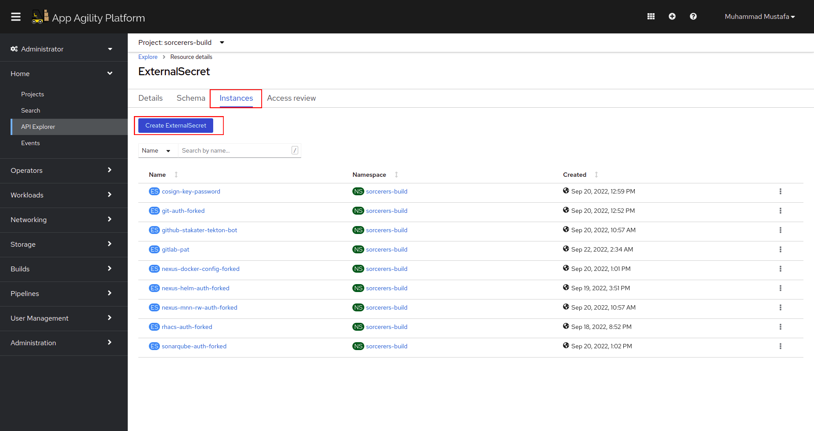
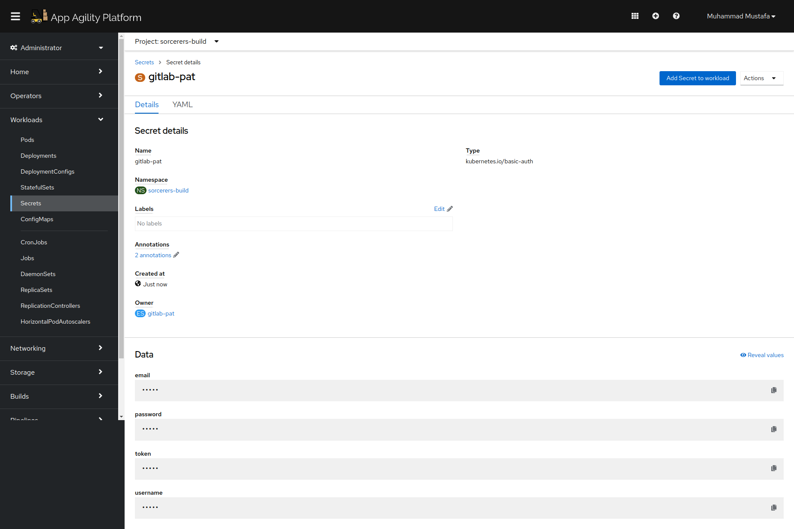

## Add Secrets through Vault and External Secrets

With GitOps you will face the challenge of how to handle secrets and credentials when these should never be committed to git, at least not as plain text or base64. 

There is tooling out there for storing secrets in your GitOps with an additional layer of encryption, such as Sealed Secrets operator but we find this to be a fairly poor developer experience and prefer to maintain secrets in a specialized Vault and fetch these secrets when needed.

To run our pipelines, we need to provide a secret to our tasks. This secret will contain the token for GitLab. We will store this secret in Vault and then through ExternalSecret, add a secret to Workloads.

   > SAAP comes with a fully managed instance of Vault OSS. 

### Add GitLab Group Access Token secret to Vault

First we need to generate a Group Access Token in gitlab to be used later for our automation to interact with GitLab.

1. In GitLab goto `Menu` > `Groups` > `Your Groups` > Select your `<TENANT_NAME>` group created earlier

2. Select `Settings` > `Access Tokens` > enter `Token name` as `pipeline`

3. Select `read_repository` and `write_repository` > click `Create group access token` > copy the value and make a note of it for later.

Now we can add the secret to our Vault instance.

1. To access your Vault Service, from your Forecastle console, click on the Vault tile.

    

2. Open the Vault Login page, Select OIDC Method and Click Sign In with OIDC provider. Open the popup link, Select `workshop` and Login.

      

2. Click on the name of your tenant. 

    

3. Click on `Create Secret`

4. Here add the name of secret `gitlab-pat` and add key-value pairs with your git credentials as shown in the screenshot. 

`email` = The email you registered for the workshop  
`password` = The Group access token  
`token` = The Group access token  
`username` = `pipeline` - Yes the literal string "pipeline"


  

### Add ExternalSecret

Next step is the create an external secret CR that will connect to Vault and create a secret in console using the secret added to the Vault in previous step. 

1. Login to the OpenShift console. Open the API Explorer Under Home on left sidebar and Search External Secret, Open the details `ExternalSecret`.
  

2. Go to the `Instances` tab and Select `Create ExternalSecret`

    

3. Paste the following YAML in dialog box and make sure to replace tenant name in namespace field.

    ```
    apiVersion: external-secrets.io/v1alpha1
    kind: ExternalSecret
    metadata:
      name: gitlab-pat
      namespace: `<TENANT_NAME>-build`
    spec:
      secretStoreRef:
        name: tenant-vault-secret-store
        kind: SecretStore
      refreshInterval: "1m"
      target:
        name: gitlab-pat
        creationPolicy: 'Owner'
        template:
          type: kubernetes.io/basic-auth
          metadata:
            annotations:
              tekton.dev/git-0: 'https://gitlab.apps.devtest.vxdqgl7u.kubeapp.cloud'
      dataFrom:
        - key: gitlab-pat
    ```
  
    > Don't change target.name because the secret is being referenced by Tekton SA.

    A secret with the `spec.target.name` from External Secret yaml will be created in build namespace.  

4. Navigate to Secrets under Workloads, you will find `gitlab-pat` present.

    
 
    Click on `Reveal Values` to see If the values match to the ones you added in Vault.

    Tekton Service Account will use this secret as credentials for tasks with git commands.  
 
🪄🪄 Congratulations. You've added the secret! 🪄🪄
 