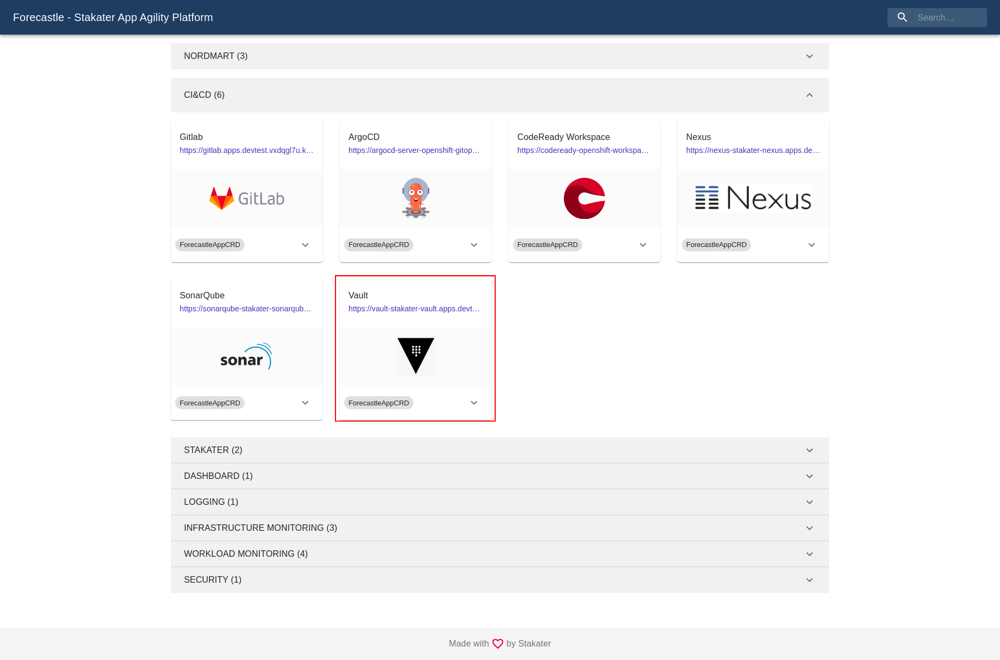
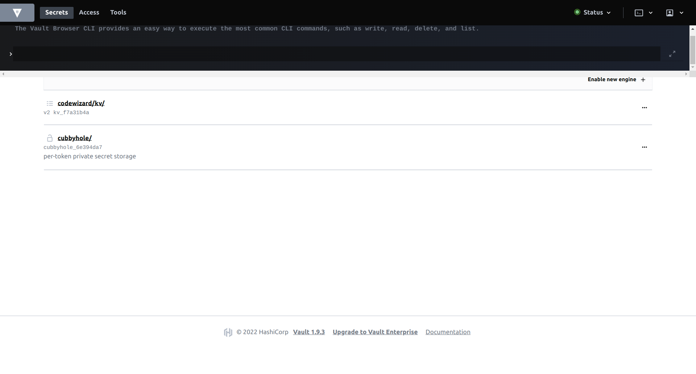
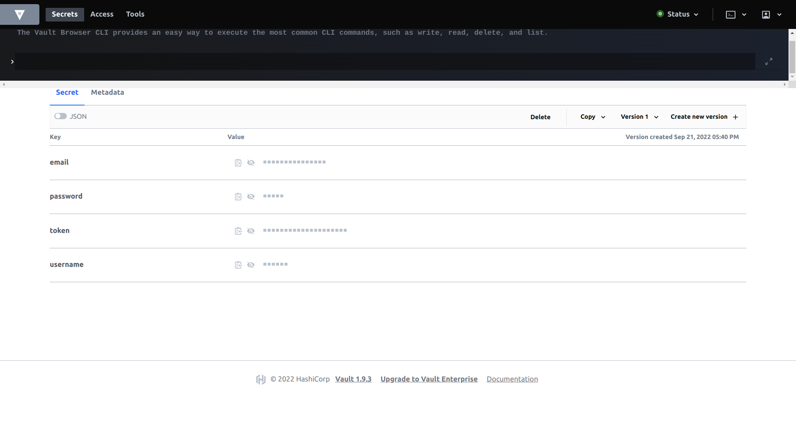

## Adding Secrets

When we say GitOps, we say _"if it's not in Git, it's NOT REAL"_ but how are we going to store our sensitive data like credentials in Git repositories, where many people can access?! Sure, Kubernetes provides a way to manage secrets using the `Secret` resource.

To run our pipelines, we need to provide a secret to our tasks. This secret will contain the token for gitlab. We will store this secret in Vault and then through ExternalSecret, add a secret to Workloads.

### Adding Gitlab Personal Access Token secret to vault

1. To access your Vault Service, from your Forecastle console, click on the Vault tile.

  

2. Click on the name of your tenant. 

  

3. Click on Create Secret

4. Here add the name of secret `gitlab-pat` and add key-value pairs with your values as shown in the screenshot. 

  

### Add ExternalSecret

Next step is the create an external secret CR that will connect to Vault and create a secret in console using the secret added to the Vault in previous step. 

Paste the following YAML in `<TENANT_NAME>-build` namespace.

```
apiVersion: external-secrets.io/v1alpha1
kind: ExternalSecret
metadata:
  name: gitlab-pat
spec:
  secretStoreRef:
    name: tenant-vault-secret-store
    kind: SecretStore
  refreshInterval: "1m"
  target:
    name: gitlab-pat
    creationPolicy: 'Owner'
    template:
      type: kubernetes.io/basic-auth
      metadata:
        annotations:
          tekton.dev/git-0: 'https://gitlab.apps.devtest.vxdqgl7u.kubeapp.cloud'
  dataFrom:
    - key: gitlab-pat
```

A secret with the `spec.target.name` from External Secret yaml will be created in build namespace.  

 🪄🪄 Congratulations. You've added the secret! 🪄🪄
 