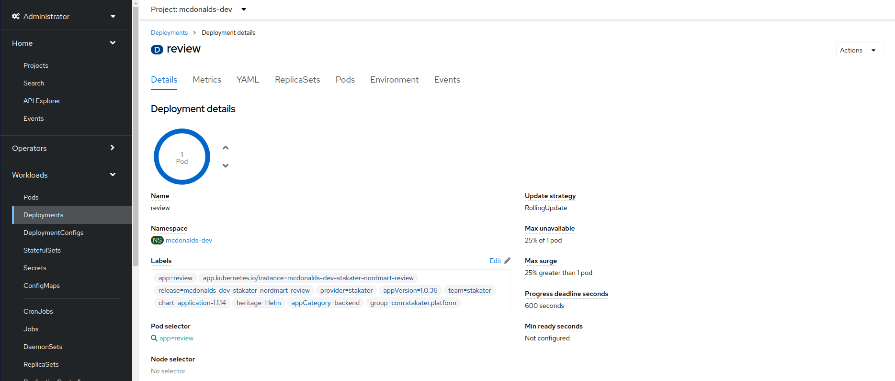
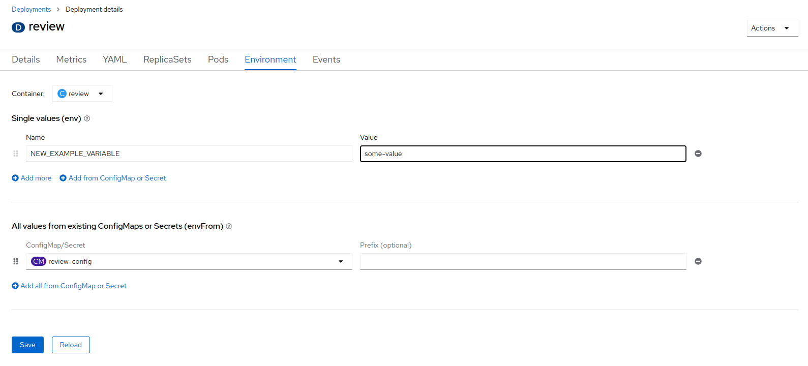

## Validate our GitOps
> GitOps is a simple process of managing all of your systems, environments, and applications via Git. Git represents the single source of truth for all your applications, your tooling, and even your clusters configuration. Changes to any of these things can be pull requested and discussed before an automated process applies them! Let's try it out - In this exercise we'll make a manual change in the OpenShift UI and have it overwritten - Go GitOps 💪

1. In OpenShift UI, go to your `<TENANT_NAME>-dev` project. Navigate to `Workloads` > `Deployments` > Click on one of the `Deployments`.

    

2. On the `Environment` tab, add a new key-value pair. For example:  

`NEW_EXAMPLE_VARIABLE` with a value of `some-value`. Hit `Save`

   

    
    If you wait a few seconds (or if like me you're lazy, you can spam refresh on the page)

    Look at that! The `NEW_EXAMPLE_VARIABLE` has disappeared!!!!

    That's right, they've been over written by ArgoCD who's taken the configuration in git and applied it on top. The `NEW_EXAMPLE_VARIABLE` was **not** in git, so it was removed. If we want to persist the variable, we can of course add it to out git repo!

🪄🪄 You've just experienced how great and powerful the GitOps is! Let's advance to see how we utilize it in our application development! 🪄🪄
