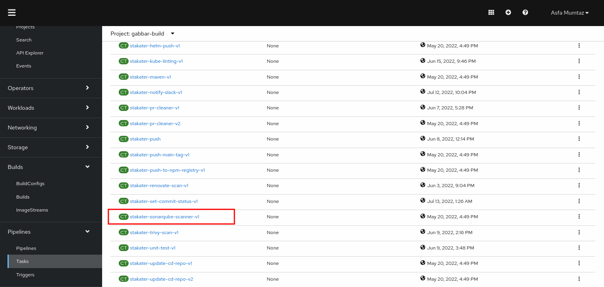
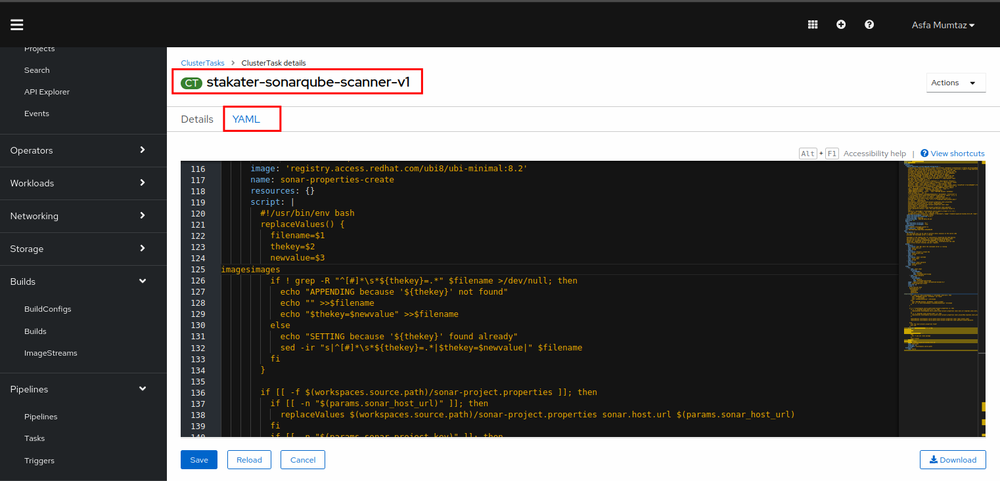

# Sonar Scanning

> Sonarqube is a tool that performs static code analysis. It looks for pitfalls in coding and reports them. It's great tool for catching vulnerabilities!
> SAAP cluster comes shipped with sonarqube. 
## Task

## Deploy Sonarqube using GitOps

In this section we are going to improve our already built `main-pr-v1` pipeline and add sonarqube scaning to it. 
The SAAP cluster is shipped with many useful predefined cluster tasks. A sonarqube cluster task is also present amongst these tasks. We will use the same task and incorporate it in to our pipeline.

1. To view the already defined sonarqube cluster task, open up the `Pipelines` section from the left menu and cluck `Tasks`
   
    

2. Select `ClusterTasks`. A number of tasks will be displayed on your screen. Scroll down and select the task `stakater-sonarqube-scanner-v1`
   
   
3. CLick YAML to display the tasks definiation.
   

#### Integrate the pipeline with Tekton:
## TODO
- Configure your pipeline to run code analysis
   todo
- Configure your pipeline to check the quality gate
- Improve your application code quality 
- [tekton](3-revenge-of-the-automated-testing/1b-tekton.md)
