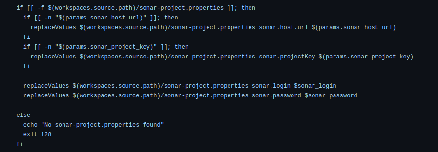
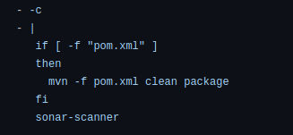

# Sonar Scanning

> SonarQube is a tool that performs static code analysis. It looks for pitfalls in coding and reports them. It's great tool for catching vulnerabilities!
> SAAP cluster comes shipped with SonarQube. 
## Task

## SAAP SonarQube Task

The SAAP cluster is shipped with many useful predefined cluster tasks. A SonarQube cluster task is also present amongst these tasks. We will use the same task and incorporate it in to our pipeline.

1. To view the already defined SonarQube cluster task, open up the `Pipelines` section from the left menu and click `Tasks`

   
    

2. Select `ClusterTasks`. A number of tasks will be displayed on your screen. Type in `sonarqube` in the search box that is displayed.
   You will see a  `stakater-sonarqube-scanner-v1` task.

   
   
3. Click `YAML` to display the task definition.

   

SonarQube scanner requires `sonar-project.properties` file along with the source code for it to run.
The Nordmart projects already contain a sonar-project.properties file with dummy values. 

The SAAP SonarQube task has two steps:

* sonar-properties-create - The first step sets the properties in sonar-project.properties file. If the file is not found, it is skipped.
  
   
 

* sonar-scan - The task run sonar scanner on the code.

 

