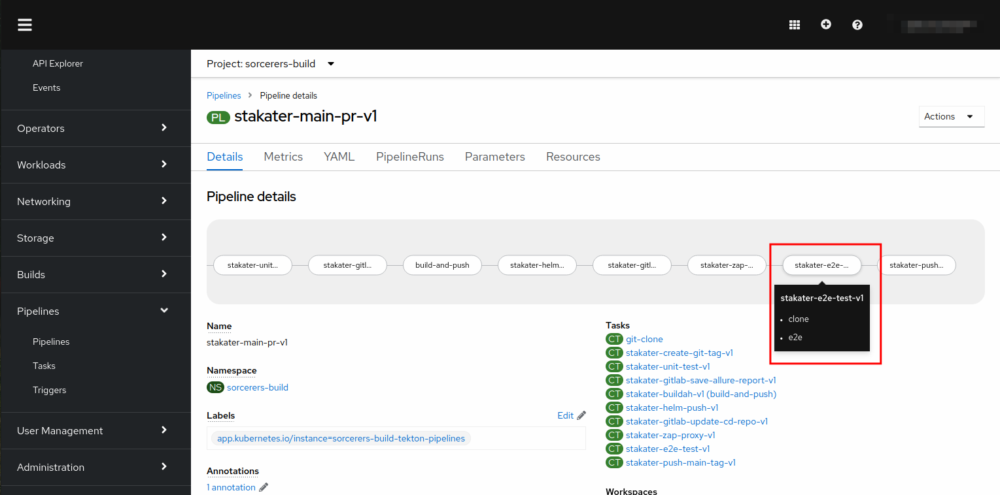

## Extend Tekton Pipeline with System Test

You will use the End-to-End systems tests task shipped with SAAP `stakater-e2e-test-v1` to test all the endpoints of our applications to ensure they are reachable and functioning as expected.

1. To add the Systems Tests task to your pipeline, open the `values.yaml` file containing our pipeline definitions with your preferred editor.

2. After the `stakater-create-enviroment-v1` task, add the following task.

    ````yaml   
     - defaultTaskName: stakater-e2e-test-v1
       params:
         - name: namespace
    ````              


3. Your pipeline will now have the following tasks.

   ```yaml
   apiVersion: v2
   pipeline-charts:
      name: stakater-main-pr-v1
      workspaces:
      - name: source
        volumeClaimTemplate:
          accessModes: ReadWriteOnce
          resourcesRequestsStorage: 1Gi
      pipelines:
        tasks:
          - defaultTaskName: git-clone
          - defaultTaskName: stakater-create-git-tag-v1
          - defaultTaskName: stakater-buildah-v1
            params:
              - name: BUILD_IMAGE
                value: "true"
            name: build-and-push
          - defaultTaskName: stakater-helm-push-v1
          - defaultTaskName: stakater-create-environment-v1
          - defaultTaskName: stakater-e2e-test-v1
            params:
              - name: namespace
          - defaultTaskName: stakater-gitlab-update-cd-repo-v1
            params:
              - name: gitlab_group
          - defaultTaskName: stakater-push-main-tag-v1
      triggertemplate:
           pipelineRunNamePrefix: $(tt.params.repoName)-$(tt.params.prnumberBranch)
           params:
             - name: repoName
             - name: prnumberBranch
               default: "main"
      eventlistener:
        triggers:               
          - name: gitlab-mergerequest-create
            bindings:
              - ref: stakater-gitlab-merge-request-v1
              - name: oldcommit
                value: "NA"
              - name: newcommit
                value: $(body.object_attributes.last_commit.id)
          - name: gitlab-mergerequest-synchronize
            bindings:
              - ref: stakater-gitlab-merge-request-v1
              - name: oldcommit
                value: $(body.object_attributes.oldrev)
              - name: newcommit
                value: $(body.object_attributes.last_commit.id)
          - name: gitlab-push
            bindings:
              - ref: stakater-gitlab-push-v1
              - name: oldcommit
                value: $(body.before)
              - name: newcommit
                value: $(body.after)
      rbac:
        enabled: false
      serviceAccount:
        name: stakater-workshop-tekton-builder
        create: false
    ```
    

4. Commit your changes. You will be able to see your newly added task from your `OpenShift Console` thanks to your GitOps workflow with ArgoCD.

 

5. Let's run end to end test on `stakater-nordmart-review-ui`. Trigger the pipeline by making a change in the `stakter-nordmart-revoew-ui` project

6. You will see the e2e task running.

You have successfully added End-to-End testing in your pipeline.
