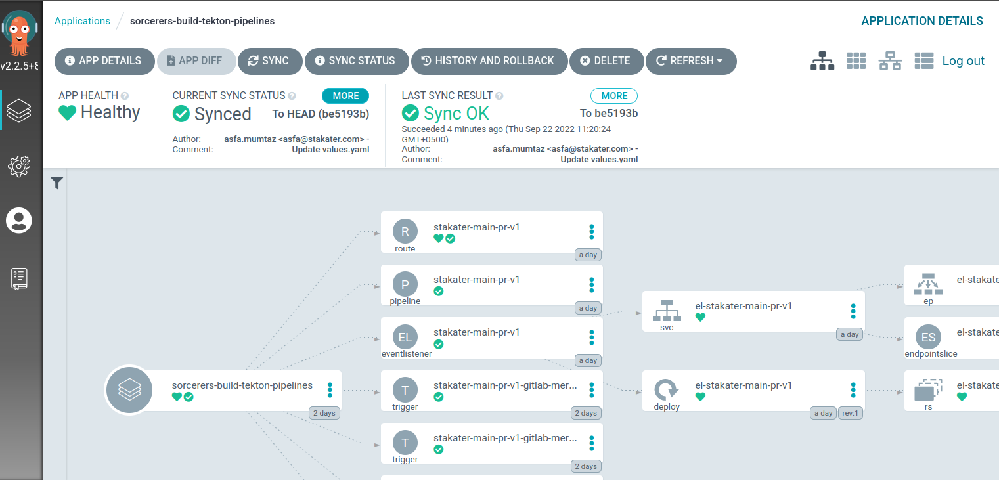
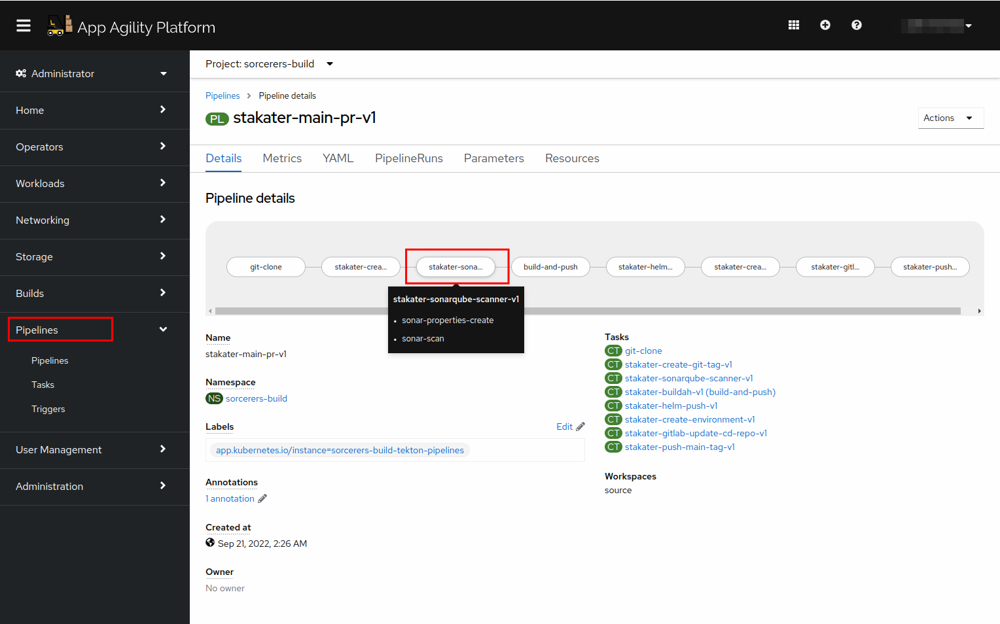
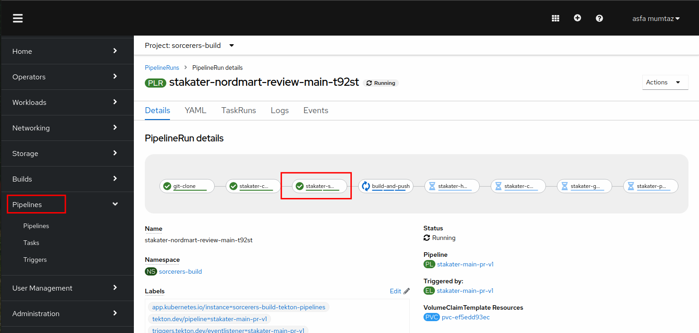

## Extend Tekton Pipeline with Sonar Scanning

> In this section we are going to improve our already built pipeline and add sonarqube scanning to it.


1. Open the Chart we added to 00-tekton-pipelines folder in section 2.

2. Open the values file in the editor. After the `stakater-create-git-tag-v1`, reference the sonarqube task and add a runAfter field to make it run after the create-git-tag-v1 task:

```
- defaultTaskName: stakater-sonarqube-scanner-v1
  runAfter:
    - stakater-create-git-tag-v1

```
The pipeline will now become:
   ````
   apiVersion: v2
   pipeline-charts:
      name: stakater-main-pr-v1
      workspaces:
      - name: source
        volumeClaimTemplate:
          accessModes: ReadWriteOnce
          resourcesRequestsStorage: 1Gi
     pipelines:
       tasks:
         - defaultTaskName: git-clone
         - defaultTaskName: stakater-create-git-tag-v1
         - defaultTaskName: stakater-sonarqube-scanner-v1
           runAfter:
             - stakater-create-git-tag-v1
         - defaultTaskName: stakater-buildah-v1
           name: build-and-push
              params:
               - name: BUILD_IMAGE
                 value: "true"
         - defaultTaskName: stakater-helm-push-v1
         - defaultTaskName: stakater-create-environment-v1
         - defaultTaskName: stakater-gitlab-update-cd-repo-v1
           params: 
             - name: gitlab_group
         - defaultTaskName: stakater-push-main-tag-v1
     triggertemplate:
           serviceAccountName: stakater-workshop-tekton-builder
           pipelineRunNamePrefix: $(tt.params.repoName)-$(tt.params.prnumberBranch)
           params:
             - name: repoName
             - name: prnumberBranch
               default: "main"
     eventlistener:
           serviceAccountName: stakater-workshop-tekton-builder
           triggers:
           - name: gitlab-mergerequest-create
             bindings:
               - ref: stakater-gitlab-merge-request-v1
               - name: oldcommit
                 value: "NA"
               - name: newcommit
                 value: $(body.object_attributes.last_commit.id)
           - name: gitlab-mergerequest-synchronize
             bindings:
               - ref: stakater-gitlab-merge-request-v1
               - name: oldcommit
                 value: $(body.object_attributes.oldrev)
               - name: newcommit
                 value: $(body.object_attributes.last_commit.id)
           - name: gitlab-push
             bindings:
               - name: newcommit
                 value: $(body.after)
               - name: oldcommit
                 value: $(body.before)
               - ref: stakater-gitlab-push-v1
     rbac:
         enabled: false
     serviceAccount:
         name: stakater-workshop-tekton-builder
         create: false

````
4. Commit the changes.


5. Now open Argocd and check if the changes were synchronized. Click refresh if argocd has not synced the changes yet.


   
Open up the console and navigate to your pipeline definition by going to `Pipelines` and selecting your pipeline from the list. You should see a sonarqube task there as well.




6. If the sync is green, you're good to go. You have successfully added sonarqube to your pipeline!

7. Now make a small change on the nordmart-review application to trigger the pipeline. Head over to the console and check the running pipeline. You should be able to see sonarqube task running.



8. Once the task completes, head over to `sonarqube` by opening the following url.

```
https://sonarqube-stakater-sonarqube.apps.devtest.vxdqgl7u.kubeapp.cloud/
```
It will take you to the projects page. You should be able to see nordmart-review project in the console. 


CONGRATULATIONS!!! Sonarqube scanning is now integrated into your pipelines.