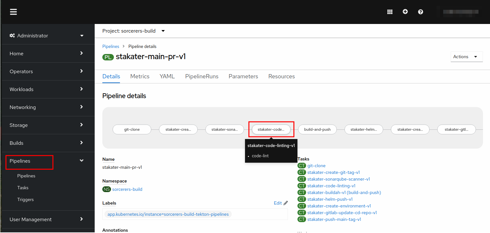
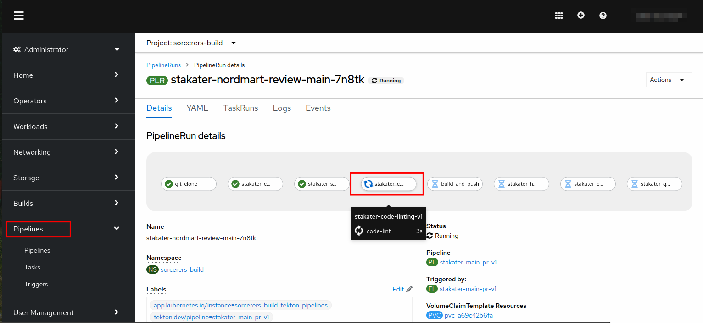
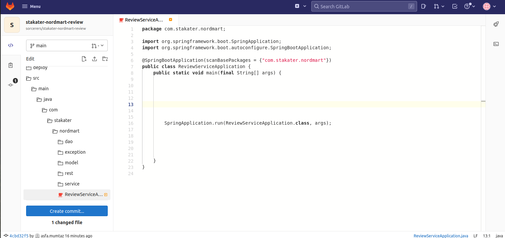
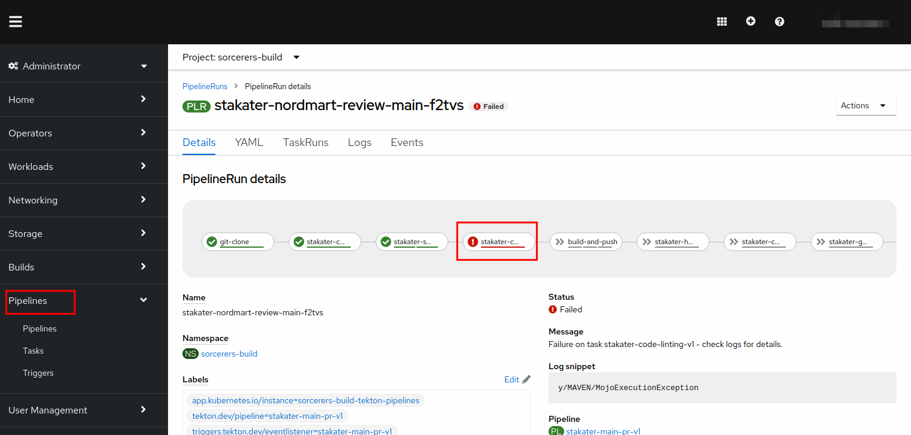

## Extend Tekton Pipeline with Code Linting Task

## Integrate the pipeline with Tekton:
1. Open the Chart we added to 00-tekton-pipelines folder in section 2.
  
  
2. Open the values file in the editor. After the `stakater-sonarqube-scanner-v1`, reference the code-linting task and add a runAfter field to make it run after the stakater-sonarqube-scanner-v1 task:

```
- defaultTaskName: stakater-code-linting-v1
  runAfter:
    - stakater-sonarqube-scanner-v1

```
The pipeline will now become:
   ````
   apiVersion: v2
   pipeline-charts:
     name: stakater-main-pr-v1
     workspaces:
     - name: source
       volumeClaimTemplate:
         accessModes: ReadWriteOnce
         resourcesRequestsStorage: 1Gi
     pipelines:
       tasks:
         - defaultTaskName: git-clone
         - defaultTaskName: stakater-create-git-tag-v1
         - defaultTaskName: stakater-sonarqube-scanner-v1
           runAfter:
             - stakater-create-git-tag-v1
         - defaultTaskName: stakater-code-linting-v1
           runAfter:
            - stakater-sonarqube-scanner-v1
         - defaultTaskName: stakater-buildah-v1
           name: build-and-push
              params:
               - name: BUILD_IMAGE
                 value: "true"
         - defaultTaskName: stakater-helm-push-v1
         - defaultTaskName: stakater-create-environment-v1
         - defaultTaskName: stakater-gitlab-update-cd-repo-v1
           params: 
             - name: gitlab_group
         - defaultTaskName: stakater-push-main-tag-v1
     triggertemplate:
         serviceAccountName: stakater-workshop-tekton-builder
         pipelineRunNamePrefix: $(tt.params.repoName)-$(tt.params.prnumberBranch)
         params:
           - name: repoName
           - name: prnumberBranch
             default: "main"
     eventlistener:
         serviceAccountName: stakater-workshop-tekton-builder
         triggers:
         - name: gitlab-mergerequest-create
           bindings:
             - ref: stakater-gitlab-merge-request-v1
             - name: oldcommit
               value: "NA"
             - name: newcommit
               value: $(body.object_attributes.last_commit.id)
         - name: gitlab-mergerequest-synchronize
           bindings:
             - ref: stakater-gitlab-merge-request-v1
             - name: oldcommit
               value: $(body.object_attributes.oldrev)
             - name: newcommit
               value: $(body.object_attributes.last_commit.id)
         - name: gitlab-push
           bindings:
             - name: newcommit
               value: $(body.after)
             - name: oldcommit
               value: $(body.before)
             - ref: stakater-gitlab-push-v1
     rbac:
       enabled: false
     serviceAccount:
       name: stakater-workshop-tekton-builder
        create: false

````
4. Commit the changes.

5. Now open Argocd and check if the changes were synchronized. If the sync is green, you're good to go. You have successfully added code-linting to your pipeline


6. Open up the console and navigate to your pipeline definition by going to Pipelines and selecting your pipeline from the list. You should see a sonarqube task there as well.

   

7. Now make a small change on the nordmart-review application to trigger the pipeline. Add an extra line at the end of pom.xml. This should not appear as a code linting issue. Commit the change and head over to the console and check the running pipeline. You should be able to see code-lint task running.

   


8. Let try to fail code linting now. Open up the nordmart review application and navigate to` src > main > java > com > stakater > nordmart` and open `ReviewServiceApplication.java`. Add 5-6 extra lines in the main function. This is a linting issue so it should cause the code lint task to fail. Commit the change.

   


9. Head over to the console and check the pipeline run. It should fail on the code linting task.


   
