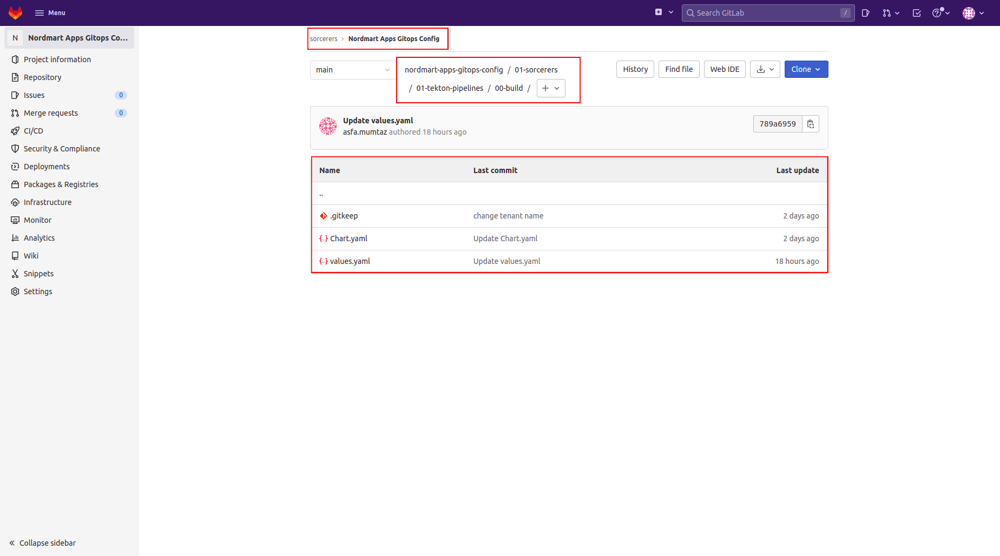
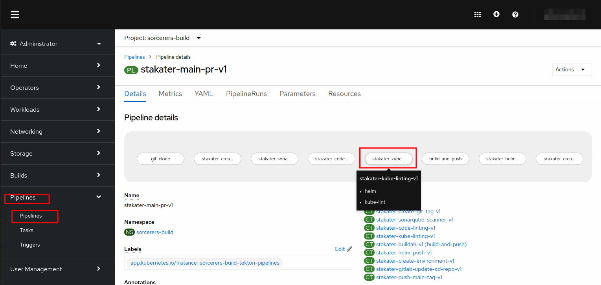
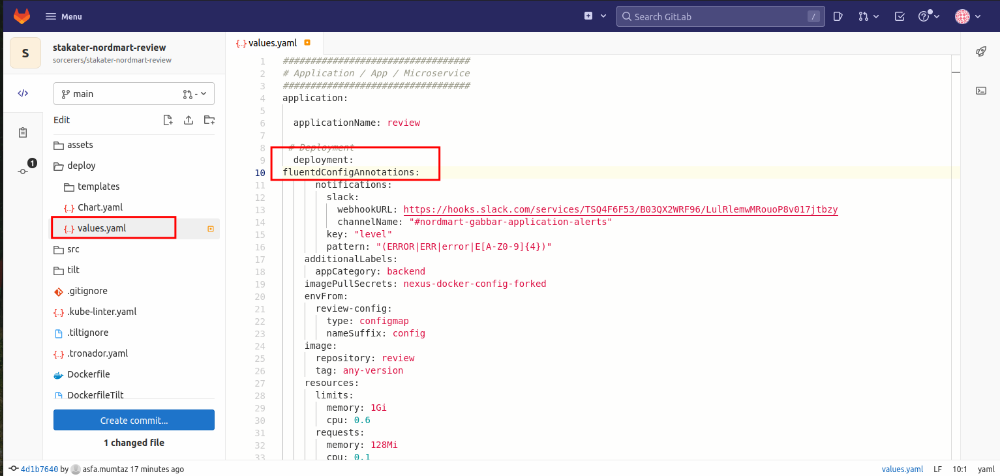
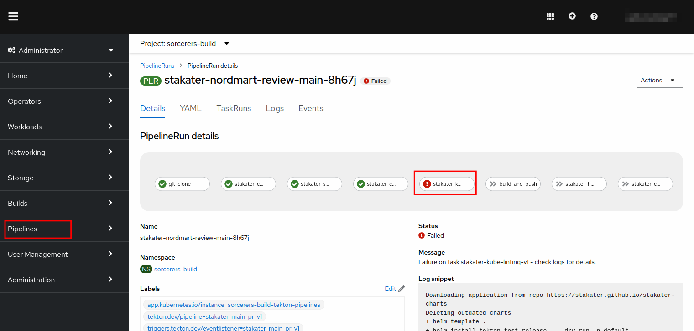

# Extend Tekton Pipeline with `Kube Linting` Task

Let's enable the **`kube-linter`** task in our pipeline.

1. Open the Chart we added to `00-tekton-pipelines` folder in section 2.
  

2. Open the values file in the editor. After the `stakater-code-linting-v1`, reference the `kube-linting` task and add a `runAfter` field to make it run after the stakater-code-linting-v1 task:

```
- taskName: stakater-kube-linting-v1
  runAfter:
    - stakater-code-linting-v1
  params:
    - name: namespace

```
The pipeline will now become:
   ````
   apiVersion: v2
   pipeline-charts:
     name: stakater-main-pr-v1
     workspaces:
     - name: source
       volumeClaimTemplate:
         accessModes: ReadWriteOnce
         resourcesRequestsStorage: 1Gi
     pipelines:
       tasks:
         - defaultTaskName: git-clone
         - defaultTaskName: stakater-create-git-tag-v1
         - defaultTaskName: stakater-sonarqube-scanner-v1
           runAfter:
             - stakater-create-git-tag-v1
         - defaultTaskName: stakater-code-lint-v1
           runAfter:
            - stakater-sonarqube-scanner-v1
         - defaultTaskName: stakater-kube-linting-v1
           runAfter:
            - stakater-code-linting-v1
            params:
              - name: namespace
         - defaultTaskName: stakater-buildah-v1
           name: build-and-push
           runAfter:
            - stakater-build-image-flag-v1
              params:
               - name: BUILD_IMAGE
                 value: "true"
         - defaultTaskName: stakater-helm-push-v1
         - defaultTaskName: stakater-create-environment-v1
         - defaultTaskName: stakater-gitlab-update-cd-repo-v1
           params: 
             - name: gitlab_group
         - defaultTaskName: stakater-push-main-tag-v1
     triggertemplate:
         serviceAccountName: stakater-workshop-tekton-builder
         pipelineRunNamePrefix: $(tt.params.repoName)-$(tt.params.prnumberBranch)
     eventlistener:
         serviceAccountName: stakater-workshop-tekton-builder
         triggers:
         - name: gitlab-mergerequest-create
           bindings:
             - ref: stakater-gitlab-merge-request-v1
             - name: oldcommit
               value: "NA"
             - name: newcommit
               value: $(body.object_attributes.last_commit.id)
         - name: gitlab-mergerequest-synchronize
           bindings:
             - ref: stakater-gitlab-merge-request-v1
             - name: oldcommit
               value: $(body.object_attributes.oldrev)
             - name: newcommit
               value: $(body.object_attributes.last_commit.id)
         - name: gitlab-push
           bindings:
             - name: newcommit
               value: $(body.after)
             - name: oldcommit
               value: $(body.before)
             - ref: stakater-gitlab-push-v1
     rbac:
        enabled: false
     serviceAccount:
        name: stakater-workshop-tekton-builder
        create: false

````
4. Commit the changes

5. Now open ArgoCD and check if the changes were synchronized. If the sync is green, you're good to go. You have successfully added code-linting to your pipeline


5. If the sync is green, you're good to go. You have successfully added `kube-linting` to your pipeline.

6. Open up the console and navigate to your pipeline definition by going to Pipelines and selecting your pipeline from the list. You should see a SonarQube task there as well.

   

7. Trigger the pipeline by making a small change in the `nordmart-review` application and head over to the OpenShift console to see the pipeline run.


8. Let's try to fail code linting now. Open up the `nordmart-review` application and navigate to `deploy` and open `values.yaml`. Add incorrect indentation . Commit the change.
   This should make the `kube-linting` task to fail.





