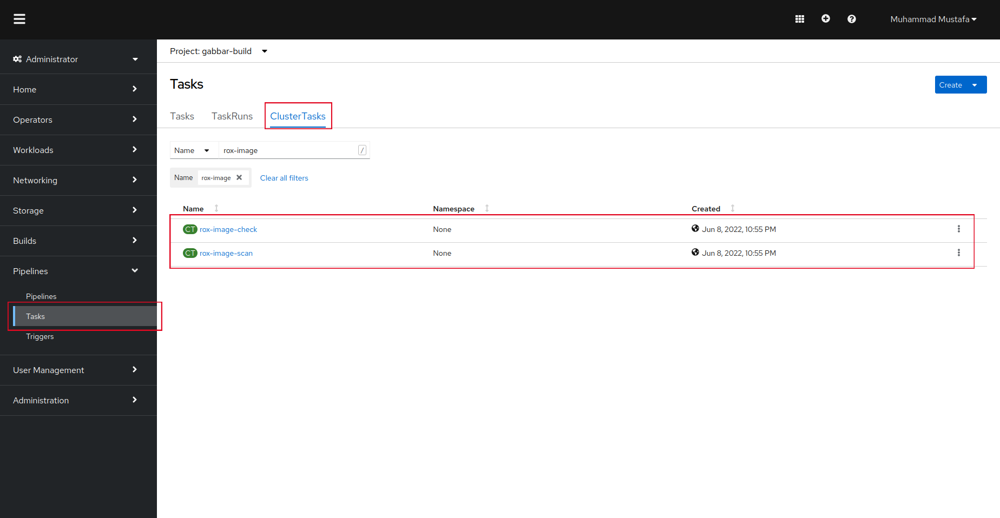
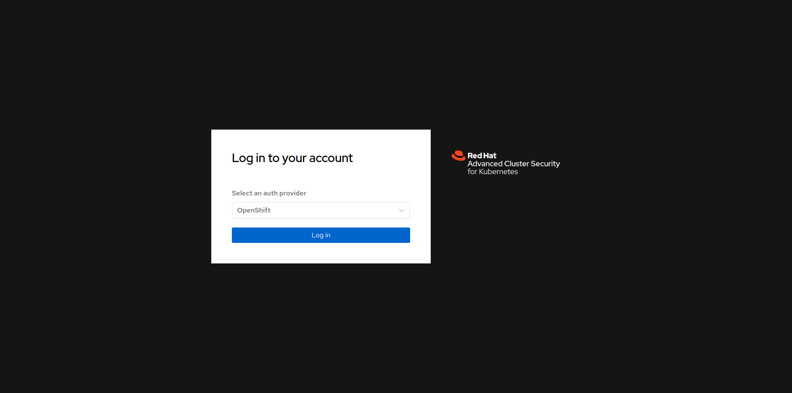
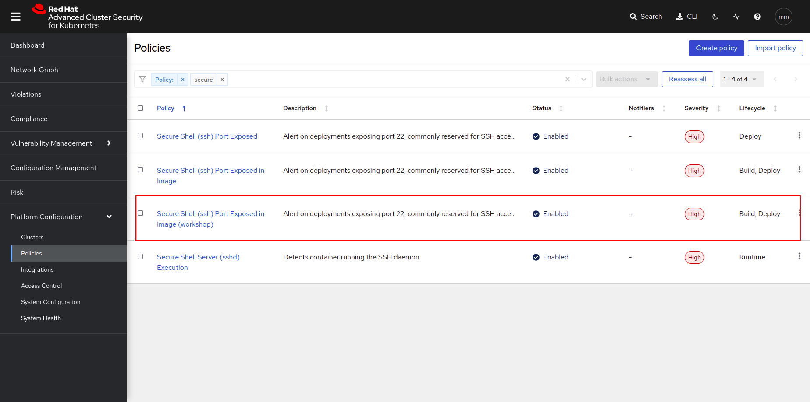

# Image Security (`Stack Rox`)

> We use some ready container images to build our own application images. We use them as base and add our app binaries, or install packages on top of them. We need to protect our containers from errors and vulnerabilities in public registry images, or outdated packages and libraries. Image security step in our pipeline helps us to discover them before moving images to production.

## Task

## SAAP Image Security:

SAAP cluster is shipped with a two image security tasks **`rox image scan`** to `scan` images for CVE/CVSS and **`rox image check`** to `check` build time policy violations using **ACS**

> StackRox / Advanced Cluster Security (ACS) performs a risk analysis of the container environment, delivers visibility and runtime alerts, and provides recommendations to proactively improve security by hardening the environment. 

Lets view this task in our cluster:

1. To view the already defined Image Scanning/Checking Cluster Task, Open up the `Pipelines` section from the left menu and click `Tasks`

   
    
2. Select `ClusterTasks`. A number of tasks will be displayed on your screen. Type in `rox-image-scan` in the search box that is displayed.
   You will see a  `rox-image-scan` task. Click to view details.

   
   
3. Click `YAML` to display the task definition.

    
    

## Access StackRox

StackRox / Advanced Cluster Security (ACS) is deployed once at the cluster scope. It can be used to monitor multiple clusters. The ACS/StackRox operator is already deployed and configured in the cluster for you.

Below is the URL to ACS (Available on Forecastle UI):

> Red Hat ACS UI: **`https://central-stakater-stackrox.apps.devtest.vxdqgl7u.kubeapp.cloud/login`**

1. Navigate to the Red Hat ACS via the URL above and select OpenShift as Auth Provider. Login via `workshop` SSO flow.

    

2. Browse to the `Platform Configuration` > `Policies` view. Type in and select `Policy` and then `secure shell`, select the `Secure Shell (ssh) Port Exposed in Image` policy.

    

3. This policy identifies image build violations and fails whenever we expose ssh port. We will expose port 22 in our application dockerfile and image check scan in our pipeline in the next section.

### Integrate the pipeline with Tekton:

Now we can use ACS to help move security **LEFT** in our build pipeline. In each group we will do the following:

- Configure your pipeline to `check` build time policy violations 
- Configure your pipeline to `scan` images for CVE/CVSS
- Break/Fix your pipeline

