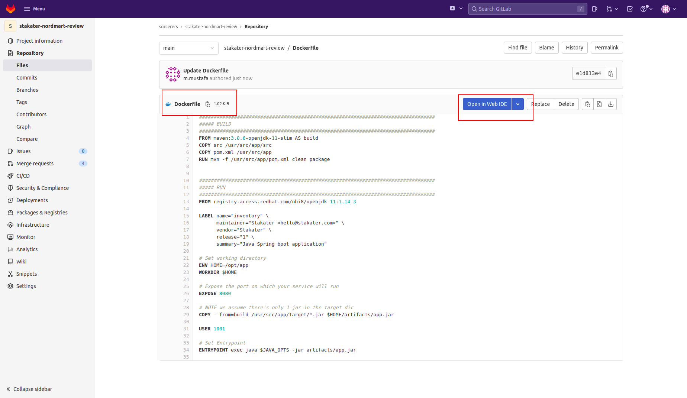
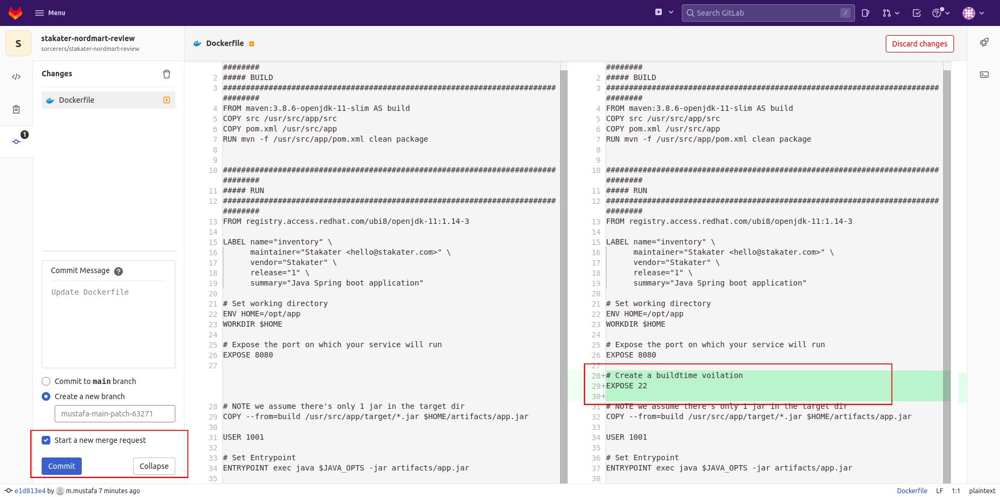

# Extend Tekton Pipeline with Stackrox (WIP)

## Integrate Rox Image Scan into pipeline
> With **StackRox**, you can analyze images for vulnerabilities. Scanner analyzes all image layers to check for known vulnerabilities by comparing them with the Common Vulnerabilities and Exposures (CVEs) list using **rox-image-scan**. You can also Check Build/Deploy Time Violations using **rox-image-check**

In this section we are going to improve our already built `main-pr-v1` pipeline and add Rox Image Scan task into the pipeline.  
The SAAP cluster is shipped with many useful predefined cluster tasks. 
Lets add two tasks into our pipeline  **rox-image-scan** and **rox-image-check**. 

1. Open the Chart we added to 00-tekton-pipelines folder in section 2.
  

2. Open the `values.yaml` file in the editor. After the `build-and-push`, reference the rox-image-scan task. 

    ```
    - taskName: rox-image-check
    - taskName: rox-image-scan
    ```

    The pipeline will now become:
    <div class="highlight" style="background: #f7f7f7">
    <pre><code class="language-yaml">
    pipeline-charts:
        name: stakater-main-pr-v1
        workspaces:
        - name: source
          volumeClaimTemplate:
          accessModes: ReadWriteOnce
          resourcesRequestsStorage: 1Gi
      pipelines:
        tasks:
          - taskName: git-clone
          - taskName: stakater-create-git-tag-v1
            params:
              - name: oldcommit
              - name: action
          - taskName: stakater-sonarqube-scanner-v1
          - taskName: stakater-buildah-v1
            name: build-and-push
                params:
                - name: BUILD_IMAGE
                  value: "true"
          <span style="color:orange"># Add rox-image-scan after build-and-push
          - taskName: rox-image-check
          - taskName: rox-image-scan
          # End</span>
          - taskName: stakater-comment-on-github-pr-v1
          - taskName: stakater-helm-push-v1
          - taskName: stakater-update-cd-repo-v3
          - taskName: stakater-push-main-tag-v1
        eventlistener:
            serviceAccountName: stakater-tekton-builder
            triggers:
            - name: pullrequest-create
              bindings:
                - ref: stakater-pr-v1
                - name: oldcommit
                  value: "NA"
                - name: newcommit
                  value: $(body.object_attributes.last_commit.id)
            - name: pullrequest-synchronize
              bindings:
                - ref: stakater-pr-v1
                - name: oldcommit
                  value: $(body.object_attributes.oldrev)
                - name: newcommit
                  value: $(body.object_attributes.last_commit.id)
            - name: push
              bindings:
                - name: newcommit
                  value: $(body.after)
                - name: oldcommit
                  value: $(body.before)
                - ref: stakater-pr-v1
                  kind: ClusterTriggerBinding
            - name: stakater-pr-cleaner-v2-pullrequest-merge
              create: false
        rbac:
          enabled: false
        serviceAccount:
          name: stakater-tekton-builder
          create: false
    </code></pre></div>
3. Now open Argocd and check if the changes were synchronized.

    
    


4. If the sync is green, you're good to go. You have successfully added rox-image-scan to your pipeline!
    TODO: See Pipeline

🪄🪄 Observe the **stakater-nordmart-review** pipeline running with the **rox-image-scan** & **rox-image-check** task.🪄🪄

🩴🔑🐉

## Breaking the Build

Let's run through a scenario where we break/fix the build using a build policy violation.

1. Let's try breaking a *Build Policy* within ACS by triggering the *Build* policy we viewed earlier. We will create a merge request for our code repo and see what happens when its pipeline runs.

2. Open the <GROUP_NAME>/stakater-nordmart-review repository on gitlab. Edit the Dockerfile.

    

3. Edit the `Dockerfile` and add the following line under `EXPOSE 8080`

    ```bash
    EXPOSE 22
    ```
    Commit this change with `Start with Merge Request` option checked.
    

4. Navigate to the UI, Goto Pipelines under Piplines section in sidebar and open the pipeline for your merge request.

4. This should now fail on the **image-scan/rox-image-check** task.  

    ## TODO Replace Screenshot
    

5. Back in ACS we can also see the failure in the *Violations* view.  

    

6. Remove the `EXPOSE 22` from the `Dockerfile` in the same merge request branch and the pipeline will succeed.

🪄🪄 Observe the **stakater-nordmart-review** pipeline running successfully again 🪄🪄
