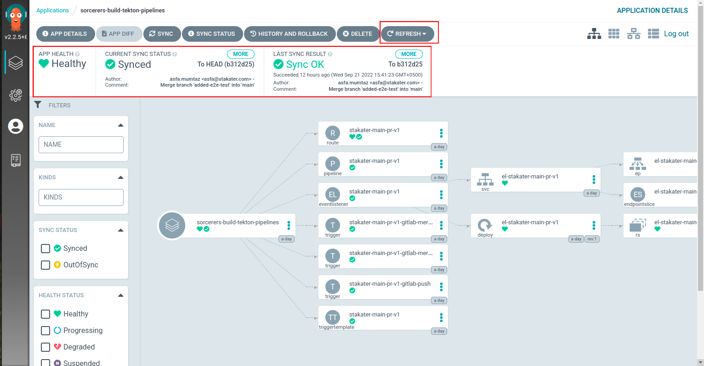
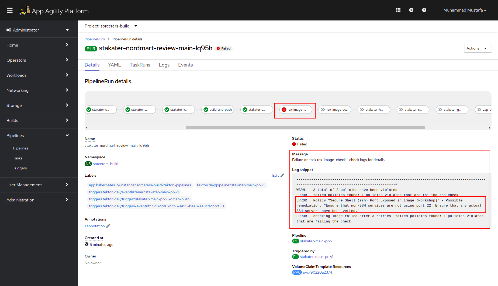
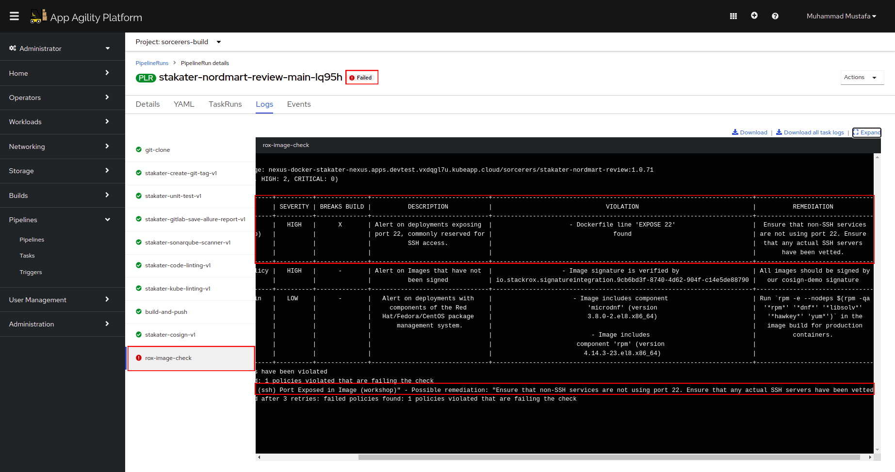

# Extend Tekton Pipeline with StackRox

## Integrate `Rox Image Scan` into your pipeline
> With **StackRox**, you can analyze images for vulnerabilities. Scanner analyzes all image layers to check for known vulnerabilities by comparing them with the Common Vulnerabilities and Exposures (CVEs) list using **`rox-image-scan`**. You can also Check Build/Deploy Time Violations using **`rox-image-check`**.

In this section we are going to improve our already built `main-pr-v1` pipeline and add `Rox Image Scan` task into the pipeline.  
The SAAP cluster is shipped with many useful predefined cluster tasks. 
Lets add two tasks into our pipeline **`rox-image-scan`** and **`rox-image-check`**. 

1. Open the chart directory found in GitLab at `<TENANT_NAME>/nordmart-apps-gitops-config/01-<TENANT_NAME>/01-tekton-pipelines/00-build/`

  

2. Open the `values.yaml` file in the editor. After the `build-and-push`, reference the `rox-image-scan` task. 

    ```yaml
    - defaultTaskName: rox-image-check
    - defaultTaskName: rox-image-scan
    ```


The pipeline will now become:
   ```yaml
pipeline-charts:
  name: stakater-main-pr-v1
  workspaces:
  - name: source
    volumeClaimTemplate:
      accessModes: ReadWriteOnce
      resourcesRequestsStorage: 1Gi
  pipelines:
    tasks:
      - defaultTaskName: git-clone
      - defaultTaskName: stakater-create-git-tag-v1
      - defaultTaskName: stakater-sonarqube-scanner-v1
        runAfter:
          - stakater-create-git-tag-v1
      - defaultTaskName: stakater-unit-test-v1
        runAfter:
          - stakater-sonarqube-scanner-v1
      - defaultTaskName: stakater-gitlab-save-allure-report-v1
      - defaultTaskName: stakater-code-linting-v1
      - defaultTaskName: stakater-kube-linting-v1
        runAfter:
         - stakater-code-linting-v1
        params:
          - name: namespace
      - defaultTaskName: stakater-buildah-v1
        name: build-and-push
        params:
          - name: BUILD_IMAGE
            value: "true"
      - defaultTaskName: rox-image-check
      - defaultTaskName: rox-image-scan
      - defaultTaskName: stakater-helm-push-v1
      - defaultTaskName: stakater-create-environment-v1
      - defaultTaskName: stakater-gitlab-update-cd-repo-v1
        params:
          - name: gitlab_group
      - defaultTaskName: stakater-zap-proxy-v1
        params:
          - name: app_url
            value: "https://review-meow-dev.apps.devtest.vxdqgl7u.kubeapp.cloud"
          - name: allure_host
            value: "https://meow-dev-allure-meow-dev.apps.devtest.vxdqgl7u.kubeapp.cloud"
      - defaultTaskName: stakater-push-main-tag-v1
  triggertemplate:
      serviceAccountName: stakater-workshop-tekton-builder
      pipelineRunNamePrefix: $(tt.params.repoName)-$(tt.params.prnumberBranch)
      params:
        - name: repoName
        - name: prnumberBranch
          default: "main"
  eventlistener:
      serviceAccountName: stakater-workshop-tekton-builder
      triggers:
      - name: gitlab-mergerequest-create
        bindings:
          - ref: stakater-gitlab-merge-request-v1
          - name: oldcommit
            value: "NA"
          - name: newcommit
            value: $(body.object_attributes.last_commit.id)
      - name: gitlab-mergerequest-synchronize
        bindings:
          - ref: stakater-gitlab-merge-request-v1
          - name: oldcommit
            value: $(body.object_attributes.oldrev)
          - name: newcommit
            value: $(body.object_attributes.last_commit.id)
      - name: gitlab-push
        bindings:
          - name: newcommit
            value: $(body.after)
          - name: oldcommit
            value: $(body.before)
          - ref: stakater-gitlab-push-v1
  rbac:
    enabled: false
  serviceAccount:
    name: stakater-workshop-tekton-builder
    create: false
  ```
3. Now open ArgoCD and check if the changes were synchronized.

    
    


4. If the sync is green, you're good to go. You have successfully added `rox-image-scan` to your pipeline!

🪄🪄 Observe the **`stakater-nordmart-review`** pipeline running with the **`rox-image-scan`** & **`rox-image-check`** task.🪄🪄

🩴🔑🐉

## Breaking the Build

Let's run through a scenario where we break/fix the build using a build policy violation.

1. Let's try breaking a *Build Policy* within ACS by triggering the *Build* policy we viewed earlier. We will create a merge request for our code repo and see what happens when its pipeline runs.

2. Open the `<TENANT_NAME>/stakater-nordmart-review` repository on GitLab. Edit the `Dockerfile`.

    

3. Edit the `Dockerfile` and add the following line under `EXPOSE 8080`

    ```bash
    EXPOSE 22
    ```
    Commit this change with `Start with Merge Request` option checked.
    

4. Navigate to the UI, go to Pipelines under Pipelines section in sidebar and open the pipeline for your merge request.

4. This should now fail on the **image-scan/rox-image-check** task.  

    
    

5. Remove the `EXPOSE 22` from the `Dockerfile` in the same merge request branch and the pipeline will succeed.

🪄🪄 Observe the **`stakater-nordmart-review`** pipeline running successfully again 🪄🪄
