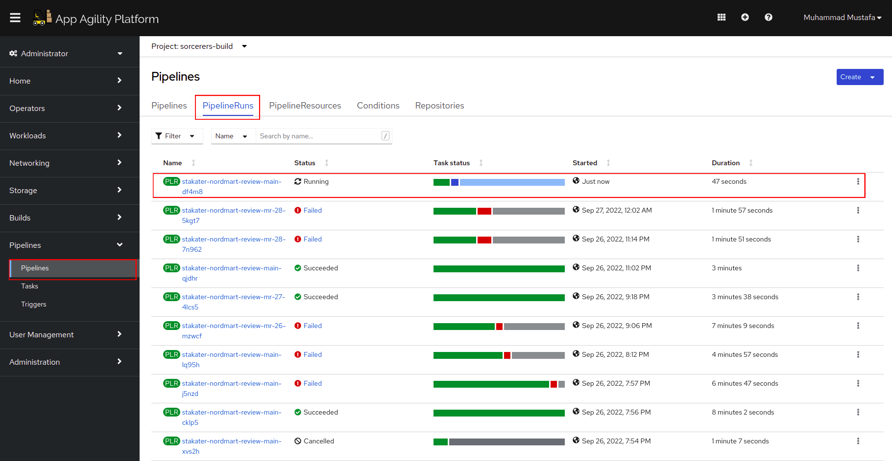
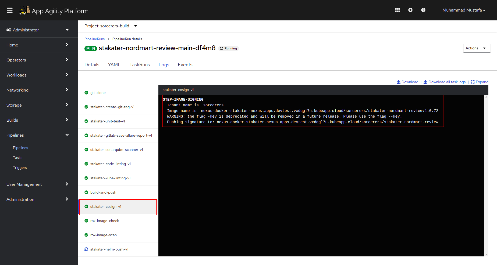
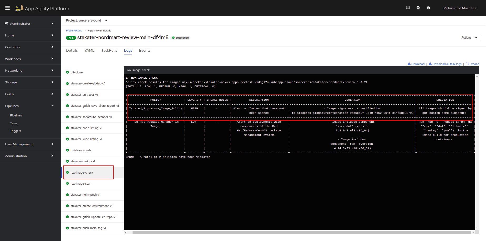
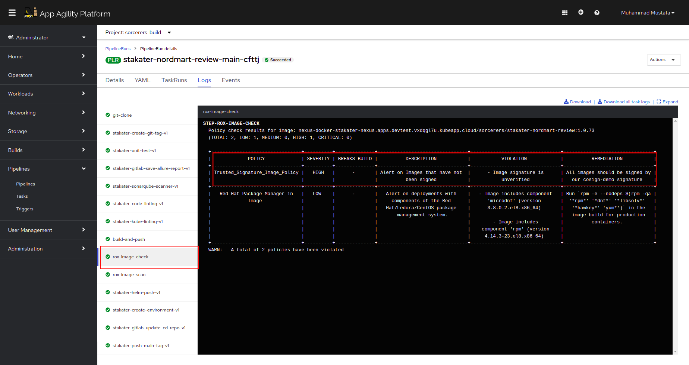

## Extend Tekton Pipeline with Image Signing

## Integrate `stakater-cosign-v1` into your pipeline

In this section we are going to improve our already built `main-pr-v1` pipeline and add `stakater-cosign-v1` task into the pipeline.  


1. Open the chart directory found in GitLab at `<TENANT_NAME>/nordmart-apps-gitops-config/01-<TENANT_NAME>/01-tekton-pipelines/00-build/`

    

2. Open the `values.yaml` file in the editor. After the `build-and-push`, reference the `stakater-cosign-v1` task. 

    ```yaml
    - defaultTaskName: stakater-cosign-v1
    ```


The pipeline will now become:
   ```yaml
   pipeline-charts:
     name: stakater-main-pr-v1
     workspaces:
     - name: source
       volumeClaimTemplate:
         accessModes: ReadWriteOnce
         resourcesRequestsStorage: 1Gi
     pipelines:
       tasks:
         - defaultTaskName: git-clone
         - defaultTaskName: stakater-create-git-tag-v1
         - defaultTaskName: stakater-sonarqube-scanner-v1
           runAfter:
             - stakater-create-git-tag-v1
         - defaultTaskName: stakater-unit-test-v1
           runAfter: 
             - stakater-sonarqube-scanner-v1
         - defaultTaskName: stakater-gitlab-save-allure-report-v1
         - defaultTaskName: stakater-code-linting-v1
         - defaultTaskName: stakater-kube-linting-v1
           runAfter:
            - stakater-code-linting-v1
           params:
             - name: namespace
         - defaultTaskName: stakater-buildah-v1
           name: build-and-push
           runAfter:
            - stakater-build-image-flag-v1
           params:
             - name: BUILD_IMAGE
               value: "true"
         - defaultTaskName: stakater-cosign-v1
         - defaultTaskName: rox-image-check
         - defaultTaskName: rox-image-scan
         - defaultTaskName: stakater-helm-push-v1
         - defaultTaskName: stakater-create-environment-v1
         - defaultTaskName: stakater-gitlab-update-cd-repo-v1
           params: 
             - name: gitlab_group
         - defaultTaskName: stakater-push-main-tag-v1
     triggertemplate:
         serviceAccountName: stakater-workshop-tekton-builder
         pipelineRunNamePrefix: $(tt.params.repoName)-$(tt.params.prnumberBranch)
     eventlistener:
         serviceAccountName: stakater-workshop-tekton-builder
         triggers:
         - name: gitlab-mergerequest-create
           bindings:
             - ref: stakater-gitlab-merge-request-v1
             - name: oldcommit
               value: "NA"
             - name: newcommit
               value: $(body.object_attributes.last_commit.id)
         - name: gitlab-mergerequest-synchronize
           bindings:
             - ref: stakater-gitlab-merge-request-v1
             - name: oldcommit
               value: $(body.object_attributes.oldrev)
             - name: newcommit
               value: $(body.object_attributes.last_commit.id)
         - name: gitlab-push
           bindings:
             - name: newcommit
               value: $(body.after)
             - name: oldcommit
               value: $(body.before)
             - ref: stakater-gitlab-push-v1
     rbac:
        enabled: false
     serviceAccount:
        name: stakater-workshop-tekton-builder
        create: false
  ```
3. Now open ArgoCD and check if the changes were synchronized.

    
    


4. If the sync is green, you're good to go. You have successfully added `stakater-cosign-v1` to your pipeline!

🪄🪄 Now lets observe the **`stakater-nordmart-review`** pipeline running successfully 🪄🪄

5. Lets trigger our pipeline again by making a commit onto README.md in the main branch. Open the pipeline on OpenShift console and view the pipeline running <TENANT_NAME>-build

    

6. View the task logs to see, if image was signed successfully.

    

7. We have also implemented a policy in Redhat ACS to make sure all images are signed by this particular key.
`rox-image-check` task we added to our pipeline in previous section shows image signature is verified.
Open the `rox-image-check` tasks logs. You ll see that our image is signed and verified by Redhat ACS.

    

    Otherwise it shows `Image signature is unverified`
      

🪄🪄 Your pipeline should run successfully if everything is fine 🪄🪄

