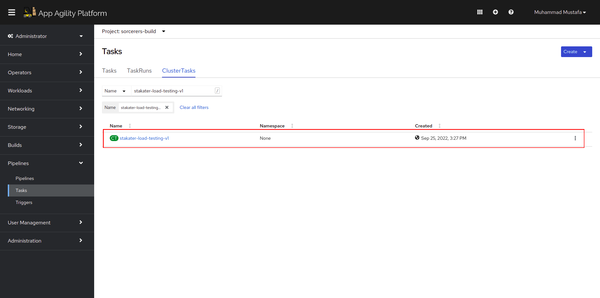
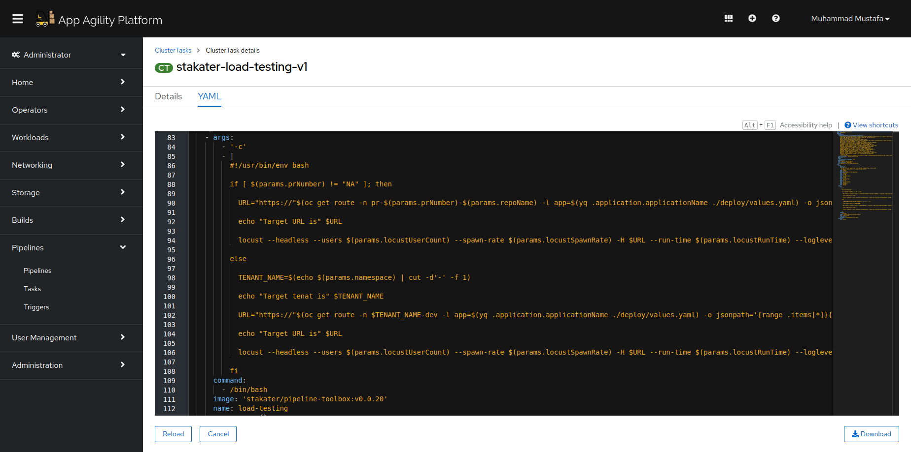
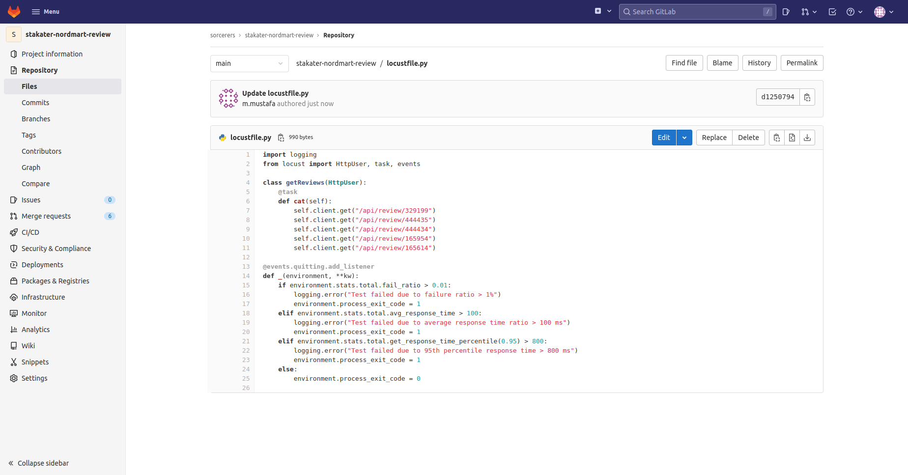

# Load Testing

> Load testing helps us to understand how our application behaves in production. Even the application passes all functional tests, if it doesn't perform well, the end users become unhappy. For that reason, we should understand how our users interact with our applications and set realistic benchmarks for performance.

The SAAP cluster is shipped with many useful predefined cluster tasks.

## SAAP Load Testing:

SAAP cluster is shipped with load testing **stakater-load-testing-v1** to load test our deployed application.

Lets view this task in our cluster:

1. To view the already defined Image Scanning/Checking Cluster Task, Open up the `Pipelines` section from the left menu and click `Tasks`

   
    
2. Select `ClusterTasks`. A number of tasks will be displayed on your screen. Type in `stakater-load-testing-v1` in the search box that is displayed.
   You will see a  `stakater-load-testing-v1` task. Click to view details.

   
   
3. CLick YAML to display the task definition.

    


## Integrate Load Test into pipeline

For load testing, we will use a Python-based open source tool called <span style="color:blue;">[`locust`](https://docs.locust.io/en/stable/index.html)</span>. Locust helps us to write scenario based load testing and fail the pipeline if the results don't match with our expectations (i.e. if average response time ratio is higher 200ms, the pipeline fails).


We have added the following scenario into our `stakater-nordmart-review` repositories.

_You can find how to write more complex testing scenarios for your needs in <span style="color:blue;">[Locust documentation](https://docs.locust.io/en/stable/writing-a-locustfile.html)_</span>
    
Below scenario calls `/api/review/{productId}` endpoint and fails the test if:  
  - 1% of calls are not 200 (OK)
  - Total average response time to `/api/review/{productId}` is more than 100 ms
  - The max response time in 90 percentile is higher than 800 ms

    ```bash
    cat /projects/stakater-nordmart-review/locustfile.py
    ```
    ```python
    import logging
    from locust import HttpUser, task, events

    class getReviews(HttpUser):
        @task
        def cat(self):
            self.client.get("/api/review/{productId}")

    @events.quitting.add_listener
    def _(environment, **kw):
        if environment.stats.total.fail_ratio > 0.01:
            logging.error("Test failed due to failure ratio > 1%")
            environment.process_exit_code = 1
        elif environment.stats.total.avg_response_time > 200:
            logging.error("Test failed due to average response time ratio > 200 ms")
            environment.process_exit_code = 1
        elif environment.stats.total.get_response_time_percentile(0.95) > 800:
            logging.error("Test failed due to 95th percentile response time > 800 ms")
            environment.process_exit_code = 1
        else:
            environment.process_exit_code = 0

    EOF
    ```
    If the pipeline fails due to the thresholds we set, you can always adjust it by updating the `locustfile.py` with higher values.

      Open repo `stakater-nordmart-review` to view the `locustfile.py` present at the root folder.
   
      


#### Integrate the pipeline with Tekton:

- Add a load test task to our pipeline
- <span style="color:blue;">[Tekton](9b-tekton.md)</span>