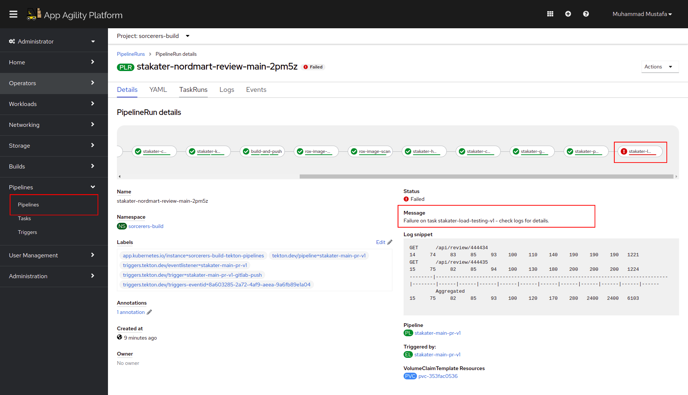
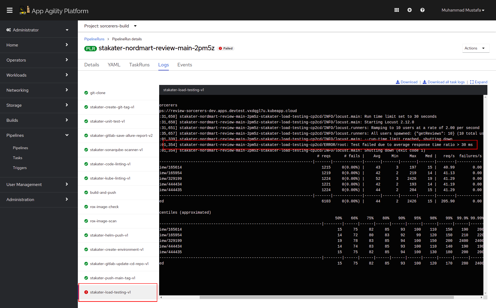
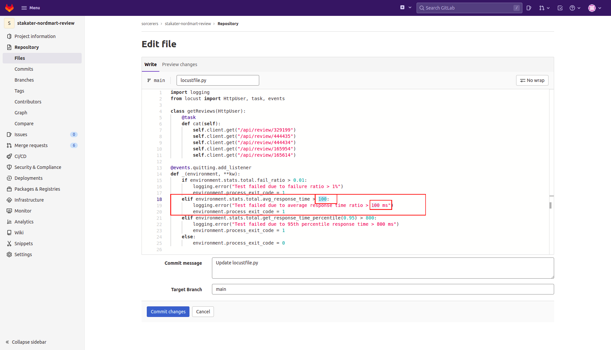
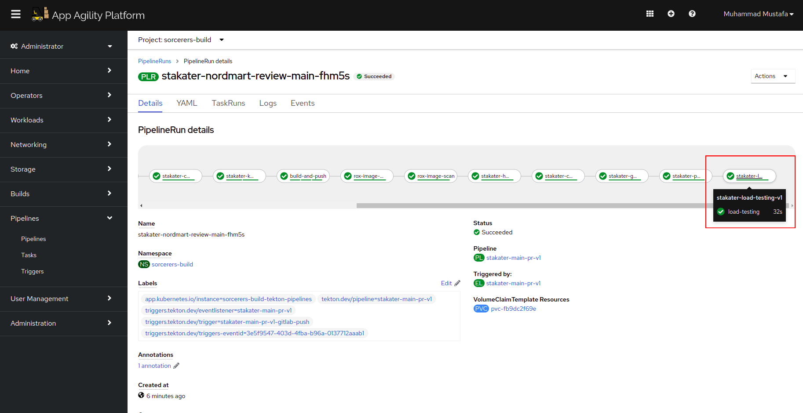

# Extend Tekton Pipeline with Load Testing

In this section we are going to improve our already built `main-pr-v1` pipeline and add stakater-load-test-v1 task into the pipeline.
The SAAP cluster is shipped with many useful predefined cluster tasks including **`stakater-load-testing-v1`**.  

Lets add this task into our pipeline **`stakater-load-testing-v1`**.

1. Open the chart directory found in GitLab at `<TENANT_NAME>/nordmart-apps-gitops-config/01-<TENANT_NAME>/01-tekton-pipelines/00-build/`
  

2. Open the `values.yaml` file in the editor. 

    ```
    - defaultTaskName: stakater-load-testing-v1
    ```
The pipeline will now become:
   ```yaml
   pipeline-charts:
     name: stakater-main-pr-v1
     workspaces:
     - name: source
       volumeClaimTemplate:
         accessModes: ReadWriteOnce
         resourcesRequestsStorage: 1Gi
     pipelines:
       tasks:
         - defaultTaskName: git-clone
         - defaultTaskName: stakater-create-git-tag-v1
         - defaultTaskName: stakater-sonarqube-scanner-v1
           runAfter:
             - stakater-create-git-tag-v1
         - defaultTaskName: stakater-unit-test-v1
           runAfter: 
             - stakater-sonarqube-scanner-v1
         - defaultTaskName: stakater-gitlab-save-allure-report-v1
         - defaultTaskName: stakater-code-linting-v1
         - defaultTaskName: stakater-kube-linting-v1
           runAfter:
            - stakater-code-linting-v1
           params:
             - name: namespace
         - defaultTaskName: stakater-buildah-v1
           name: build-and-push
           runAfter:
            - stakater-build-image-flag-v1
           params:
             - name: BUILD_IMAGE
               value: "true"
         - defaultTaskName: rox-image-check
         - defaultTaskName: rox-image-scan
         - defaultTaskName: stakater-helm-push-v1
         - defaultTaskName: stakater-create-environment-v1
         - defaultTaskName: stakater-gitlab-update-cd-repo-v1
           params: 
             - name: gitlab_group
         - defaultTaskName: stakater-load-testing-v1
         - defaultTaskName: stakater-push-main-tag-v1
     triggertemplate:
         serviceAccountName: stakater-workshop-tekton-builder
         pipelineRunNamePrefix: $(tt.params.repoName)-$(tt.params.prnumberBranch)
     eventlistener:
         serviceAccountName: stakater-workshop-tekton-builder
         triggers:
         - name: gitlab-mergerequest-create
           bindings:
             - ref: stakater-gitlab-merge-request-v1
             - name: oldcommit
               value: "NA"
             - name: newcommit
               value: $(body.object_attributes.last_commit.id)
         - name: gitlab-mergerequest-synchronize
           bindings:
             - ref: stakater-gitlab-merge-request-v1
             - name: oldcommit
               value: $(body.object_attributes.oldrev)
             - name: newcommit
               value: $(body.object_attributes.last_commit.id)
         - name: gitlab-push
           bindings:
             - name: newcommit
               value: $(body.after)
             - name: oldcommit
               value: $(body.before)
             - ref: stakater-gitlab-push-v1
     rbac:
        enabled: false
     serviceAccount:
        name: stakater-workshop-tekton-builder
        create: false
  ```

3. Now open ArgoCD, Open the `<TENANT_NAME>-build-tekton-pipelines` application, trigger Refresh and  wait for the changes were synchronized.

    


4. If the sync is green, you're good to go. You have successfully added stakater-load-testing-v1 to your pipeline!
    
🪄🪄 Now lets observe the **`stakater-nordmart-review`** pipeline running with the **stakater-load-testing-v1** task.🪄🪄


5. Lets trigger our pipeline again by making a commit onto README.md in the main branch. Open the pipeline on OpenShift console. You ll notice our pipeline failed.

    

    


6. Navigate to TaskRuns and open the task `stakater-load-testing-v1` logs. We ll notice that our pipeline fails because our locustfile.py was configured to fail if average response time < 30ms.

    


7. Open the `stakater-nordmart-review` repository and edit the `locustfile.py` and change the average response time  to < 100ms.

    

    Commit to main branch and A pipeline will be initiated. Open the OpenShift console and navigate to PipelineRun.

    

8. Navigate to TaskRuns and open the task `stakater-load-testing-v1` logs. You'll see that the pipeline has succeeded after increasing the average response time in failure scenario.

    

    

🪄🪄 TADA. You've successfully added load-testing to your pipeline🪄🪄

