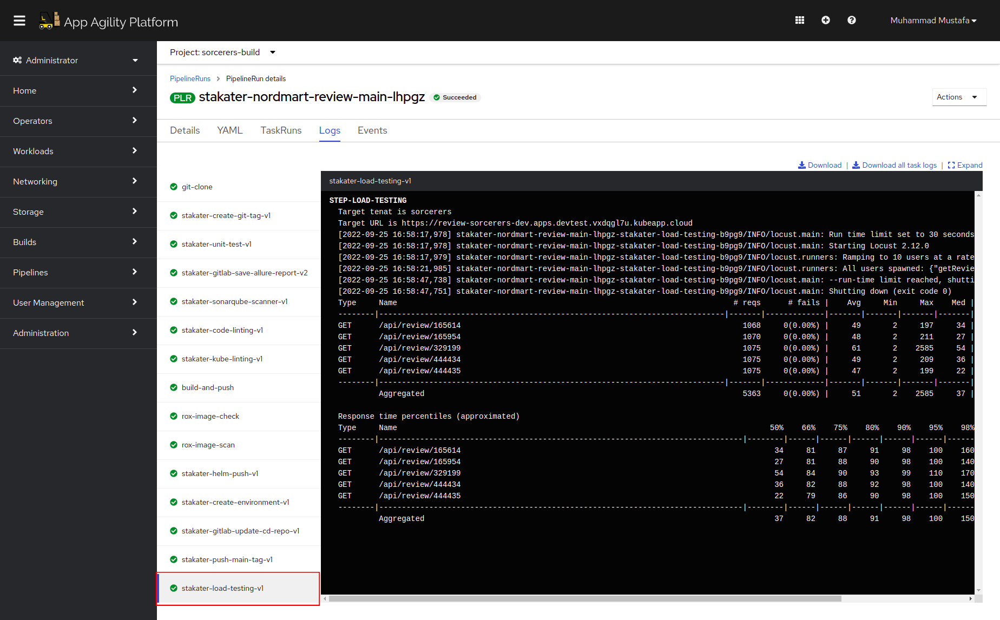

# Extend Tekton Pipeline with Load Testing (WIP)

<<<<<<< HEAD
1. For load testing, we will use a Python-based open source tool called <span style="color:blue;">[`locust`](https://docs.locust.io/en/stable/index.html)</span>. Locust helps us to write scenario based load testing and fail the pipeline if the results don't match with our expectations (i.e.if average response time ratio is higher 200ms, the pipeline fails).
=======
In this section we are going to improve our already built `main-pr-v1` pipeline and add stakater-load-test-v1 task into the pipeline.
The SAAP cluster is shipped with many useful predefined cluster tasks including **stakater-load-testing-v1**.  
>>>>>>> main

Lets add this task into our pipeline  **stakater-load-testing-v1**.

1. Open the Chart we added to 00-tekton-pipelines folder in section 2.
  

2. Open the `values.yaml` file in the editor. 

    ```
    - defaultTaskName: stakater-load-testing-v1
    ```

<<<<<<< HEAD
2. Add a task to the Tekton pipeline for running the load testing:

    ```bash
    cd /projects/tech-exercise
    cat <<'EOF' > tekton/templates/tasks/load-testing.yaml
    apiVersion: tekton.dev/v1beta1
    kind: Task
    metadata:
      name: load-testing
    spec:
=======
    The pipeline will now become:
    <div class="highlight" style="background: #f7f7f7">
    <pre><code class="language-yaml">apiVersion: v2
   pipeline-charts:
      name: stakater-main-pr-v1
>>>>>>> main
      workspaces:
      - name: source
        volumeClaimTemplate:
          accessModes: ReadWriteOnce
          resourcesRequestsStorage: 1Gi
      pipelines:
        tasks:
          - defaultTaskName: git-clone
          - defaultTaskName: stakater-create-git-tag-v1
          - defaultTaskName: stakater-unit-test-v1
          - taskRef:
              task: allure-post-report
              kind: Task
            name: allure-post-report
            workspaces:
              - name: source
                workspace: source
            params: 
              - name: APPLICATION_NAME
              - name: IMAGE
              - name: WORK_DIRECTORY
              - name: ALLURE_HOST
          - defaultTaskName: stakater-sonarqube-scanner-v1
            runAfter:
              - allure-post-report
          - defaultTaskName: stakater-code-linting-v1
            runAfter:
              - stakater-sonarqube-scanner-v1
          - defaultTaskName: stakater-kube-linting-v1
            runAfter:
              - stakater-code-linting-v1
            params:
              - name: namespace
          - defaultTaskName: stakater-buildah-v1
            params:
              - name: BUILD_IMAGE
                value: "true"
            name: build-and-push
          - defaultTaskName: rox-image-check
          - defaultTaskName: rox-image-scan
          - defaultTaskName: stakater-helm-push-v1
          - defaultTaskName: stakater-create-environment-v1
          - defaultTaskName: stakater-gitlab-update-cd-repo-v1
          <span style="color:orange">- defaultTaskName: stakater-load-testing-v1</span>          
            params:
              - name: gitlab_group
          - defaultTaskName: stakater-push-main-tag-v1
      triggertemplate:
           params:
             - name: repoName
             - name: prnumberBranch
               default: "main"
      eventlistener:
        triggers:               
          - name: gitlab-mergerequest-create
            bindings:
              - ref: stakater-gitlab-merge-request-v1
              - name: oldcommit
                value: "NA"
              - name: newcommit
                value: $(body.object_attributes.last_commit.id)
          - name: gitlab-mergerequest-synchronize
            bindings:
              - ref: stakater-gitlab-merge-request-v1
              - name: oldcommit
                value: $(body.object_attributes.oldrev)
              - name: newcommit
                value: $(body.object_attributes.last_commit.id)
          - name: gitlab-push
            bindings:
              - ref: stakater-gitlab-push-v1
              - name: oldcommit
                value: $(body.before)
              - name: newcommit
                value: $(body.after)
          - name: nordmart-ci-mustafa-gitlab-push
            create: false
      rbac:
        enabled: false
      serviceAccount:
        name: stakater-workshop-tekton-builder
        create: false</code></pre></div>

3. Now open Argocd, Open the <TENANT_NAME>-build-tekton-pipelines application, trigger Refresh and  wait for the changes were synchronized.

    


4. If the sync is green, you're good to go. You have successfully added stakater-load-testing-v1 to your pipeline!
    
🪄🪄 Now lets observe the **stakater-nordmart-review** pipeline running with the **stakater-load-testing-v1** task.🪄🪄

<<<<<<< HEAD
5. Now let's trigger the `nordmart-review` pipeline by pushing `locustfile.py` and verify if the load testing task works as expected.
=======
>>>>>>> main

5. Lets trigger our pipeline again by making a commit onto README.md in the main branch.

<<<<<<< HEAD
    🪄 Observe the **`nordmart-review`** pipeline running with the **`load-testing`** task.

    If the pipeline fails due to the thresholds we set, you can always adjust it by updating the `locustfile.py` with higher values.
=======
    

>>>>>>> main

6. Navigate to TaskRuns and open the task `stakater-load-testing-v1` logs. We ll notice that our pipeline fails because our locustfile.py was configured to fail if average response time < 30ms.

7. Open the stakater-nordmart-review repository and edit the `locustfile.py` and change the average response time  to < 100ms.
    

8. Navigate to TaskRuns and open the task `stakater-load-testing-v1` logs. You ll see that the pipeline has succeeded after increasing the average response time in failure scenario.

    

