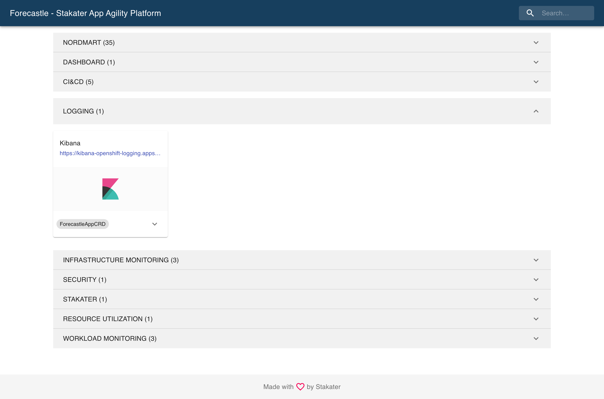
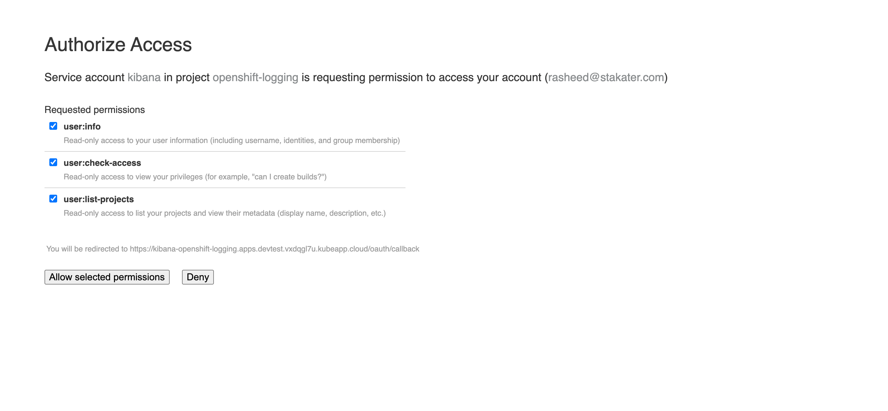
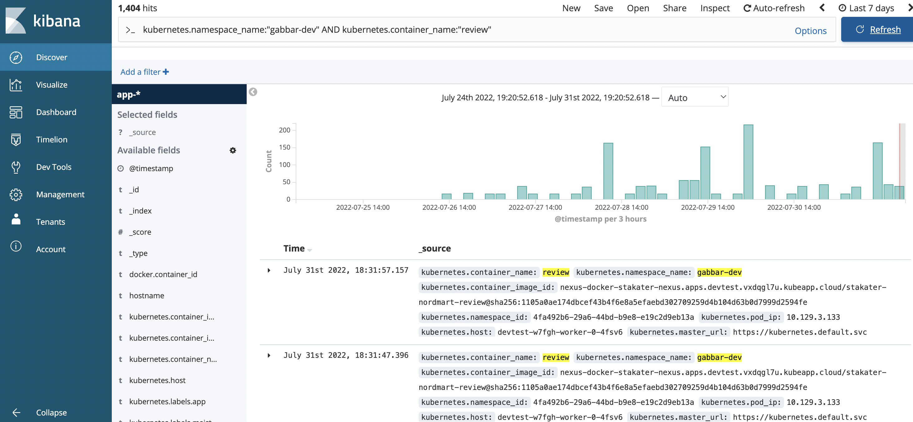
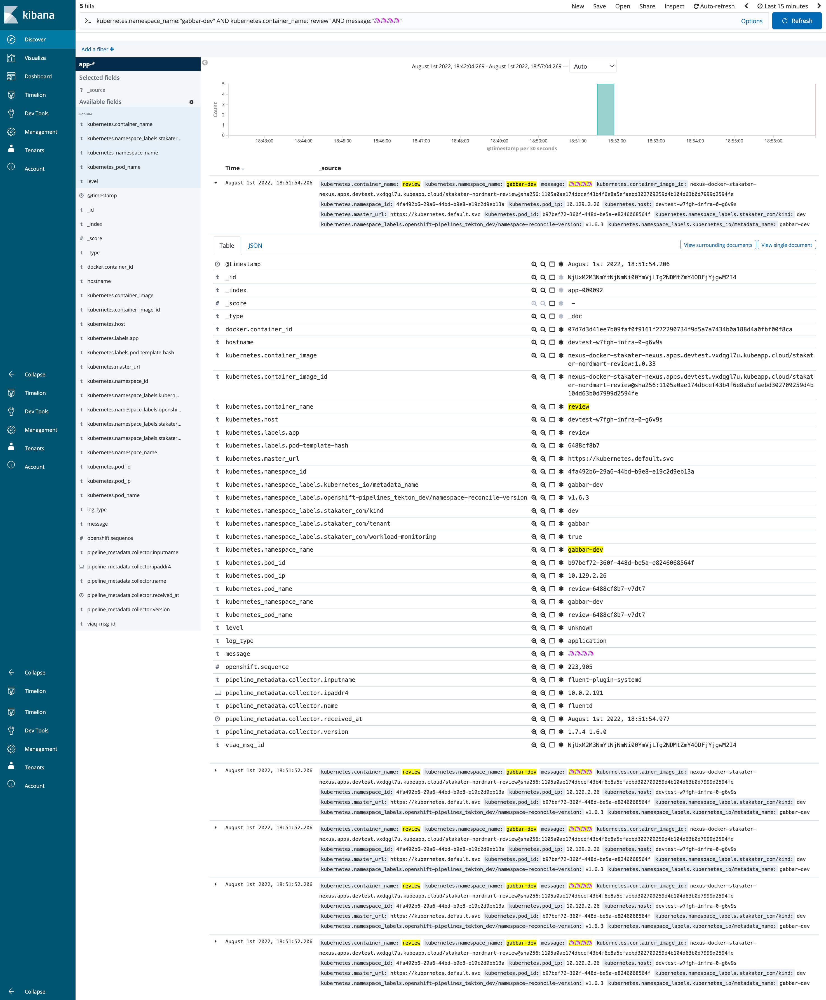

## Aggregated Logging

> SAAP built in logging... Something installed operator before hand. Very memory intensive, logging is deployed to the infra nodes!

1. Observe logs from any given container:

    ```bash
    oc project ${TENANT_NAME}-dev
    oc logs `oc get po -l app.kubernetes.io/component=mongodb -o name -n ${TENANT_NAME}-dev` --since 10m
    ```

    By default, these logs are not stored in a database, but there are a number of reasons to store them (i.e. troubleshooting, legal obligations..)

2. SAAP magic provides a great way to collect logs across services, anything that's pumped to `STDOUT` or `STDERR` is collected by Fluentd and added to Elastic Search. This makes indexing and querying logs very easy. Kibana is added on top for easy visualisation of the data. Let's take a look at Kibana now. Back to Forecastle:

    

3. Login using your standard credentials. On first login you'll need to `Allow selected permissions` for OpenShift to pull your permissions.

    

4. Once logged in, you'll be prompted to create an `index` to search on. This is because there are many data sets in elastic search, so you must choose the ones you would like to search on. We'll just search on the application logs as opposed to the platform logs in this exercise. Create an index pattern of `app-*` to search across all application logs in all namespaces.

    

5. On configure settings, select `@timestamp` to filter by and create the index.

    

6. Go to the Kibana Dashboard - Hit `Discover` in the top right hand corner, we should now see all logs across all pods. It's a lot of information but we can query it easily.

    

7. Let's filter the information, look for the logs specifically for pet-battle apps running in the test namespace by adding this to the query bar:
`kubernetes.namespace_name:"<TENANT_NAME>-dev" AND kubernetes.container_name:"review"`

    

8. Container logs are ephemeral, so once they die you'd loose them unless they're aggregated and stored somewhere. Let's generate some messages and query them from the UI in Kibana. Connect to pod via `rsh` and generate logs.

    ```bash
    oc project ${TENANT_NAME}-test
    oc rsh `oc get po -l app=review -o name -n ${TENANT_NAME}-dev`
    ```

    Then inside the container you've just remote logged on to we'll add some nonsense messages to the logs:

    ```bash
    echo "🦄🦄🦄🦄" >> /tmp/custom.log
    tail -f /tmp/custom.log > /proc/1/fd/1 &
    echo "🦄🦄🦄🦄" >> /tmp/custom.log
    echo "🦄🦄🦄🦄" >> /tmp/custom.log
    echo "🦄🦄🦄🦄" >> /tmp/custom.log
    echo "🦄🦄🦄🦄" >> /tmp/custom.log
    exit
    ```

9. Back on Kibana we can filter and find these messages with another query:

    ```yaml
    kubernetes.namespace_name:"<TENANT_NAME>-dev" AND kubernetes.container_name:"review" AND message:"🦄🦄🦄🦄"
    ```

    
