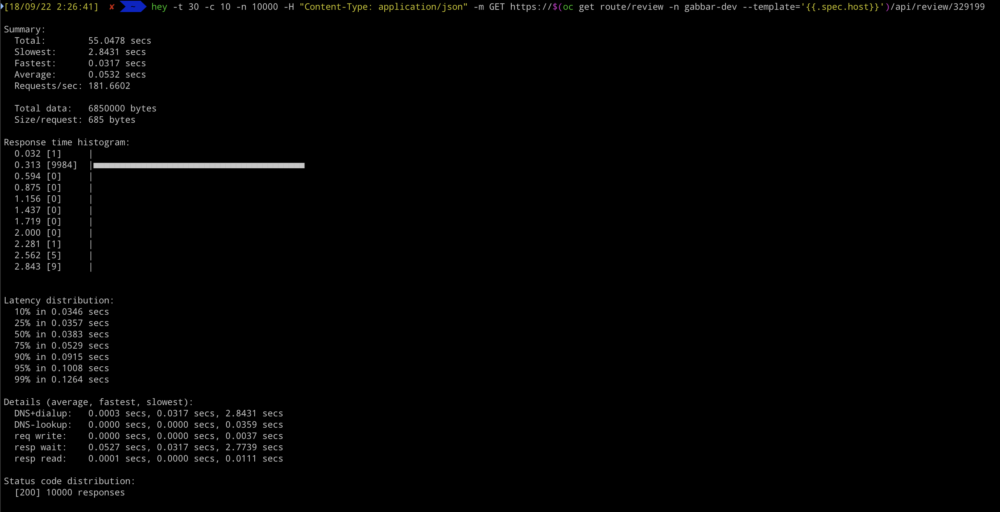
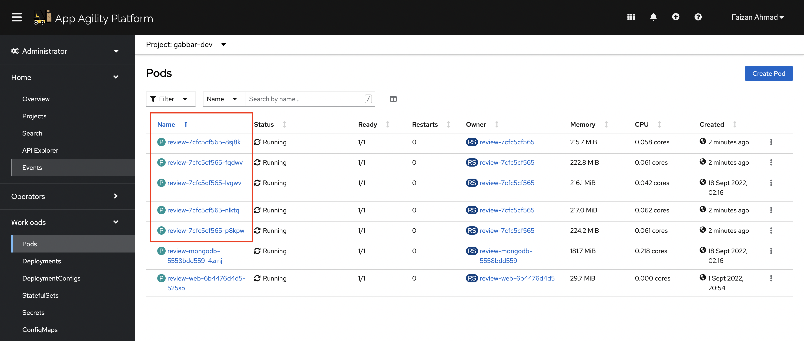
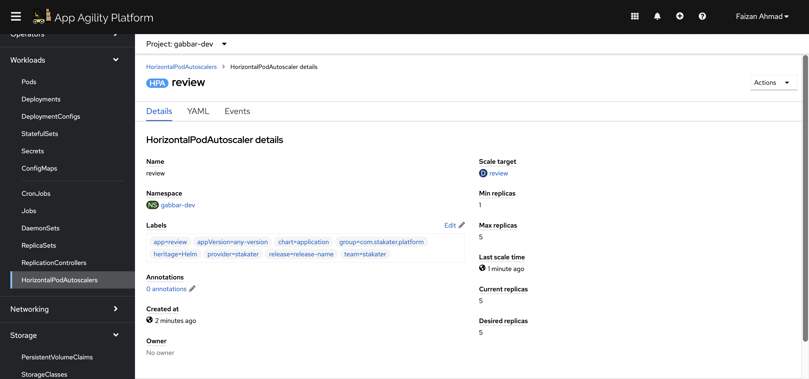

## Autoscaling

> Horizontal pod autoscaler (HPA) helps us to specify how OpenShift should automatically increase or decrease the scale of an application, based on metrics collected from the pods. After we define an HPA (based on CPU and/or memory usage metrics), the platform calculates the current usage and compare it with the desired utilization, then scales pods up or down accordingly.

1. The stakater-nordmart-review API helm chart contains the Horizontal Pod Autoscaler yaml. By default we've switched it off. This is what it looks like:

    <div class="highlight" style="background: #f7f7f7">
    <pre><code class="language-yaml">
    # Source: stakater-nordmart-review/charts/application/templates/hpa.yaml
    apiVersion: autoscaling/v2beta2
    kind: HorizontalPodAutoscaler
    metadata:
      name: review
    spec:
      scaleTargetRef:
        apiVersion: apps/v1
        kind: Deployment
        name: review
      minReplicas: 1
      maxReplicas: 10
      metrics:
        - resource:
            name: cpu
            target:
              averageUtilization: 60
              type: Utilization
          type: Resource
        - resource:
            name: memory
            target:
              averageUtilization: 60
              type: Utilization
          type: Resource
    </code></pre></div>

2. Often we only enable the HPA in the stage or prod environments, so being able to configure it on / off when testing is useful. To turn it on in a given environment, we can simply supply new values to our application config. Update the `deploy/values.yaml` by setting the `autoscaling` to `enabled:true`

    ```yaml
      autoscaling:
        enabled: true
        minReplicas: 1
        maxReplicas: 5
        metrics:
        - type: Resource
          resource:
            name: cpu
            target: 
              type: Utilization
              averageUtilization: 60
        - type: Resource
          resource:
            name: memory
            target: 
              type: Utilization
              averageUtilization: 60
    ```

3. Git commit the changes. We probably don't need to tell you the commands to do this by now, but just incase... here they are again 🐎🐎🐎 !

    ```bash
    cd /projects/stakater-nordmart-review
    git add deploy/values.yaml
    git commit -m  "🐎ADD - HPA enabled for test env 🐎 "
    git push
    ```

4. With the change synchronized, we should see a new HorizontalPodAutoscaler object in ArgoCD and the cluster. Feel free to check those out.

5. Let's now test our pod autoscaler, to do this we want to fire lots of load on the API of review microservice. This should trigger an autoscale due to the increased load on the pods. [hey](https://github.com/rakyll/hey) is simple load testing tool that can be run from the command line that will fire lots of load at our endpoint:

    ```bash
    hey -t 30 -c 10 -n 10000 -H "Content-Type: application/json" -m GET https://$(oc get route/review -n <TENANT_NAME>-dev --template='{{.spec.host}}')/api/review/329199
    ```

    Where:
    * -c: Number of workers to run concurrently (10)
    * -n: Number of requests to run (10,000)
    * -t: Timeout for each request in seconds (30)

6. While this is running, we should see in OpenShift land the autoscaler is kickin in and spinnin gup additional pods. If you navigate to the review deployment, you should see the replica count has jumped.

    
    
    
    

