## A/B Deployments

> A/B deployments generally imply running two (or more) versions of the application at the same time for testing or experimentation purposes. A/B deployment distributes the traffic between two different versions of the application.

<span style="color:blue;">[OpenShift Docs](https://docs.openshift.com/container-platform/4.9/applications/deployments/route-based-deployment-strategies.html#deployments-ab-testing_route-based-deployment-strategies)</span> is pretty good at showing an example of how to do a manual A/B deployment. But in the real world you'll want to automate this by increasing the load of the alternative service based on some tests or other metric. Plus this is GitOps! So how do we do a A/B with all of this automation and new tech, let's take a look with our Pet Battle UI!

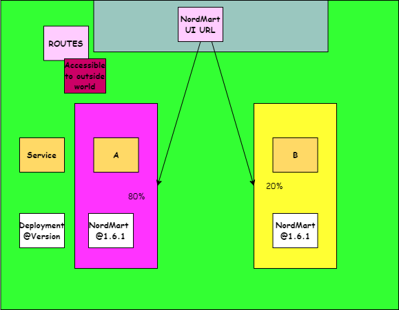

As you see in the diagram, OpenShift can distribute the traffic that coming to Route. But how does it do it? Let’s explore route definition. This is a classic Route definition:

    <div class="highlight" style="background: #f7f7f7">
    <pre><code class="language-yaml">
      apiVersion: route.openshift.io/v1
      kind: Route
      metadata:
        name: review-ui
      spec:
        port:
          targetPort: http
        to:
          kind: Service
          name: review-ui
          weight: 100       <-- All of the traffic goes to `pet-battle` service
    ...
    </code></pre></div>

    In order to split the traffic, we introduce something called `alternateBackends`.

    <div class="highlight" style="background: #f7f7f7">
    <pre><code class="language-yaml">
      apiVersion: route.openshift.io/v1
      kind: Route
      metadata:
        name: review-ui-ab
      spec:
        port:
          targetPort: http
        to:
          kind: Service
          name: review-ui-ab-a
          weight: 80
        alternateBackends: <-- This helps us to divide the traffic
        - kind: Service
          name: review-ui-ab-b
          weight: 20       <-- based on the percentage we give
    </code></pre></div>

    We will deploy the route for ab deployments similarly, but before that, we need to install a helper tool.

### A/B and Analytics

> The reason we are doing these advanced deployment strategies is to experiment, to see if our newly introduced features are liked by our end users, to see how the performance is of the new version and so on. But splitting traffic is not enough for this. We need to track and measure the effect of the changes. Therefore, we will use a tool called `Matomo` to get detailed reports on Nordmart and record the users' behaviour.

Before we jump to A/B deployment, let's deploy Matomo through Argo CD.

Note: Each user will have a separate deployment of Matomo running in your tenant.

1. Open up  nordmart-apps-gitops-config and navigate to `<TENANT-NAME>/00-argocd-apps/01-dev` path, create a new file named `<TENANT-NAME>-matomo.yaml` and add the following config to deploy Matomo through ArgoCD.
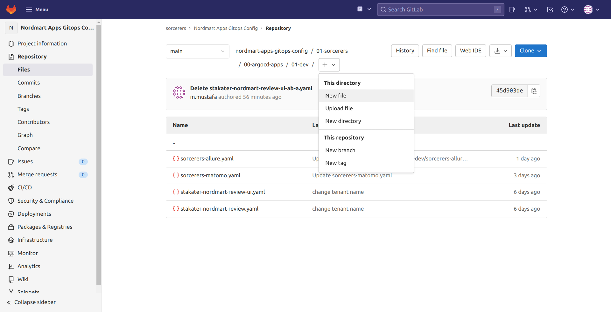
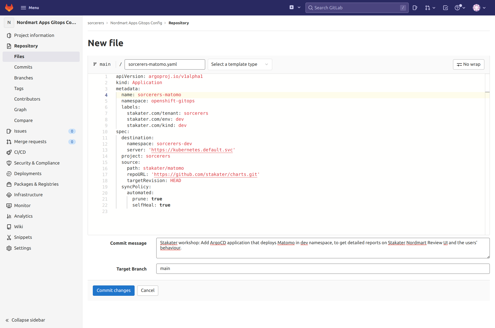

    ```yaml
      # Matomo
      apiVersion: argoproj.io/v1alpha1
      kind: Application
      metadata:
        name: <TENANT-NAME>-matomo
        namespace: openshift-gitops
        labels:
          stakater.com/tenant: <TENANT-NAME>
          stakater.com/env: dev
          stakater.com/kind: dev         
      spec:
        destination:
          namespace: <TENANT-NAME>-dev
          server: 'https://kubernetes.default.svc'
        project: <TENANT-NAME> 
        source:
          path: stakater/matomo
          repoURL: 'https://github.com/stakater/charts.git'
          targetRevision: HEAD
        syncPolicy:
          automated:
            prune: true
            selfHeal: true
    ```
  Track the change through ArgoCD. An app `<TENANT-NAME>-matomo` should appear in ArgoCD.

  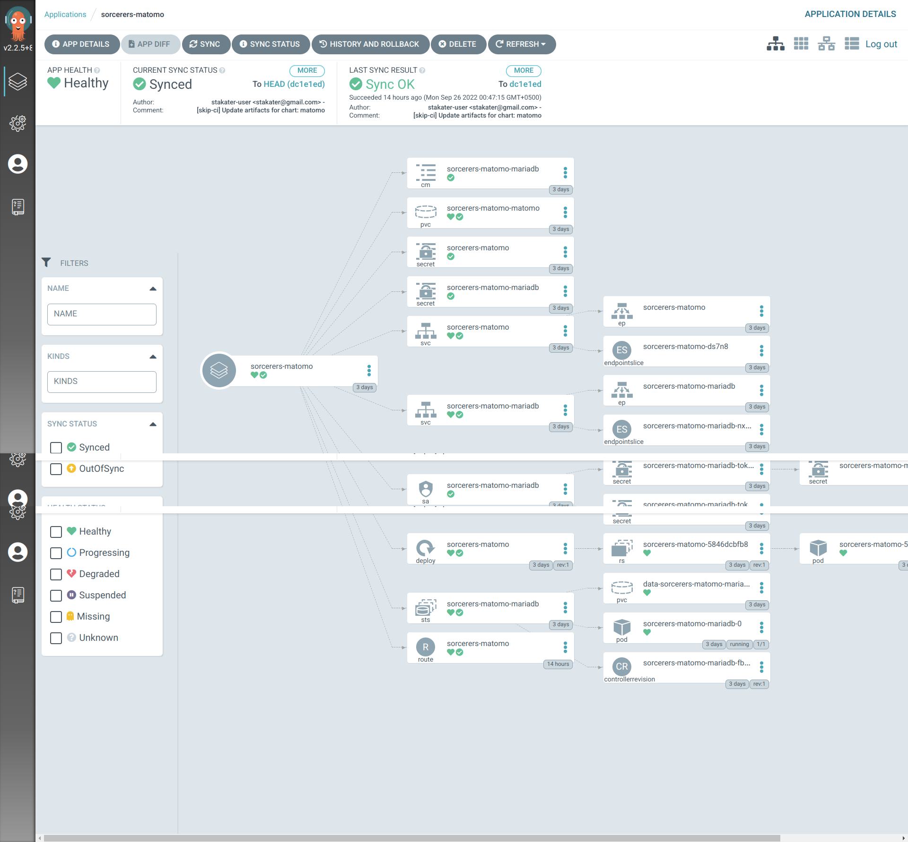

  Once matomo is deployed and synced in argoCD, head over to Openshift Console and in your `<TENANT-NAME>-dev` namespace, click on `Networking>Routes` and copy the link for `<TENANT-NAME>-matomo` route, we will use this in the steps to follow.

  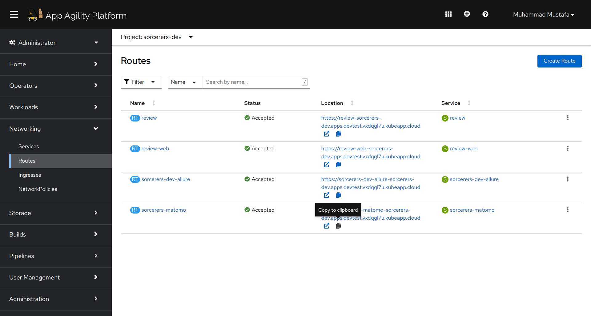

2. Log in to matomo using username `user` and password `password`. (Yes the literal strings user and password)
   Currently, there is no data yet. But Stakater Nordmart Review UI is already configured to send data to Matomo every time a connection happens. Let's start experimenting with A/B deployment and check Matomo UI on the way.

### A/B Deployment

For this experiment, we are going to deploy 2 instances of Stakater Nordmart Review UI. We will call them `A` and `B`.

1. Let's deploy `A`. In your Gitlab, navigate to `nordmart-apps-gitops-config/01-<TENANT_NAME>`and create a New Directory with name `stakater-nordmart-review-ui-ab-a/01-dev`. 

  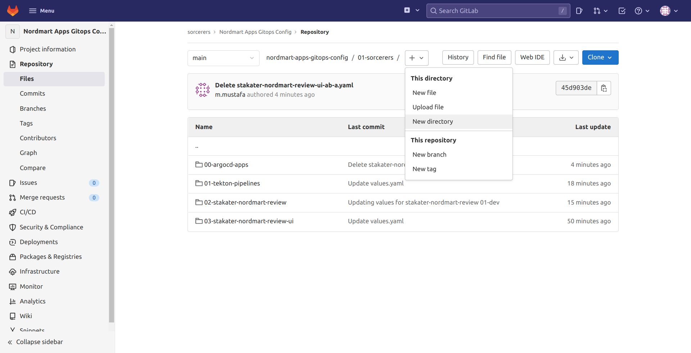

  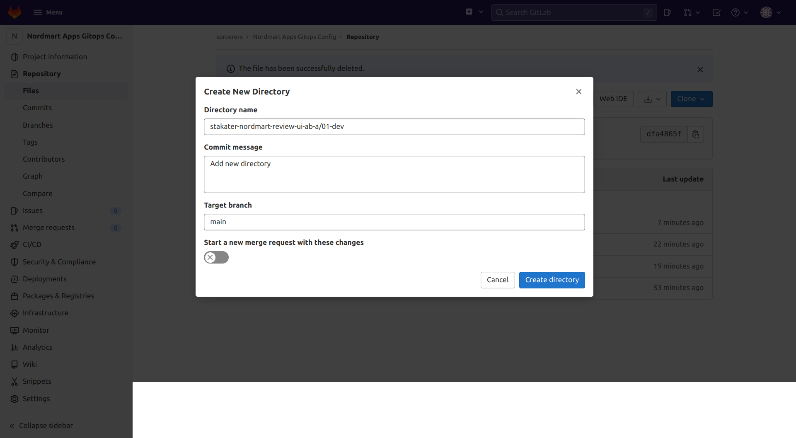

2. Create a file with name `Chart.yaml` and paste below yaml in it.

    ```yaml
      apiVersion: v2
      name: stakater-nordmart-review-ui-ab-a
      description: A Helm chart for Kubernetes
      dependencies:
        - name: stakater-nordmart-review-ui
          version: 1.0.14
          repository:  https://nexus-helm-stakater-nexus.apps.devtest.vxdqgl7u.kubeapp.cloud/repository/helm-charts/
      version: 1.0.14
    ```
    
  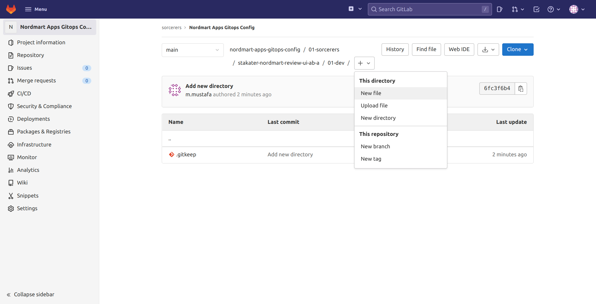

  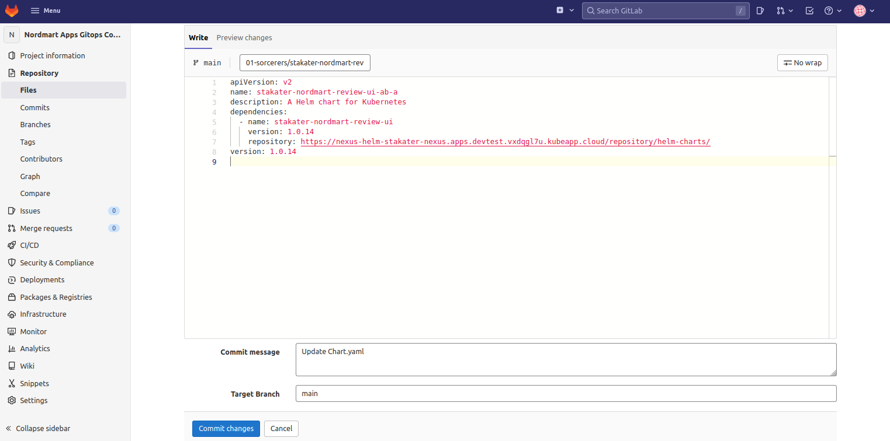

3. Create another file named `values.yaml` in the same directory and paste below yaml in it.

    **Note: Substitute the value of Matomo route we copied in the previous section in `MATOMO_BASE_URL` in the yaml below**

    ```yaml
      stakater-nordmart-review-ui:
        application:
          applicationName: "review-ui-ab-a"
          deployment:
            image:
              repository: stakater/stakater-nordmart-review-ui
              tag: 1.0.24-a
            env:
              REVIEW_API:
                  value: "https://review-{{ .Release.Namespace }}.apps.devtest.vxdqgl7u.kubeapp.cloud/"
              MATOMO_BASE_URL:
                  value: "<YOUR_MATOMO_URL_HERE>"
          route:
            enabled: false

    ```
  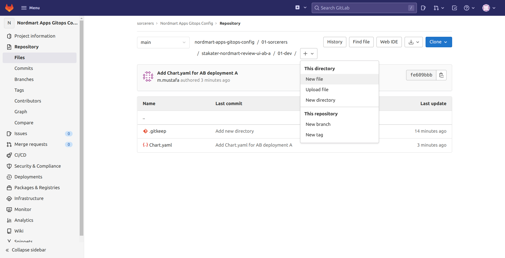

  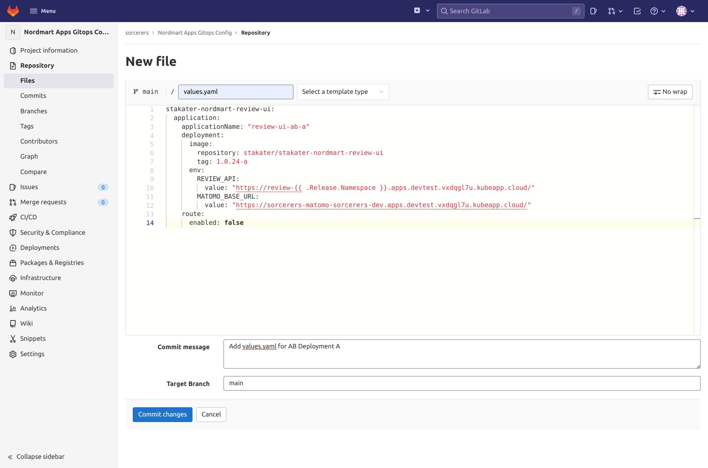

4. Now we will create an ArgoCD app that deploys our `A` application. Navigate to `nordmart-apps-gitops-config/01-sorcerers/00-argocd-apps/01-dev` and create a new file named `<TENANT_NAME>-stakater-nordmart-review-ui-ab-a.yaml` and paste below yaml in it.

    ```yaml
    apiVersion: argoproj.io/v1alpha1
    kind: Application
    metadata:
      name: <TENANT-NAME>-stakater-nordmart-review-ui-ab-a
      namespace: openshift-gitops
      labels:
        stakater.com/tenant: <TENANT-NAME>
        stakater.com/env: dev
        stakater.com/kind: dev
    spec:
      destination:
        namespace: <TENANT-NAME>-dev
        server: 'https://kubernetes.default.svc'
      project: <TENANT-NAME>
      source:
        path: 01-<TENANT-NAME>/stakater-nordmart-review-ui-ab-a/01-dev
        repoURL: 'https://gitlab.apps.devtest.vxdqgl7u.kubeapp.cloud/<TENANT-NAME>/nordmart-apps-gitops-config.git'
        targetRevision: HEAD
      syncPolicy:
        automated:
          prune: true
          selfHeal: true

    ```
  
    

    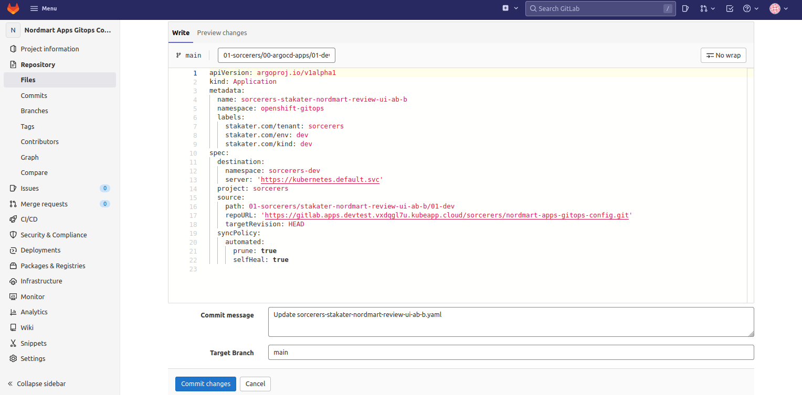


5. Now let's deploy `B`. Navigate to `01-<TENANT_NAME>` again and create a New Directory with name `stakater-nordmart-review-ui-ab-b/01-dev`.

  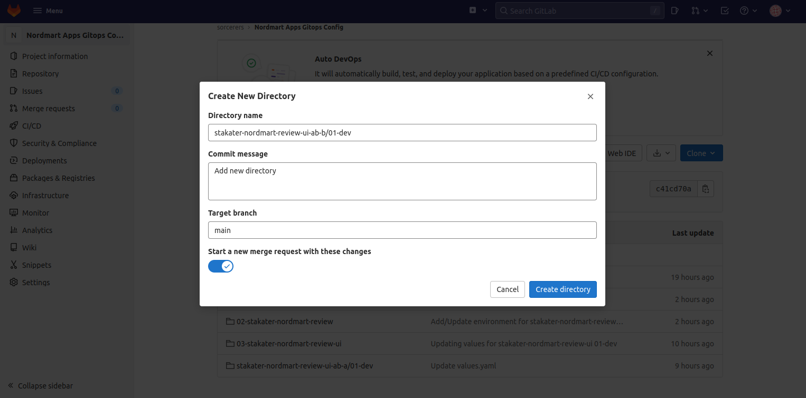

6. Create a file with name `Chart.yaml` and paste below yaml in it.

    ```yaml
      apiVersion: v2
      name: stakater-nordmart-review-ui-ab-b
      description: A Helm chart for Kubernetes
      dependencies:
      - name: stakater-nordmart-review-ui
        version: 1.0.14
        repository: https://nexus-helm-stakater-nexus.apps.devtest.vxdqgl7u.kubeapp.cloud/repository/helm-charts/
      version: 0.0.0
    ```

   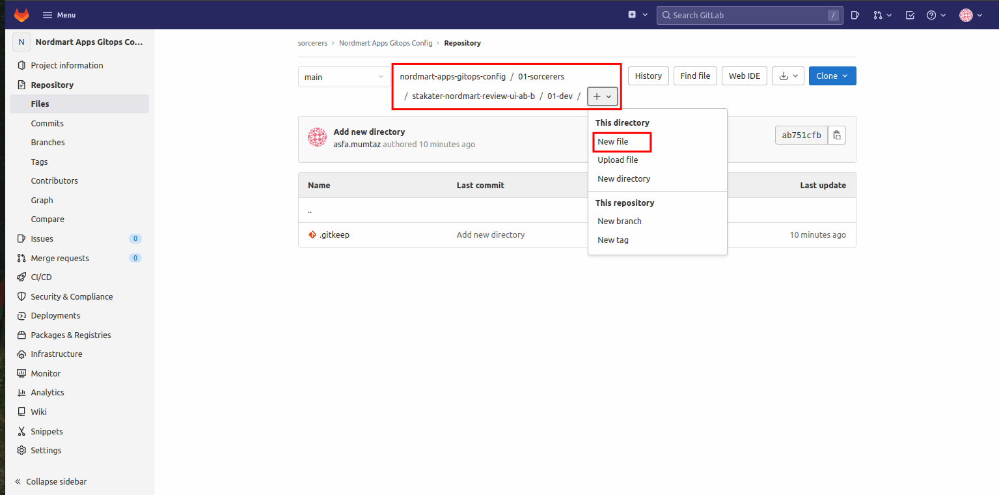

   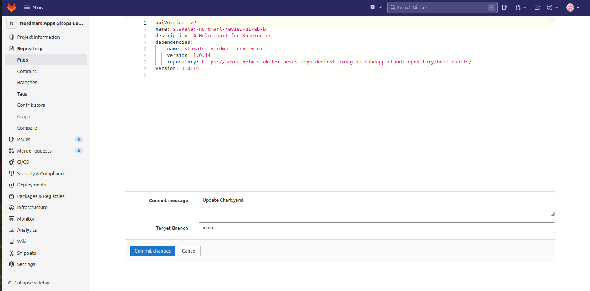

7. Create another file named `values.yaml` in the same directory and paste below yaml in it.

   **Note: Dont forget to replace the matomo URL.**

    ```yaml
      stakater-nordmart-review-ui:
        application:
          applicationName: "review-ui-ab-b"
          deployment:
            image:
              repository: stakater/stakater-nordmart-review-ui
              tag: 1.0.24-b
            env:
              REVIEW_API:
                  value: "https://review-{{ .Release.Namespace }}.apps.devtest.vxdqgl7u.kubeapp.cloud/"
              MATOMO_BASE_URL:
                  value: "<YOUR_MATOMO_URL_HERE>"
          route:
            enabled: false

    ```
   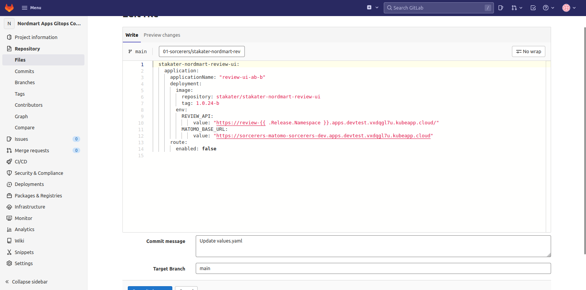

8. Now we will create a ArgoCD app for deploying `B` application. Navigate to `nordmart-apps-gitops-config/01-sorcerers/00-argocd-apps/01-dev` and create a new file named `<TENANT_NAME>-stakater-nordmart-review-ui-ab-b.yaml` and paste below yaml in it.

    ```yaml
    apiVersion: argoproj.io/v1alpha1
    kind: Application
    metadata:
      name: <TENANT-NAME>-stakater-nordmart-review-ui-ab-b
      namespace: openshift-gitops
      labels:
        stakater.com/tenant: <TENANT-NAME>
        stakater.com/env: dev
        stakater.com/kind: dev
    spec:
      destination:
        namespace: <TENANT-NAME>-dev
        server: 'https://kubernetes.default.svc'
      project: <TENANT-NAME>
      source:
        path: 01-<TENANT-NAME>/stakater-nordmart-review-ui-ab-b/01-dev
        repoURL: 'https://gitlab.apps.devtest.vxdqgl7u.kubeapp.cloud/<TENANT-NAME>/nordmart-apps-gitops-config.git'
        targetRevision: HEAD
      syncPolicy:
        automated:
          prune: true
          selfHeal: true

    ```

   

   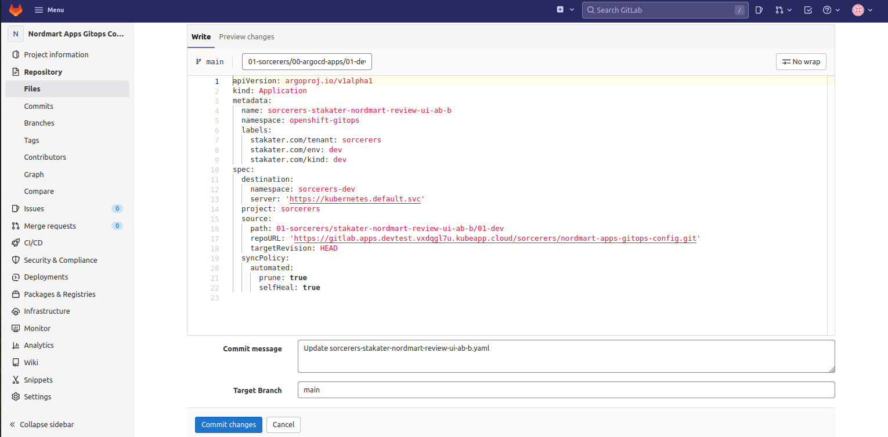

9. Now lets head over to ArgoCD to check if our application B was deployed.
   
   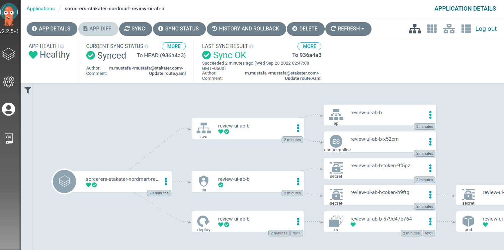

10. Now we will deploy a route for Stakater Nordmart Review UI AB deployment. Create new directory in `nordmart-apps-gitops-config/<TENANT-NAME>`

   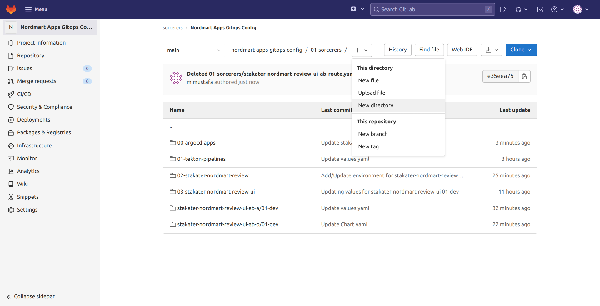

11. Add a new file and paste the content below in it
   
   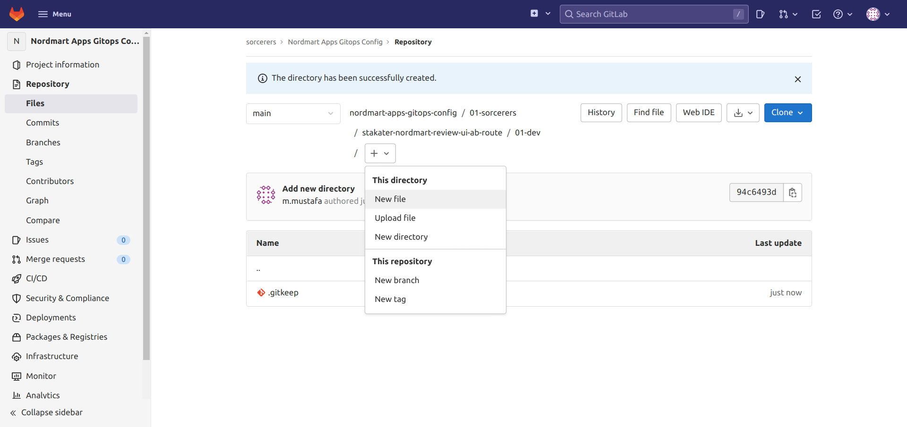
   
   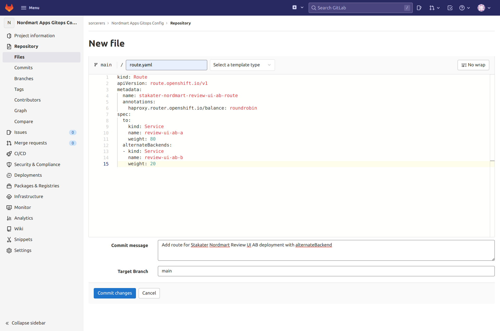
   
   ```yaml
    kind: Route
    apiVersion: route.openshift.io/v1
    metadata:
      name: stakater-nordmart-review-ui-ab-route
      annotations:
        haproxy.router.openshift.io/balance: roundrobin
    spec:
      to:
        kind: Service
        name: review-ui-ab-a
        weight: 80
      alternateBackends: 
      - kind: Service
        name: review-ui-ab-b
        weight: 20 
   ```

 12. Now lets create an argoCD application in `nordmart-apps-gitops-config/<TENANT-NAME>/00-argocd-apps/01-dev`, and paste the yaml below 
    
    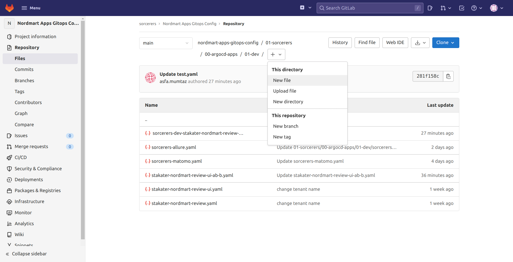
    
    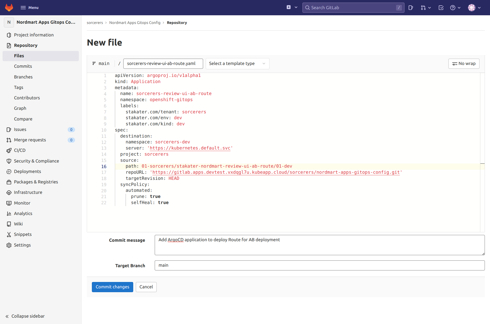
    
    ```yaml
      apiVersion: argoproj.io/v1alpha1
      kind: Application
      metadata:
        name: <TENANT-NAME>-dev-stakater-nordmart-review-ui-bg-route
        namespace: openshift-gitops
        labels:
          stakater.com/tenant: <TENANT-NAME>
          stakater.com/env: dev
          stakater.com/kind: dev            
      spec:
        destination:
          namespace: <TENANT-NAME>-dev
          server: 'https://kubernetes.default.svc'
        project: <TENANT-NAME>
        source:
          path: <TENANT-NAME>/03-stakater-nordmart-review-ui-bg-route/01-dev
          repoURL: 'https://gitlab.apps.devtest.vxdqgl7u.kubeapp.cloud/<TENANT-NAME>/nordmart-apps-gitops-config.git'
          targetRevision: HEAD
        syncPolicy:
          automated:
            prune: true
            selfHeal: true

    ```
    
  13. Head over to ArgoCD to view deployed Route. 
        
      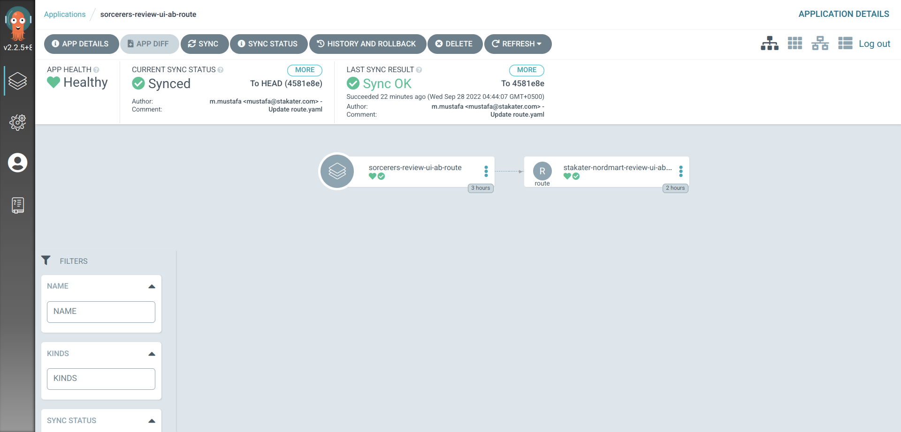
   
   

  14. Now let's redirect 99% of the traffic to `B`, that means that only 1% of the traffic will go to `A`. So you need to update `weight` value in `route.yaml` file. And as always, make the change in the Git repository - <strong>Because if it's not in Git, it's not real!</strong>

    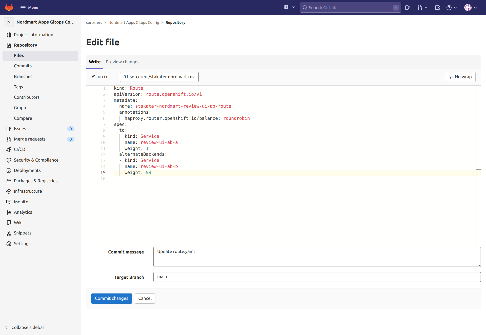

    You will notice A and B in the logo of Stakater for A and B deployments.

    ..and do not forget to check Matomo!
    
    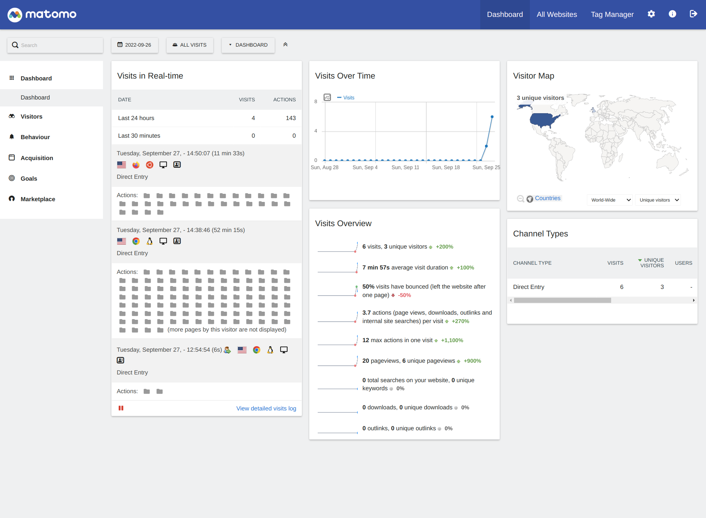 
